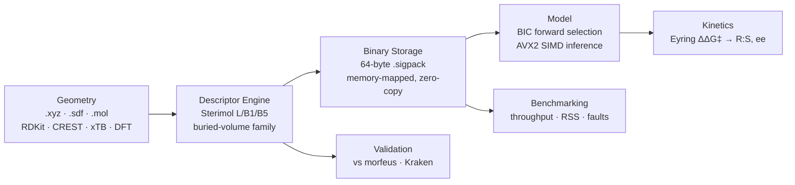
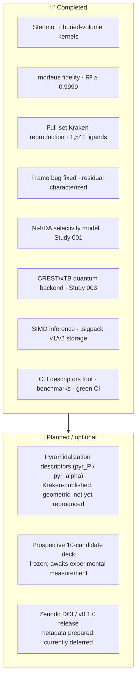

# StericX

**A native-Rust engine for physical-organic molecular featurization and reaction-selectivity inference.**

[](https://github.com/AndrejRumenovski/StericX/actions/workflows/ci.yml)
[](#license)

StericX computes 3D **Sterimol** and coordination-aware **buried-volume**
descriptors directly from Cartesian coordinates, stores reaction observations in
cache-aligned binary matrices, evaluates interpretable linear models with
parallel SIMD kernels, and converts predicted energy differences into product
distributions through the Eyring equation — as a single, portable binary.

It exists because the standard steric-descriptor toolchain is Python-based and
research-specific. StericX is an **independent, from-scratch reimplementation**
whose results are validated two ways: numerically against `morfeus-fsu`
(\(R^2 \geq 0.9999\)) and against Kraken's *own published values* across the
**full 1,541-ligand library**. Every number below is a generated measurement,
and every documented failure is kept in view.

📄 Manuscript-style write-up: [`docs/REPRODUCTION_REPORT.md`](docs/REPRODUCTION_REPORT.md)
· 🖼️ One-page visual overview: [`docs/results.html`](docs/results.html)
· 🔁 Clone-to-results walkthrough: [`REPRODUCE.md`](REPRODUCE.md)

---

## Why StericX?

Most steric-descriptor tooling (Kraken, morfeus) is Python and tuned to a
specific research workflow. StericX is different in four defensible ways:

- **Native Rust, single binary.** No Python runtime, no atom-index bookkeeping —
  point the tool at an `.xyz`/`.sdf`/`.mol` file and it auto-detects the donor
  from the geometry.
- **Validated against two independent references.** Numerical fidelity vs
  `morfeus-fsu` on identical geometries, *and* reproduction of Kraken's published
  DFT descriptor values at full library scale (1,541 ligands / 31,611
  conformers).
- **Failures stay visible.** Where a cheaper conformer pipeline or a compact
  descriptor underperforms, the weaker result is kept and explained rather than
  hidden — the project's entire purpose is an honest, defensible reproduction.
- **Systems-engineered core.** Cache-aligned 64-byte records, zero-copy
  memory-mapped reads, and an explicit AVX2 inference kernel.

StericX is an independent reproduction — not affiliated with, endorsed by, or
produced by the Sigman or Reisman groups. See [References](#references-and-attribution).

---

## Research Highlights

- **Descriptor validation** — Sterimol \(L\), \(B_1\), \(B_5\) reproduce
  `morfeus-fsu` to \(R^2 \geq 0.9999\); the buried-volume voxel kernel matches
  Morfeus to \(R^2 = 1.000000\) on identical geometries (worst mean relative
  error \(8 \times 10^{-6}\%\)).
- **Dataset scale** — Kraken's published `vbur_max_delta_qvbur_min` reproduced
  across **1,541 chemically diverse ligands / 31,611 DFT conformers**.
- **Reproduction accuracy** — \(R^2 = 0.9986\) on the 11-ligand DFT set;
  \(R^2 = 0.9852\) (median absolute error **0.11 ų**) at full scale.
- **Descriptor families** — whole buried-volume family (8 descriptors) mean
  \(R^2 = 0.9925\); Sterimol on the coordination axis mean \(R^2 = 0.9887\).
- **Performance** — 62k molecules/s Sterimol extraction, 317.8 M evals/s SIMD
  inference over a memory-mapped million-record matrix.
- **Reproducibility** — one-command bootstrap, checksum-pinned CREST 2.12 / xTB
  6.4.0, content-addressed caches, frozen prediction hashes, green CI, dual
  MIT/Apache licensing.
- **Scientific studies** — four preregistered studies (Ni-hDA model,
  buried-volume fidelity, quantum geometry, Kraken DFT reproduction), each with
  passed *and* failed gates recorded.
- **Transparency at scale** — a genuine kernel bug surfaced by the full library
  was fixed **without discarding a single ligand**, and the remaining residual is
  fully characterized by phosphine class.

---

## Architecture

The pipeline runs from raw geometry to a validated selectivity prediction. The
descriptor engine feeds both the modeling path and the two independent
assurance paths (validation and benchmarking).



---

## Quick Start

For a fresh checkout, one script installs the toolchains, builds the binary, and
smoke-tests it:

```bash
./bootstrap.sh                 # uv + Rust + build + smoke test
./bootstrap.sh --with-quantum  # also fetch CREST 2.12 / xTB 6.4.0 (Study 003)
```

Then featurize any phosphine geometry — the phosphorus donor and its
substituents are detected from the structure, so there is no CSV to build and no
atom indices to look up:

```bash
./target/release/stericx descriptors data/xyz/SIG-NIHDA-401_9d42bff1.xyz
```

```text
data/xyz/SIG-NIHDA-401_9d42bff1.xyz
  donor          P (atom 14)
  substituents   C, C, C
  conformers     1
  Sterimol      L 7.76   B1 1.73   B5 8.75   Å
  buried volume  Vbur 24.3%   (43.6 ų)
                 qvbur_min 9.73   qvbur_max 13.53   max_delta_qvbur 3.80   ų
```

The full command set is in the [CLI Reference](#cli-reference); manual builds and
the reproducible Python environment are covered below.

### Manual build

```bash
cargo build --release
cargo test --all-targets
```

For a machine-native optimized binary:

```bash
RUSTFLAGS="-C target-cpu=native" cargo build --release
```

### Python tooling

The reproduction studies use Python, installed reproducibly with
[uv](https://docs.astral.sh/uv/):

```bash
uv sync --extra science
```

Then prefix Python workflows with `uv run` (for example `uv run prepare_data.py`).
Study 003 optionally uses the exact public Kraken-era quantum toolchain; the
installer verifies the release-archive checksums and keeps the executables and
calculation cache under the ignored `.stericx/` directory:

```bash
./install_quantum_tools.sh
```

---

## Features

### Scientific capabilities

- **Compact physical-organic features** — the model combines \(L\), \(B_1\),
  \(B_5\), donor NBO charge, IR frequency, and interpretable steric–electronic
  interaction terms.
- **Coordination-aware sterics** — a deterministic metal-centred voxel engine
  calculates total, quadrant, octant, near/far, and conformer-ensemble buried
  volumes using the public Kraken/Morfeus convention.
- **Transition-state kinetics** — Eyring calculations convert
  \(\Delta\Delta G^\ddagger\) into rate constants, R:S distributions, and
  enantiomeric excess.

### Systems engineering

- **Zero-copy mapped reads** — reaction observations use an exact 64-byte
  `#[repr(C, align(64))]` layout. `bytemuck` provides POD byte casting and
  `memmap2` exposes `.sigpack` files as borrowed record slices without
  per-record deserialization.
- **Hardware SIMD inference** — the eight-feature RegressX dot product uses an
  explicit eight-lane AVX2 kernel on supported x86/x86-64 processors, with a
  portable unrolled fallback.
- **Parallel work-stealing** — `rayon` distributes independent inference rows
  across CPU workers. The prediction hot loop has no shared mutable model state
  or per-record locks.

---

## Validation

Two independent references anchor every descriptor claim: `morfeus-fsu` for
numerical fidelity on identical geometries, and Kraken's own *published* values
for chemical accuracy at library scale.

### Numerical fidelity vs `morfeus-fsu`

[`validate_stericx.py`](validate_stericx.py) evaluates every structure in
`data/xyz/` with both StericX and `morfeus-fsu`, using identical attachment
indices and atomic radii, and renders 400-DPI correlation plots.

```bash
python validate_stericx.py
```

The current checked-in validation run contains 11 structures.

| Parameter | \(R^2\) | Slope | Intercept (Å) | RMSE (Å) | Status |
|---|---:|---:|---:|---:|---|
| \(L\) | 1.000000 | 1.000000 | 0.000001 | 0.000000 | Validated |
| \(B_1\) | 0.999959 | 1.000249 | 0.008294 | 0.010539 | Validated |
| \(B_5\) | 1.000000 | 1.000000 | -0.000001 | 0.000001 | Validated |

The comparison uses Morfeus's uncorrected \(L\) value because both tools then
report the raw geometric extent \(\max_i(z_i + r_i)\). StericX scans \(B_1\) at
one-degree intervals while Morfeus uses a denser angular search; the remaining
discretization difference is 0.0105 Å RMSE. Separately, the buried-volume voxel
kernel matches Morfeus to \(R^2 = 1.000000\) (worst mean relative error
\(0.000008\%\)) on identical structures — the geometry engine is exact; the open
question is always the input geometry, which the studies below isolate.

|  |  |  |
|:---:|:---:|:---:|
| \(L\) | \(B_1\) | \(B_5\) |

### Reproducing Kraken's published values (full library)

Running the unchanged StericX kernel on Kraken's own DFT geometries at Kraken's
documented 2.28 Å convention reproduces the published descriptors across the
whole public library. Full derivation is in
[Scientific Studies](#scientific-studies) (Study 004).

| Target vs published Kraken (DFT geometries) | Scale | Result |
|---|---|---:|
| `vbur_max_delta_qvbur_min` | 11 ligands | \(R^2 = 0.9986\) |
| `vbur_max_delta_qvbur_min` | 1,541 ligands / 31,611 conformers | \(R^2 = 0.9852\) · medAE 0.11 ų |
| Buried-volume family (8 descriptors) | 1,541 ligands | mean \(R^2 = 0.9925\) |
| Sterimol \(L\)/\(B_1\)/\(B_5\) (coordination axis) | 1,541 ligands | mean \(R^2 = 0.9887\) |

---

## Benchmarks

[`benchmark_linux.sh`](benchmark_linux.sh) builds StericX with
`-C target-cpu=native`, constructs a 10,000-structure workload, generates a
64 MB one-million-record mapped matrix, and collects Linux process metrics with
`/usr/bin/time -v`.

```bash
./benchmark_linux.sh
```

| Workload | Items | Phase latency | Operations/sec | Throughput | Peak RAM |
|---|---:|---:|---:|---:|---:|
| Sterimol extraction | 10,000 molecules | 0.160964 s | 62,125.7 ops/s | 62,125.7 mol/s | 7.75 MB |
| Binary `.sigpack` packing | 10,000 records | 0.000176 s | 56,818,181.8 ops/s | 56.82 M records/s | 7.75 MB |
| RegressX SIMD prediction | 1,000,000 records | 0.003147 s | 317,762,948.8 ops/s | 317.76 M evals/s | 58.94 MB |

The extraction and packing latencies come from separate internal phase timers
inside one `parse` process; consequently, their GNU `time` CPU, RSS, and page
fault measurements are shared. The mapped prediction workload recorded zero major
page faults and 3,176 minor page faults. Machine-readable results (including CPU
utilization and page faults) are in
[`docs/benchmark_results.json`](docs/benchmark_results.json). Run the benchmark
on any target workstation to replace these with results from that system.

---

## Scientific Studies

Four preregistered studies build from a small published reaction family up to the
full Kraken library. Each writes a complete model card, frozen prediction hashes,
raw comparisons, plots, and machine-readable results under `docs/study_00N/`.
**Passed and failed gates are both retained.**

### Dataset preparation

[`prepare_data.py`](prepare_data.py) downloads the public Sigman Group
Ni-catalyzed homo-Diels–Alder/Kraken table when available. It preserves the
complete 1,566-ligand source table and exact-download SHA-256 provenance,
identifies the ten published training ligands and historical holdout, and
generates deterministic ETKDGv3/MMFF94 conformer ensembles for measured rows
(optimized, energy-windowed, and Boltzmann-weighted before export).

```bash
python prepare_data.py            # or --offline for the embedded 100-reaction benchmark
```

```text
data/official/ni_hda_kraken.csv   Exact complete public source
data/official/provenance.json     Source URL, hash, counts, and split IDs
data/conformers/                   56 retained conformer geometries
data/reactions_raw.csv             10 training + 1 historical-blind reaction
```

### Study 001 — Ni-hDA enantioselectivity model

[`study_ni_hda.py`](study_ni_hda.py) reproduces the published ten-ligand
enantioselectivity relationship using the preregistered Kraken descriptor
`vbur_max_delta_qvbur_min`, writing and hashing the ligand-723 prediction before
revealing the experimental target.

```bash
python study_ni_hda.py --offline
```

| Model | Training \(R^2\) | LOO \(Q^2\) | LOO RMSE | Historical-blind MAE |
|---|---:|---:|---:|---:|
| Published Kraken descriptor OLS | 0.8193 | 0.7521 | 0.3430 kcal/mol | 0.3730 kcal/mol |
| Curated descriptors, nested ridge | — | 0.6652 | 0.3986 kcal/mol | — |
| Curated descriptors, nested LASSO | — | 0.6558 | 0.4042 kcal/mol | — |
| Native StericX ensemble descriptors | 0.3625 | 0.0020 | 0.6882 kcal/mol | 0.6978 kcal/mol |

The native result is an **intentional descriptor ablation**: it shows that
compact Sterimol/NBO features do not replace the published coordination-aware
buried-volume descriptor for this small reaction family. Full model card,
limitations, frozen prediction hashes, residuals, correlations, and VIF table:
[`docs/study_001/STUDY_001.md`](docs/study_001/STUDY_001.md).


### Study 002 — Coordination-aware buried-volume fidelity

[`study_buried_volume.py`](study_buried_volume.py) freezes the descriptor
definition from the public Kraken implementation, calculates a trusted Morfeus
reference on every retained conformer, executes the native Rust implementation,
validates `.sigpack` v2 aggregation, and reruns the unchanged Ni-hDA
train/holdout partition.

```bash
uv run --extra science python study_buried_volume.py
```

| Validation target | Result | Status |
|---|---:|---|
| Native voxel geometry vs Morfeus | \(R^2 = 1.000000\), worst mean relative error \(0.000008\%\) | Pass |
| Native ensemble descriptor vs official Kraken | \(R^2 = 0.8626\), RMSE \(2.8740\) ų | Below preregistered target |
| Native buried-volume Ni-hDA model | Train \(R^2 = 0.7693\), LOO \(Q^2 = 0.6549\) | Below published LOO target |
| Historical blind ligand 723 | Absolute error \(0.1529\) kcal/mol | Pass |

The distinction matters: the Rust geometry kernel matches Morfeus to numerical
precision on identical structures, while inexpensive RDKit/MMFF conformers and an
inferred lone-pair direction do not fully reproduce Kraken's CREST/xTB/DFT and
localized-orbital workflow. Failed gates remain visible. Full specification and
model card: [`docs/study_002/STUDY_002.md`](docs/study_002/STUDY_002.md).

|  |  |
|:---:|:---:|

### Study 003 — Quantum geometry & prospective validation

Study 003 adds a checksum-pinned CREST 2.12/GFN2-xTB 6.4.0 backend, immutable
content-addressed caches, executable hashes, full command logs, exact
Kraken-compatible phosphorus LMO selection, and explicit per-conformer
coordination centres.

**Phase A** keeps the 56 existing ETKDGv3/MMFF94 conformers and isolates the
effect of replacing the inferred centre with the xTB LMO centre:

```bash
uv run --extra science python prepare_quantum_data.py --mode lmo
uv run --extra science python study_quantum_geometry.py --no-build
```

| Validation target | Result | Gate |
|---|---:|---|
| All conformers have explicit xTB LMO centres | 56 / 56 | Pass |
| Native descriptor vs official Kraken | \(R^2 = 0.8517\), RMSE \(3.0317\) ų | Fail |
| Fixed-feature Ni-hDA model | LOO \(Q^2 = 0.6314\), RMSE \(0.4182\) kcal/mol | Fail |
| Historical replay of ligand 723 | Absolute error \(0.1902\) kcal/mol | Historical only |
| Frozen target-free prospective deck | 10 candidates, targets unaccessed | Pass |

The negative phase-A result is retained: changing the centre alone *reduced*
agreement from Study 002's \(R^2 = 0.8626\), isolating conformational sampling as
the next controlled variable. **Phase B** replaces the ensemble with 322 freshly
sampled CREST conformers using the same CREST profile Kraken recorded:

```bash
uv run --extra science python prepare_quantum_data.py \
  --mode crest --threads 4 --lmo-workers 4 \
  --output-csv data/reactions_crest.csv \
  --provenance data/quantum/crest_provenance.json
```

CREST ensembles and xTB LMO calculations occupy independent content-addressed
cache stages; CREST is committed durably before LMO work begins, LMO jobs run in
a CPU-bounded worker pool and checkpoint after every conformer, and interrupted
jobs resume from cache while PID/start-time-aware locks reclaim dead owners
without stealing live work.

| Validation target | Result | Gate |
|---|---:|---|
| Native descriptor vs official Kraken | \(R^2 = 0.9254\), RMSE \(2.8354\) ų (\(+0.0627\) over Study 002) | Improves over Study 002 |
| Native descriptor \(R^2 > 0.99\) | \(R^2 = 0.9254\) | Fail |
| Fixed-feature Ni-hDA model | LOO \(Q^2 = 0.5941\), RMSE \(0.4389\) kcal/mol | Below published target |
| Historical replay of ligand 723 | Absolute error \(0.1107\) kcal/mol | Historical only |
| Frozen target-free prospective deck | 10 candidates, targets unaccessed | Pass |

Better conformers raised descriptor agreement to the best of the three geometry
pipelines and lowered the ligand-723 error to 0.1107 kcal/mol — but the small
ten-ligand model's LOO \(Q^2\) still fell to 0.5941, so better descriptor
fidelity did **not** translate into better held-out kinetic prediction on this
family. Both outcomes remain visible. Full results:
[`docs/study_003/STUDY_003.md`](docs/study_003/STUDY_003.md).

### Study 004 — Reproducing Kraken's published descriptors on DFT geometries

Studies 002 and 003 left the native descriptor below the official values
(\(R^2 = 0.8626\) and \(0.9254\)) without isolating whether the shortfall came
from the StericX kernel or the cheaper conformer geometries.
[`study_kraken_dft_reproduction.py`](study_kraken_dft_reproduction.py) settles it
by downloading Kraken's own DFT-optimized geometries (PBE/6-31+G(d,p), GD3BJ)
from the public MolSSI descriptor-library REST API and running the unchanged
kernel on them.

```bash
uv run --extra science python study_kraken_dft_reproduction.py --no-build
```

**Step 1 — isolate the geometry.** Holding StericX's 2.1 Å geometric-centre
convention fixed and changing only the geometry source:

| Geometry source (2.1 Å centre) | Native descriptor \(R^2\) vs official Kraken |
|---|---:|
| Study 002 — RDKit/MMFF | 0.8626 |
| Study 003 — CREST/GFN2-xTB | 0.9254 |
| Kraken's own DFT geometries | \(R^2 = 0.9937\), Pearson \(r = 0.9993\), RMSE 0.5682 ų |

Agreement jumps to \(R^2 = 0.9937\) with a near-constant offset, localizing the
earlier shortfall to conformer geometry — not the voxel kernel.

**Step 2 — resolve the residual.** Kraken's descriptor code places the reference
metal 2.28 Å from phosphorus (`PL_dft_library_201027.py`), not 2.1 Å. Adopting
that documented convention closes the offset:

| Reference-metal distance | 11-ligand \(R^2\) | RMSE (ų) | Slope |
|---|---:|---:|---:|
| 2.1 Å (geometry-isolating baseline) | 0.9937 | 0.5682 | 0.93 |
| 2.28 Å (Kraken's documented value) | **0.9986** | **0.2725** | 0.98 |

At Kraken's convention the kernel reproduces the published descriptor to
\(R^2 = 0.9986\), Pearson \(r = 0.9998\) — confirming the residual was a
coordination-centre convention difference, not the structures or the kernel.
Per-ligand table, parity plot, and provenance:
[`docs/study_004/STUDY_004.md`](docs/study_004/STUDY_004.md).


**Scaled to the entire public Kraken set.**
[`study_kraken_dft_scaled.py`](study_kraken_dft_scaled.py) runs the identical
kernel (2.28 Å convention) on every Kraken ligand with a published value and DFT
geometry:

```bash
uv run --extra science python study_kraken_dft_scaled.py --no-build
```

Across **1,541 chemically diverse ligands** (31,611 DFT conformers) the kernel
reproduces `vbur_max_delta_qvbur_min` with \(R^2 = 0.9852\), Pearson
\(r = 0.9927\), and a median absolute error of **0.11 ų**. The error is
heavy-tailed, so the robust summary (correct for such a distribution, *not*
outlier removal) is a trimmed \(R^2 = 0.9897\) excluding the worst 1 % of
ligands. Details: [`docs/study_004/STUDY_004_SCALED.md`](docs/study_004/STUDY_004_SCALED.md).


**A genuine kernel bug, found and fixed at scale.** Scaling exposed a bug the
eleven trisubstituted Ni-hDA ligands could never trigger: the quadrant frame took
a donor's three *nearest heavy atoms* as its substituents, which silently
mis-framed primary and secondary phosphines (R–PH₂, R₂P–H) by discarding their
bonded hydrogens. Switching to covalent-radius bonding (hydrogens included)
removed every spurious zero and lifted \(R^2\) from 0.9649 to 0.9852 **without
discarding a single ligand** — the validated count in fact rose. The residual is
then fully characterized: tertiary phosphines (98.4 %) are unbiased, and the
entire remaining bias is confined to 24 primary/secondary phosphines, growing
~0.7 ų per P–H bond — the signature of the geometric lone-pair centre standing
in for Kraken's exact xTB centre
([`study_frame_residual.py`](study_frame_residual.py),
[`STUDY_004_RESIDUAL.md`](docs/study_004/STUDY_004_RESIDUAL.md)).

**The whole descriptor family, not one contrast.**
[`study_kraken_vbur_family.py`](study_kraken_vbur_family.py) compares StericX
against Kraken's published values for the *entire* `vbur` family — buried volume,
quadrant and octant extrema, near/far hemispheres, eight descriptors — across all
1,541 ligands (mean \(R^2 = 0.9925\)).
[`study_kraken_sterimol.py`](study_kraken_sterimol.py) does the same for Kraken's
published Sterimol once its coordination-axis convention is matched (a virtual
metal at the same 2.28 Å centre, with the +0.40 Å Verloop \(L\) correction; mean
\(R^2 = 0.9887\)). Two independent classical steric-descriptor families, each
reproduced to ~0.99 against Kraken's own numbers over the whole library. (These
are the headline rows summarized under [Validation](#validation).)

|  |  |
|:---:|:---:|

---

## Roadmap



Planned items are scoped but not started. Pyramidalization would be validated at
the same 1,541-ligand scale as the `vbur` family, pending confirmation of
Kraken's exact formula; the prospective candidate deck stays target-free until
lab data exists.

---

## CLI Reference

All commands are subcommands of the release binary
(`./target/release/stericx`).

### `descriptors` — featurize a ligand (start here)

Point `descriptors` at any phosphine geometry — an `.xyz`, or an `.sdf`/`.mol`
(one or many conformers) — and get its Sterimol and buried-volume descriptors.
The donor and its substituents are detected from the geometry, so there is no
reaction CSV to build and no atom indices to look up.

Descriptors use Kraken's convention by default (3.5 Å sphere, Bondi radii ×1.17,
2.28 Å reference-metal distance); override with `--sphere-radius`,
`--radii-scale`, or `--center-distance`. A multi-model SDF is treated as a
conformer ensemble, and per-file values are averaged over conformers with
Kraken's `max_delta_qvbur_min` (the minimum over the ensemble) reported as the
headline buried-volume descriptor.

Featurize a whole folder into a spreadsheet-ready table, or emit JSON:

```bash
./target/release/stericx descriptors --format csv  ligands/*.xyz > descriptors.csv
./target/release/stericx descriptors --format json ligands/*.sdf
```

By default Sterimol is measured along the donor→substituent bond. For a
metal-bound ligand, pass `--sterimol-axis coordination` to measure along the
coordination axis instead (a virtual metal 2.28 Å from the donor on the lone
pair, with the +0.40 Å Verloop \(L\) correction) — the convention Kraken and the
ligand-descriptor literature use, which StericX reproduces to a mean
\(R^2 = 0.9887\) against Kraken's published values across 1,541 ligands.

Non-phosphine donors work too — pass `--donor-element N`, or name the atom
directly with `--donor-index` when a structure has more than one candidate. Files
that are not valid trivalent donors are reported on stderr and skipped, so a
batch run over a messy folder still completes.

### `parse` — pack reaction structures

```bash
./target/release/stericx parse \
  --csv data/reactions_raw.csv \
  --xyz-dir data \
  --output data/reactions.sigpack
```

The reaction CSV contains:

```text
Reaction_ID,Ligand_XYZ_Path,Attach_Atom_Idx,Primary_Bond_Vector_Idx,NBO_Charge,IR_Frequency,Temp_K,Exp_ddG_kcal_mol
```

StericX parses each XYZ structure, aligns the attachment vector, calculates
Sterimol \(L\), \(B_1\), \(B_5\), Boltzmann-averages conformer ensembles, stores
their minimum/maximum envelopes in the reserved binary slots, and exports one
64-byte `PackedReactionRecord` per reaction.

### `buried-volume` — coordination-aware buried volume

```bash
./target/release/stericx buried-volume \
  --csv data/reactions_quantum.csv \
  --xyz-dir data \
  --output data/reactions_v2.sigpack \
  --per-conformer-output data/buried_volume_conformers.csv \
  --require-explicit-centers
```

The command places a virtual metal centre 2.1 Å from the donor, scans all three
donor-substituent quadrant orientations, and writes total, quadrant, octant,
near/far, and maximum-adjacent-quadrant descriptors. Per-conformer values are
reduced to Boltzmann, minimum, maximum, range, and
minimum-buried-volume-conformer statistics. When the CSV supplies
`Conformer_Coordination_Centers_Angstrom`, each conformer can use an xTB
localized-molecular-orbital centre; `--require-explicit-centers` prevents an
accidental fallback to a geometrically inferred direction.

### `predict` — parallel SIMD regression

Weights are an eight-number JSON array; the eight model features are
`[1, L, B1, B5, nbo_charge, B1*nbo_charge, B5*nbo_charge, ir_freq]`.

```bash
./target/release/stericx predict \
  --data data/reactions.sigpack \
  --weights weights.json
```

The command reports mapping latency, prediction latency, throughput, Rayon
thread count, RSS memory, and MSE against the packed experimental
\(\Delta\Delta G^\ddagger\) labels.

### `fit` / `evaluate` — freeze and reveal a scientific model

```bash
./target/release/stericx fit \
  --data data/reactions.sigpack \
  --metadata data/reactions_raw.csv \
  --output docs/study_001/stericx_model.json \
  --predictions docs/study_001/stericx_frozen_predictions.csv
```

The fitter learns scaling from training rows only, limits model complexity to
fewer than one term per three observations, rejects descriptor pairs with
\(|r| > 0.95\), and performs BIC-constrained forward selection. The model
artifact includes fixed-feature leave-one-out diagnostics, nested ridge and LASSO
baselines, bootstrap coefficient intervals, response permutation tests, VIF
values, correlations, applicability ranges, and leave-one-scaffold-group-out
validation using `Ligand_Group`. Non-training predictions are written without
experimental targets; reveal them separately:

```bash
./target/release/stericx evaluate \
  --data data/reactions.sigpack \
  --metadata data/reactions_raw.csv \
  --model docs/study_001/stericx_model.json \
  --predictions docs/study_001/stericx_frozen_predictions.csv \
  --output docs/study_001/stericx_evaluation.json
```

### `simulate` — selectivity from kinetics

```bash
./target/release/stericx simulate --ddg 1.82 --temp 298.15
```

Output includes the Eyring rate constant, major/minor percentages, R:S product
distribution, enantiomeric excess, execution time, and memory metrics.

---

## Internal Architecture

### Source layout

```text
src/
├── geometry/     XYZ/SDF parsing, Sterimol, and buried-volume descriptors
├── storage/      Cache-aligned schema and memory-mapped .sigpack I/O
├── model/        Scientific fitting, feature interactions, and SIMD inference
├── kinetics/     Eyring rates and enantiomeric distributions
└── main.rs       clap command-line interface (incl. `descriptors`)

Reproduction studies (Python drivers → docs/):
├── study_ni_hda.py                    Ni-hDA enantioselectivity model (Study 001)
├── study_buried_volume.py             buried-volume fidelity vs morfeus (Study 002)
├── study_quantum_geometry.py          CREST/xTB geometry ensemble (Study 003)
├── study_kraken_dft_reproduction.py   11-ligand Kraken DFT reproduction (Study 004)
├── study_kraken_dft_scaled.py         full 1,541-ligand scaled reproduction
├── study_kraken_vbur_family.py        whole buried-volume family vs Kraken
├── study_kraken_sterimol.py           Sterimol vs Kraken, coordination axis
├── study_frame_residual.py            residual anatomy by phosphine class
└── validate_stericx.py                Sterimol fidelity vs morfeus
```

Per-study results, tables, and parity figures live under `docs/study_00N/`; a
manuscript-style write-up is in
[`docs/REPRODUCTION_REPORT.md`](docs/REPRODUCTION_REPORT.md) and the release
history in [`CHANGELOG.md`](CHANGELOG.md).

### Binary record layout

Every legacy `.sigpack` v1 row occupies exactly one cache line:

```rust
#[repr(C, align(64))]
pub struct PackedReactionRecord {
    pub l: f32,
    pub b1: f32,
    pub b5: f32,
    pub nbo_charge: f32,
    pub ir_freq: f32,
    pub temp_k: f32,
    pub exp_ddg: f32,
    pub reserved: [f32; 9],
}
```

The format is a flat native-endian POD matrix intended for high-throughput
processing on the machine that generated it. Version two adds a 64-byte
`SigPackHeaderV2` and stores `PackedReactionRecordV2` as two cache lines (the
unchanged v1 record followed by one 64-byte buried-volume block); dedicated v1
and v2 memory-mapped readers preserve backward compatibility.

```rust
#[repr(C, align(64))]
pub struct PackedReactionRecordV2 {
    pub reaction: PackedReactionRecord,
    pub buried_volume: PackedBuriedVolumeRecord,
}
```

---

## References and Attribution

StericX is an **independent** reproduction and reimplementation. It is not
affiliated with, endorsed by, or produced by the Sigman or Reisman groups, and it
reuses only their publicly released data and descriptor definitions. If you use
the descriptors, datasets, or reaction models reproduced here, please cite the
original scientific work:

- Gensch, T.; dos Passos Gomes, G.; Friederich, P.; Peters, E.; Gaudin, T.;
  Pollice, R.; Jorner, K.; Nigam, A.; Lindner-D'Addario, M.; Sigman, M. S.;
  Aspuru-Guzik, A. "A Comprehensive Discovery Platform for Organophosphorus
  Ligands for Catalysis." *J. Am. Chem. Soc.* **2022**, *144* (3), 1205–1217.
  DOI: [10.1021/jacs.1c09718](https://doi.org/10.1021/jacs.1c09718). (The
  "Kraken" descriptor platform.)
- Cadge, J. A.; Lozano, C.; Merriman, M. T.; Oblad, P.; Sigman, M. S.; Reisman,
  S. E. "A Data Science-Guided Approach for the Development of Nickel-Catalyzed
  Homo-Diels–Alder Reactions." *J. Am. Chem. Soc.* **2025**, *147* (34),
  31175–31186. DOI: [10.1021/jacs.5c09948](https://doi.org/10.1021/jacs.5c09948).
  (The Ni-hDA reaction and enantioselectivity dataset reproduced in Study 001.)

Descriptor reference values are compared against
[`morfeus`](https://github.com/digital-chemistry-laboratory/morfeus) and the
public [Kraken](https://kraken.cs.toronto.edu) tabulation. To cite StericX
itself, see [`CITATION.cff`](CITATION.cff).

---

## License

Licensed under either of

- Apache License, Version 2.0 ([`LICENSE-APACHE`](LICENSE-APACHE) or
  <http://www.apache.org/licenses/LICENSE-2.0>)
- MIT License ([`LICENSE-MIT`](LICENSE-MIT) or
  <http://opensource.org/licenses/MIT>)

at your option (SPDX: `MIT OR Apache-2.0`). Unless you explicitly state
otherwise, any contribution intentionally submitted for inclusion in the work by
you, as defined in the Apache-2.0 license, shall be dual licensed as above,
without any additional terms or conditions.
