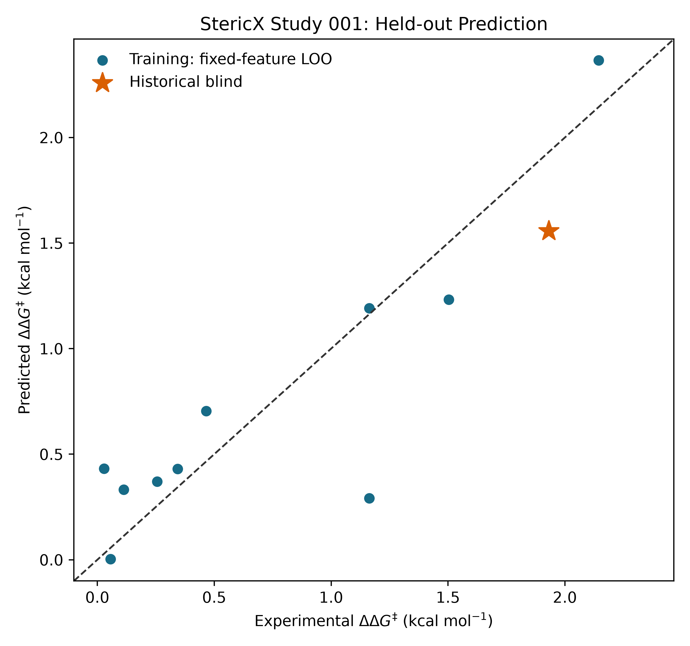
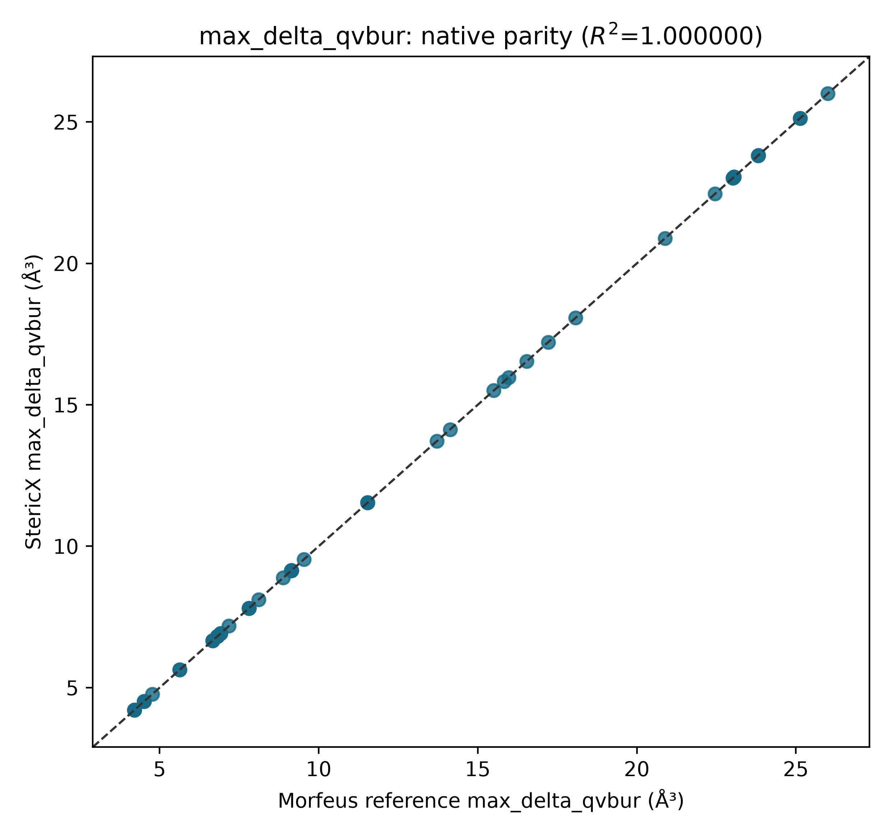
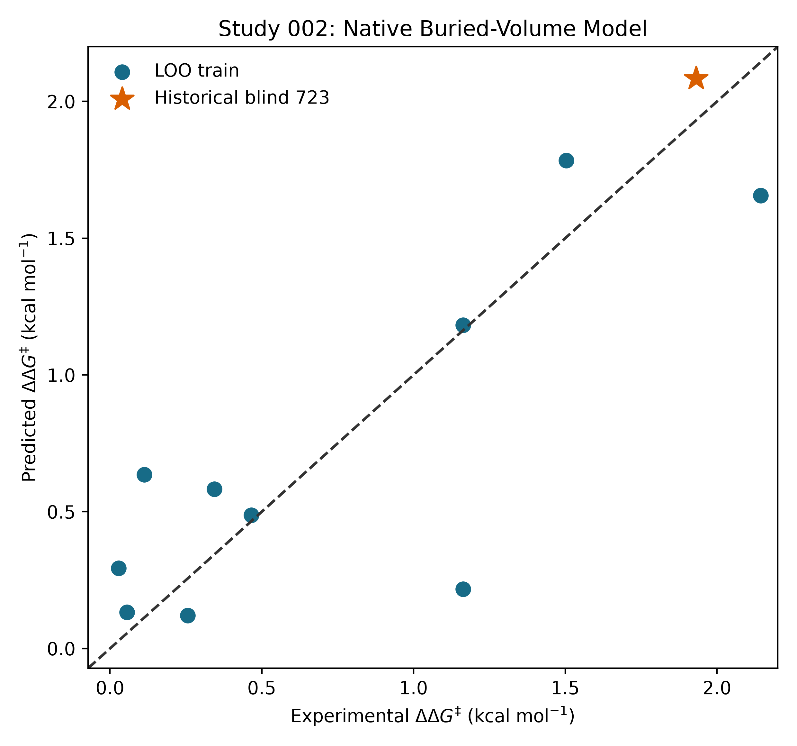
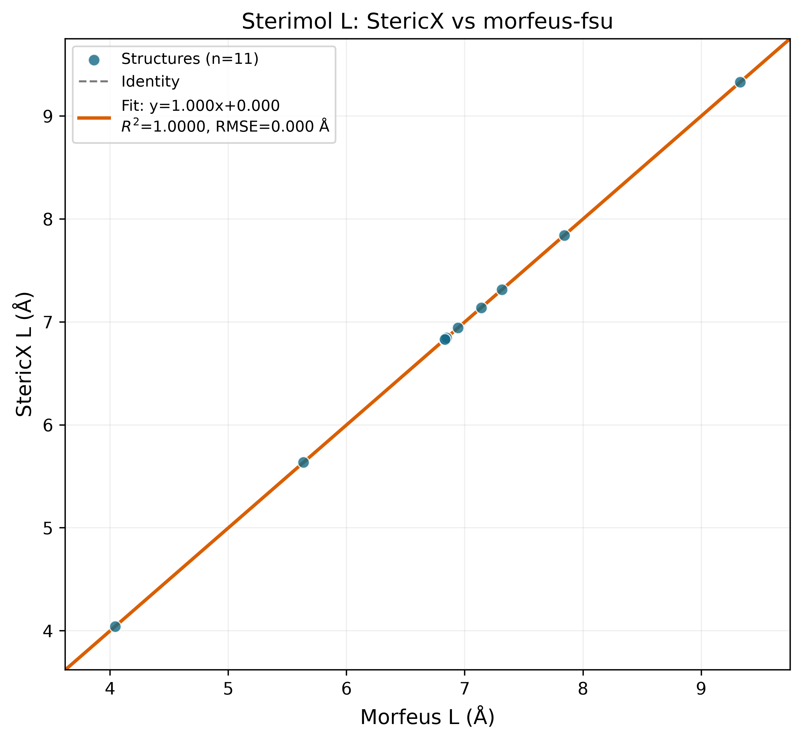
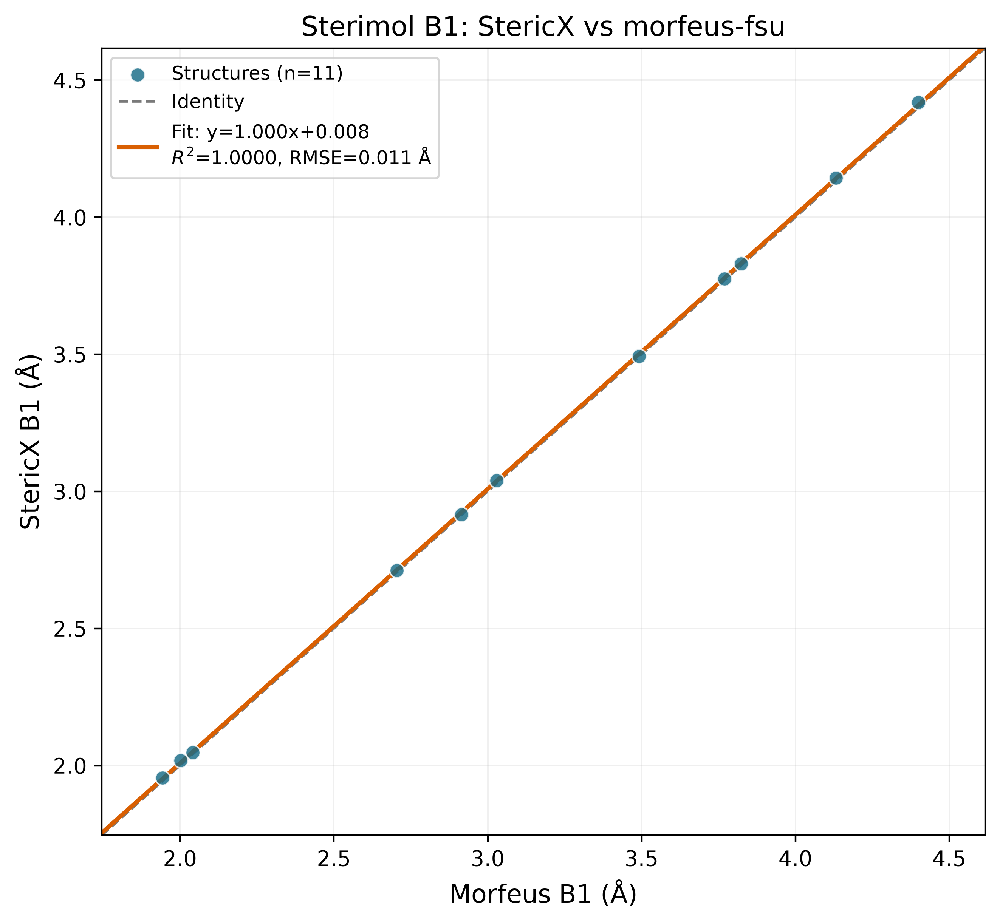
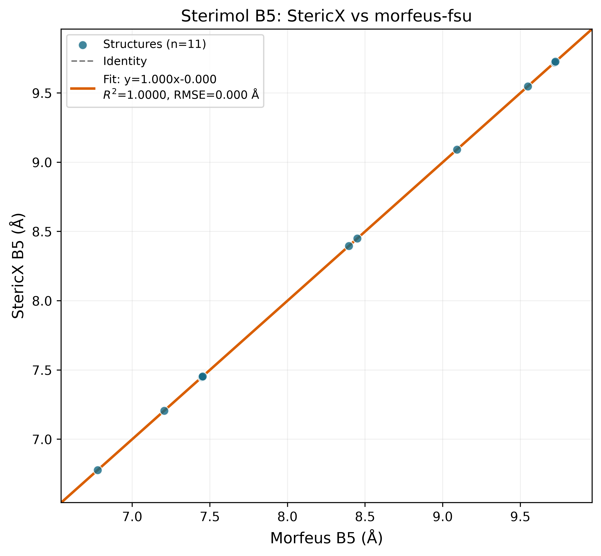

# StericX

StericX is a high-performance Rust engine for physical-organic molecular
featurization and reaction-selectivity inference. It calculates
three-dimensional Sterimol and coordination-aware buried-volume parameters
from Cartesian coordinates, stores reaction observations in cache-aligned
binary matrices, evaluates interpretable linear models with parallel SIMD
kernels, and converts predicted energy differences into product distributions
through the Eyring equation.

> [!NOTE]
> The checked-in chemical validation exceeds \(R^2 = 0.9999\) against
> `morfeus-fsu` for \(L\), \(B_1\), and \(B_5\). Results below are generated
> measurements rather than aspirational performance claims. The separate
> Ni-hDA reproduction also retains a weaker native-descriptor result instead
> of hiding a chemically important model failure.

## Key Systems Features

- **Zero-copy mapped reads:** reaction observations use an exact 64-byte
  `#[repr(C, align(64))]` layout. `bytemuck` provides POD byte casting and
  `memmap2` exposes `.sigpack` files as borrowed record slices without
  per-record deserialization.
- **Hardware SIMD inference:** the eight-feature RegressX dot product uses an
  explicit eight-lane AVX2 kernel on supported x86/x86-64 processors, with a
  portable unrolled fallback.
- **Parallel work-stealing:** `rayon` distributes independent inference rows
  across CPU workers. The prediction hot loop has no shared mutable model state
  or per-record locks.
- **Compact physical-organic features:** the model combines \(L\), \(B_1\),
  \(B_5\), donor NBO charge, IR frequency, and interpretable
  steric–electronic interaction terms.
- **Coordination-aware sterics:** a deterministic metal-centred voxel engine
  calculates total, quadrant, octant, near/far, and conformer-ensemble buried
  volumes using the public Kraken/Morfeus convention.
- **Transition-state kinetics:** Eyring calculations convert
  \(\Delta\Delta G^\ddagger\) into rate constants, R:S distributions, and
  enantiomeric excess.

## Build

The project requires a current stable Rust toolchain.

```bash
cargo build --release
cargo test --all-targets
```

For a machine-native optimized binary:

```bash
RUSTFLAGS="-C target-cpu=native" cargo build --release
```

Python tooling can be installed reproducibly with
[uv](https://docs.astral.sh/uv/):

```bash
uv sync --extra science
```

Then prefix Python workflows with `uv run`, for example
`uv run prepare_data.py`.

Study 003 optionally uses the exact public Kraken-era quantum toolchain. The
installer verifies the release-archive checksums and keeps the executables and
calculation cache under the ignored `.stericx/` directory:

```bash
./install_quantum_tools.sh
```

## Command-Line Interface

### Parse molecular structures

```bash
./target/release/stericx parse \
  --csv data/reactions_raw.csv \
  --xyz-dir data \
  --output data/reactions.sigpack
```

The reaction CSV contains:

```text
Reaction_ID,Ligand_XYZ_Path,Attach_Atom_Idx,Primary_Bond_Vector_Idx,NBO_Charge,IR_Frequency,Temp_K,Exp_ddG_kcal_mol
```

StericX parses each XYZ structure, aligns the attachment vector, calculates
Sterimol \(L\), \(B_1\), and \(B_5\), Boltzmann-averages conformer ensembles,
stores their minimum/maximum envelopes in the reserved binary slots, and
exports one 64-byte `PackedReactionRecord` per reaction.

### Calculate coordination-aware buried volume

```bash
./target/release/stericx buried-volume \
  --csv data/reactions_quantum.csv \
  --xyz-dir data \
  --output data/reactions_v2.sigpack \
  --per-conformer-output data/buried_volume_conformers.csv \
  --require-explicit-centers
```

The command places a virtual metal centre 2.1 Å from the donor, scans all
three donor-substituent quadrant orientations, and writes total, quadrant,
octant, near/far, and maximum-adjacent-quadrant descriptors. Per-conformer
values are reduced to Boltzmann, minimum, maximum, range, and
minimum-buried-volume-conformer statistics.

The v2 file begins with a validated 64-byte header. Each reaction then occupies
128 bytes: the unchanged v1 reaction record followed by one 64-byte buried
volume block. Dedicated v1 and v2 memory-mapped readers preserve backward
compatibility.

When the CSV supplies `Conformer_Coordination_Centers_Angstrom`, each
conformer can use an xTB localized-molecular-orbital centre. The
`--require-explicit-centers` gate prevents an accidental fallback to a
geometrically inferred direction.

### Run parallel regression

Weights may be provided as an eight-number JSON array:

```json
[0.10, 0.20, -0.10, 0.30, 0.50, -0.20, 0.10, 0.001]
```

Run inference with:

```bash
./target/release/stericx predict \
  --data data/reactions.sigpack \
  --weights weights.json
```

The eight model features are:

```text
[1, L, B1, B5, nbo_charge, B1*nbo_charge, B5*nbo_charge, ir_freq]
```

The command reports mapping latency, prediction latency, throughput, Rayon
thread count, RSS memory, and MSE against the packed experimental
\(\Delta\Delta G^\ddagger\) labels.

### Fit and freeze a scientific model

```bash
./target/release/stericx fit \
  --data data/reactions.sigpack \
  --metadata data/reactions_raw.csv \
  --output docs/study_001/stericx_model.json \
  --predictions docs/study_001/stericx_frozen_predictions.csv
```

The fitter learns scaling from training rows only, limits model complexity to
fewer than one term per three observations, rejects descriptor pairs with
\(|r| > 0.95\), and performs BIC-constrained forward selection. The model
artifact includes fixed-feature leave-one-out diagnostics, nested ridge and
LASSO baselines, bootstrap coefficient intervals, response permutation tests,
VIF values, correlations, applicability ranges, and leave-one-scaffold-group-out
validation using `Ligand_Group`.

Non-training predictions are written without experimental targets. Reveal them
in a separate command:

```bash
./target/release/stericx evaluate \
  --data data/reactions.sigpack \
  --metadata data/reactions_raw.csv \
  --model docs/study_001/stericx_model.json \
  --predictions docs/study_001/stericx_frozen_predictions.csv \
  --output docs/study_001/stericx_evaluation.json
```

### Simulate selectivity

```bash
./target/release/stericx simulate --ddg 1.82 --temp 298.15
```

Output includes the Eyring rate constant, major/minor percentages, R:S product
distribution, enantiomeric excess, execution time, and memory metrics.

## Preparing the Dataset

[`prepare_data.py`](prepare_data.py) downloads the public Sigman Group
Ni-catalyzed homo-Diels–Alder/Kraken table when available. It preserves the
complete 1,566-ligand source table and exact-download SHA-256 provenance,
identifies the ten published training ligands and historical holdout, and
generates deterministic ETKDGv3/MMFF94 conformer ensembles for measured rows.
Conformers are optimized, energy-windowed, and assigned normalized Boltzmann
weights before export.

```bash
python prepare_data.py
```

The generated scientific data products are:

```text
data/official/ni_hda_kraken.csv   Exact complete public source
data/official/provenance.json     Source URL, hash, counts, and split IDs
data/conformers/                   56 retained conformer geometries
data/reactions_raw.csv             10 training + 1 historical-blind reaction
```

An embedded 100-reaction synthetic benchmark is available for reproducible
offline testing:

```bash
python prepare_data.py --offline
```

## Ni-hDA Reproduction Study

[`study_ni_hda.py`](study_ni_hda.py) reproduces the published ten-ligand
enantioselectivity relationship using the preregistered Kraken descriptor
`vbur_max_delta_qvbur_min`. It writes and hashes the ligand-723 prediction
before revealing the experimental target.

```bash
python study_ni_hda.py --offline
```

Current measured results:

| Model | Training \(R^2\) | LOO \(Q^2\) | LOO RMSE | Historical-blind MAE |
|---|---:|---:|---:|---:|
| Published Kraken descriptor OLS | 0.8193 | 0.7521 | 0.3430 kcal/mol | 0.3730 kcal/mol |
| Curated descriptors, nested ridge | — | 0.6652 | 0.3986 kcal/mol | — |
| Curated descriptors, nested LASSO | — | 0.6558 | 0.4042 kcal/mol | — |
| Native StericX ensemble descriptors | 0.3625 | 0.0020 | 0.6882 kcal/mol | 0.6978 kcal/mol |

The native result is an intentional descriptor ablation. It shows that compact
Sterimol/NBO features do not replace the published coordination-aware
buried-volume descriptor for this small reaction family. The complete model
card, limitations, frozen prediction hashes, residuals, correlations, VIF
table, and machine-readable statistics are in
[`docs/study_001/STUDY_001.md`](docs/study_001/STUDY_001.md).



## Coordination-Aware Buried-Volume Study

[`study_buried_volume.py`](study_buried_volume.py) freezes the descriptor
definition from the public Kraken implementation, calculates a trusted
Morfeus reference on every retained conformer, executes the native Rust
implementation, validates `.sigpack` v2 aggregation, and reruns the unchanged
Ni-hDA train/holdout partition.

```bash
uv run --extra science python study_buried_volume.py
```

Current measured results:

| Validation target | Result | Status |
|---|---:|---|
| Native voxel geometry vs Morfeus | \(R^2 = 1.000000\), worst mean relative error \(0.000008\%\) | Pass |
| Native ensemble descriptor vs official Kraken | \(R^2 = 0.8626\), RMSE \(2.8740\) ų | Below preregistered target |
| Native buried-volume Ni-hDA model | Train \(R^2 = 0.7693\), LOO \(Q^2 = 0.6549\) | Below published LOO target |
| Historical blind ligand 723 | Absolute error \(0.1529\) kcal/mol | Pass |

The distinction matters: the Rust geometry kernel matches Morfeus to numerical
precision on identical structures, while inexpensive RDKit/MMFF conformers and
an inferred lone-pair direction do not fully reproduce Kraken's
CREST/xTB/DFT and localized-orbital workflow. Failed gates remain visible.
The complete specification, model card, frozen prediction, raw comparisons,
plots, and machine-readable results are in
[`docs/study_002/STUDY_002.md`](docs/study_002/STUDY_002.md).





## Quantum Geometry & Prospective Validation

Study 003 adds a checksum-pinned CREST 2.12/GFN2-xTB 6.4.0 backend, immutable
content-addressed caches, executable hashes, full command logs, exact
Kraken-compatible phosphorus LMO selection, and explicit per-conformer
coordination centres.

The inexpensive phase keeps the 56 existing ETKDGv3/MMFF94 conformers and
isolates the effect of replacing the inferred centre with the xTB LMO centre:

```bash
uv run --extra science python prepare_quantum_data.py --mode lmo
uv run --extra science python study_quantum_geometry.py --no-build
```

Current measured phase-A results:

| Validation target | Result | Gate |
|---|---:|---|
| All conformers have explicit xTB LMO centres | 56 / 56 | Pass |
| Native descriptor vs official Kraken | \(R^2 = 0.8517\), RMSE \(3.0317\) ų | Fail |
| Fixed-feature Ni-hDA model | LOO \(Q^2 = 0.6314\), RMSE \(0.4182\) kcal/mol | Fail |
| Historical replay of ligand 723 | Absolute error \(0.1902\) kcal/mol | Historical only |
| Frozen target-free prospective deck | 10 candidates, targets unaccessed | Pass |

The negative descriptor result is retained: changing the centre alone reduces
agreement from Study 002's \(R^2 = 0.8626\). This points to conformational
sampling as the next controlled variable. A full production ensemble uses the
same CREST profile recorded by Kraken:

```bash
uv run --extra science python prepare_quantum_data.py \
  --mode crest \
  --threads 4 \
  --lmo-workers 4 \
  --output-csv data/reactions_crest.csv \
  --provenance data/quantum/crest_provenance.json
```

CREST ensembles and xTB LMO property calculations occupy independent
content-addressed cache stages. CREST is committed durably before LMO work
begins; LMO jobs run in a CPU-bounded worker pool and checkpoint after every
completed conformer. Interrupted jobs resume from the existing CREST and LMO
caches, while PID/start-time-aware locks reclaim dead local owners without
stealing live work.

The full eleven-ligand ensemble is substantially more expensive than phase A.
The checked integration smoke test completed one ligand end to end with 59
CREST conformers and replayed its cached ensemble in 0.22 seconds; it remains
explicitly non-production. The
complete results, failed gates, historical-replay label, provenance, and
measurement-pending candidate deck are in
[`docs/study_003/STUDY_003.md`](docs/study_003/STUDY_003.md).

## Chemical Fidelity & Validation

[`validate_stericx.py`](validate_stericx.py) evaluates every structure in
`data/xyz/` with both StericX and `morfeus-fsu`. It uses identical attachment
indices and atomic radii, executes the optimized Rust CLI, calculates linear
regressions, and renders 400-DPI correlation plots.

```bash
python validate_stericx.py
```

### Correlation summary

The current checked-in validation run contains 11 structures.

| Parameter | \(R^2\) | Slope | Intercept (Å) | RMSE (Å) | Status |
|---|---:|---:|---:|---:|---|
| \(L\) | 1.000000 | 1.000000 | 0.000001 | 0.000000 | Validated |
| \(B_1\) | 0.999959 | 1.000249 | 0.008294 | 0.010539 | Validated |
| \(B_5\) | 1.000000 | 1.000000 | -0.000001 | 0.000001 | Validated |

The comparison uses Morfeus's uncorrected \(L\) value because both tools then
report the raw geometric extent \(\max_i(z_i + r_i)\). StericX scans \(B_1\)
at one-degree intervals while Morfeus uses a denser angular search; the
remaining discretization difference is 0.0105 Å RMSE.

### \(L\) correlation



### \(B_1\) correlation



### \(B_5\) correlation



## Hardware Benchmarks (Linux Workstation)

[`benchmark_linux.sh`](benchmark_linux.sh) builds StericX with
`-C target-cpu=native`, constructs a 10,000-structure workload, generates a
64 MB one-million-record mapped matrix, and collects Linux process metrics with
`/usr/bin/time -v`.

```bash
./benchmark_linux.sh
```

Current measured results:

| Workload | Items | Phase latency | Operations/sec | Throughput | Peak RAM |
|---|---:|---:|---:|---:|---:|
| Sterimol extraction | 10,000 molecules | 0.160964 s | 62,125.7 ops/s | 62,125.7 mol/s | 7.75 MB |
| Binary `.sigpack` packing | 10,000 records | 0.000176 s | 56,818,181.8 ops/s | 56.82 M records/s | 7.75 MB |
| RegressX SIMD prediction | 1,000,000 records | 0.003147 s | 317,762,948.8 ops/s | 317.76 M evals/s | 58.94 MB |

The extraction and packing latencies come from separate internal phase timers
inside one `parse` process. Consequently, their GNU `time` CPU, RSS, and page
fault measurements are shared. The mapped prediction workload recorded zero
major page faults and 3,176 minor page faults.

Machine-readable results, including CPU utilization and page faults, are stored
in [`docs/benchmark_results.json`](docs/benchmark_results.json). Run the
benchmark on any target workstation to replace these measurements with results
from that system.

## Binary Record Layout

Every legacy `.sigpack` v1 row occupies exactly one cache line:

```rust
#[repr(C, align(64))]
pub struct PackedReactionRecord {
    pub l: f32,
    pub b1: f32,
    pub b5: f32,
    pub nbo_charge: f32,
    pub ir_freq: f32,
    pub temp_k: f32,
    pub exp_ddg: f32,
    pub reserved: [f32; 9],
}
```

The format is a flat native-endian POD matrix intended for high-throughput
processing on the machine that generated it.

Version two adds a 64-byte `SigPackHeaderV2` and stores
`PackedReactionRecordV2` as two cache lines:

```rust
#[repr(C, align(64))]
pub struct PackedReactionRecordV2 {
    pub reaction: PackedReactionRecord,
    pub buried_volume: PackedBuriedVolumeRecord,
}
```

## Project Layout

```text
src/
├── geometry/     XYZ/SDF, Sterimol, and buried-volume descriptors
├── storage/      Cache-aligned schema and memory-mapped .sigpack I/O
├── model/        Scientific fitting, feature interactions, and SIMD inference
├── kinetics/     Eyring rates and enantiomeric distributions
└── main.rs       clap command-line interface
```

## License

Licensed under either the MIT License or the Apache License, Version 2.0.
