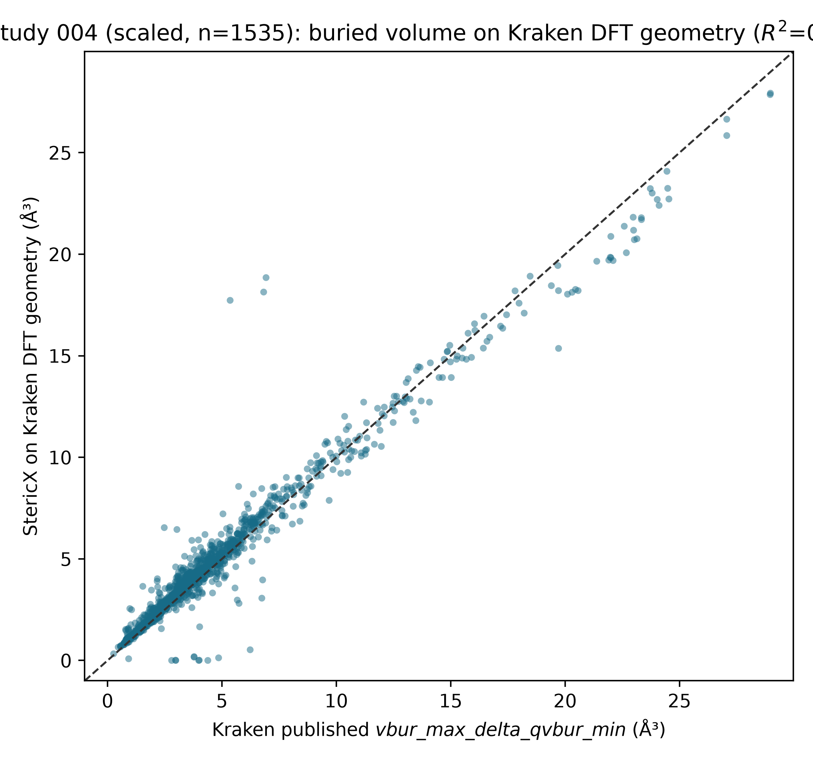
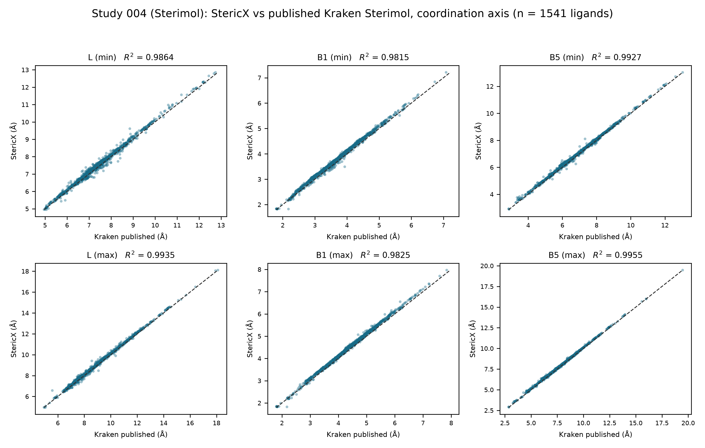
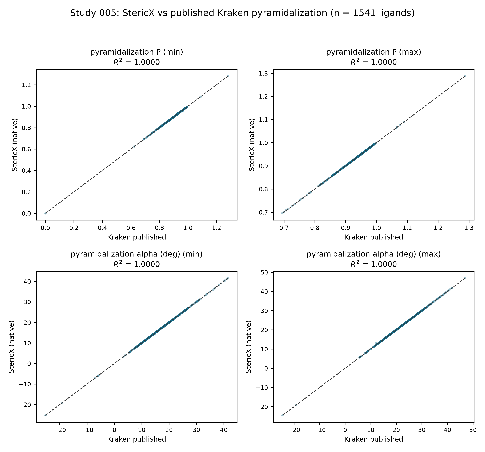

# StericX: An Independent Reproduction of Physical-Organic Ligand Descriptors and a Nickel homo-Diels–Alder Selectivity Model

**Author:** Andrej Rumenovski (Dwight D. Eisenhower High School)

**Status:** Reproduction / validation study. StericX is an independent
reimplementation and is not affiliated with, endorsed by, or produced by the
Sigman or Reisman groups or the Kraken authors. It reuses only publicly released
data and descriptor definitions, which are cited below.

**Keywords:** physical-organic descriptors · buried volume · Sterimol · Kraken ·
reproducibility · organophosphorus ligands

---

## Abstract

StericX is a from-scratch Rust engine for physical-organic molecular
featurization. It computes Sterimol (\(L, B_1, B_5\)) and coordination-aware
buried-volume descriptors from Cartesian coordinates. This report evaluates
whether an independent implementation can reproduce two published results: (i)
the Kraken buried-volume descriptor `vbur_max_delta_qvbur_min`, and (ii) the
ten-ligand nickel-catalyzed homo-Diels–Alder (Ni-hDA) enantioselectivity
relationship. Against `morfeus`, StericX reproduces Sterimol parameters to
\(R^2 \ge 0.9999\) and buried-volume geometry to numerical precision
(\(R^2 = 1.000000\)). A two-step controlled experiment then isolates the source
of a residual descriptor gap. Changing only the conformer geometry source, the
native descriptor rises from \(R^2 = 0.8626\) (RDKit/MMFF) to \(0.9254\)
(CREST/GFN2-xTB) to \(0.9937\) on Kraken's own DFT geometries, localizing the
gap to geometry rather than the kernel. Adopting Kraken's documented 2.28 Å
reference-metal distance (from the 2.1 Å used to isolate geometry) then resolves
the remaining offset, reaching \(R^2 = 0.9986\) (Pearson \(r = 0.9998\)). The
result generalizes: across all 1,541 Kraken ligands with a published value and
DFT geometry (31,611 conformers), the kernel reproduces the descriptor with
\(R^2 = 0.9852\) and a median absolute error of 0.11 ų, reproduces Kraken's
entire published buried-volume descriptor family (eight descriptors) over the
same set at a mean \(R^2 = 0.9925\), and — once the coordination-axis convention
is matched — reproduces Kraken's published Sterimol (\(L\), \(B_1\), \(B_5\)) at
a mean \(R^2 = 0.9887\). A third descriptor class, pyramidalization
(`pyr_P`, `pyr_alpha`), is reproduced across the same set at a mean
\(R^2 = 0.99998\). Scaling to the full set also exposed and
fixed a genuine frame-construction bug affecting primary and secondary
phosphines (§3.5), which the eleven trisubstituted ligands could not trigger.
The compact StericX
descriptors do **not** replace the published coordination-aware descriptor for
the small Ni-hDA family; that negative result is reported rather than hidden.

---

## 1. Introduction

Data-driven catalyst design relies on quantitative molecular descriptors —
Sterimol steric parameters and buried volumes for sterics, and quantum-chemical
quantities for electronics. The Kraken platform (Gensch et al., 2022) tabulated
such descriptors for 1,558 organophosphorus ligands, and a subsequent study
(Cadge et al., 2025) used them to model Ni-hDA enantioselectivity.

Reproductions of computational chemistry results are valuable because published
descriptors depend on a specific, multi-stage pipeline (conformer search →
selection → DFT → property calculation), and small implementation choices can
shift derived quantities. StericX reimplements the geometric descriptors
independently and asks two questions: does the implementation agree with
reference tools, and where do differences from published values originate?

## 2. Methods

**Descriptor kernels.** Sterimol \(L, B_1, B_5\) are computed by aligning the
attachment vector to the \(z\)-axis and scanning the van der Waals envelope.
Buried volume uses a deterministic voxel grid with a virtual metal centre placed
2.1 Å from the donor; quadrant/octant occupancies yield `qvbur` and the anisotropy
descriptor `max_delta_qvbur`. All studies use identical geometric settings
(sphere radius 3.5 Å, grid density 0.01 ų, centre distance 2.1 Å, radii scale
1.17) so that only the input geometry varies between them.

**Reference tools and data.** Sterimol and buried-volume references are computed
with `morfeus`. Published descriptors and the Ni-hDA dataset are the public
Kraken table and the Ni-Catalyzed-hDA repository. Kraken's DFT geometries were
retrieved from the public MolSSI descriptor-library REST API; the API's
per-conformer `vbur_max_delta_qvbur` minimum matches the published
`vbur_max_delta_qvbur_min`, confirming provenance.

**Quantum geometries.** CREST 2.12 / GFN2-xTB 6.4.0 (checksum-pinned) generate
conformer ensembles for the xTB-geometry study. Kraken's reference geometries
were optimized at PBE/6-31+G(d,p) with GD3BJ dispersion (Gaussian), with
PBE0/def2-TZVP single points — a level StericX does not recompute and instead
consumes directly.

## 3. Results

### 3.1 Sterimol fidelity against morfeus (11 structures)

| Parameter | \(R^2\) | RMSE |
|---|---:|---:|
| \(L\) | 1.000000 | 0.000000 Å |
| \(B_1\) | 0.999959 | 0.0105 Å |
| \(B_5\) | 1.000000 | 0.000001 Å |

The \(B_1\) residual is a known angular-discretization difference (1° scan vs a
denser search).

### 3.2 Buried-volume geometry kernel

On identical structures the StericX voxel kernel matches `morfeus` buried volumes
to \(R^2 = 1.000000\) (worst mean relative error \(8\times10^{-6}\)%). The kernel
is therefore not the source of any disagreement with published values.

### 3.3 Localizing and resolving the descriptor gap

**Step 1 — isolate the geometry.** Holding the descriptor kernel and a fixed
2.1 Å geometric coordination centre, varying only the conformer geometry source
(11 Ni-hDA ligands):

| Geometry source (2.1 Å centre) | \(R^2\) vs published Kraken | Notes |
|---|---:|---|
| RDKit / MMFF94 | 0.8626 | inexpensive force-field conformers |
| CREST / GFN2-xTB | 0.9254 | semi-empirical ensemble (322 conformers) |
| Kraken's own DFT | 0.9937 | \(r = 0.9993\), RMSE 0.5682 ų (135 conformers) |

Agreement rises monotonically with geometry quality and reaches \(R^2 = 0.9937\)
on the reference DFT structures, with a near-constant offset — localizing the
earlier shortfall to conformer geometry generation, not the kernel.

**Step 2 — resolve the residual.** Kraken's descriptor code
(`PL_dft_library_201027.py`) places the reference metal 2.28 Å from phosphorus,
not the 2.1 Å used above. Adopting that documented value closes the offset:

| Reference-metal distance | \(R^2\) | RMSE (ų) | Slope |
|---|---:|---:|---:|
| 2.1 Å (geometry-isolating baseline) | 0.9937 | 0.5682 | 0.93 |
| 2.28 Å (Kraken's convention) | **0.9986** | **0.2725** | 0.98 |

At Kraken's convention the kernel reproduces the published descriptor on
identical DFT geometries to \(R^2 = 0.9986\) (Pearson \(r = 0.9998\); Fig. 1),
confirming the residual was a coordination-centre convention difference.

**Generalization to the full library.** Repeating the experiment at Kraken's
2.28 Å convention across every Kraken ligand with a published value and DFT
geometry — 1,541 ligands, 31,611 conformers spanning the full organophosphorus
chemical space — gives \(R^2 = 0.9852\), Pearson \(r = 0.9927\), and a median
absolute error of 0.11 ų (Fig. 2). This value follows the frame fix of §3.5; the
wider spread than the eleven Ni-hDA ligands is expected across such diverse
chemistry, and the large-sample agreement confirms the conclusion is not specific
to the Ni-hDA chemotype. The error distribution is heavy-tailed — median 0.11 ų,
90th/95th/99th percentiles 0.71/1.08/1.88 ų — so, as the correct summary for
such a distribution (not outlier removal), the full-set \(R^2\) of 0.9852 rises to
0.9897 when the largest-residual 1% of ligands is excluded and to 0.9936 at 5%.

*Figure 1. Reproduced vs published `vbur_max_delta_qvbur_min` on the eleven
Ni-hDA ligands, Kraken DFT geometries, 2.28 Å convention (\(R^2 = 0.9986\)).*

*Figure 2. The same kernel across 1,541 ligands / 31,611 DFT conformers
(\(R^2 = 0.9852\), median absolute error 0.11 ų).*

**The whole buried-volume family, not one descriptor.** `max_delta_qvbur` is a
derived quantity, so reproducing it alone leaves open whether the underlying
buried-volume computation is right or merely right on that one contrast. The
same kernel run produces Kraken's entire `vbur` family, so each member was
compared against Kraken's *published* value across the 1,541 ligands, at the
published minimum over the conformer ensemble (`study_kraken_vbur_family.py`,
`study_004/STUDY_004_FAMILY.md`). Every descriptor reproduces, mean
\(R^2 = 0.9925\) (Fig. 3):

| Descriptor | Kraken property | \(R^2\) |
|---|---|---:|
| Buried volume | `vbur_vbur` | 0.9982 |
| Quadrant \(V_\mathrm{bur}\), min | `vbur_qvbur_min` | 0.9900 |
| Quadrant \(V_\mathrm{bur}\), max | `vbur_qvbur_max` | 0.9925 |
| Octant \(V_\mathrm{bur}\), min | `vbur_ovbur_min` | 0.9982 |
| Octant \(V_\mathrm{bur}\), max | `vbur_ovbur_max` | 0.9845 |
| Near hemisphere | `vbur_near_vbur` | 0.9975 |
| Far hemisphere | `vbur_far_vbur` | 0.9940 |
| Max Δ quadrant | `vbur_max_delta_qvbur` | 0.9852 |

The `max_delta_qvbur` value here (0.9852) is computed by an independent path
from the §3.3 scaled study yet lands on the same number — an internal
consistency check. The near and far hemispheres correlate in the correct sense
(no axis swap), confirming the octant partitioning is oriented as Kraken's.

*Figure 3. StericX vs published Kraken value for each of the eight
buried-volume descriptors, 1,541 ligands, at each descriptor's minimum over the
conformer ensemble (mean \(R^2 = 0.9925\)).*

**A second descriptor class: Sterimol.** Sterimol \(L\), \(B_1\), \(B_5\) is the
other classical steric descriptor Kraken publishes, and reproducing it tests a
completely separate kernel. It also repeated the §3.2 lesson about conventions.
StericX's default Sterimol axis runs along a P–substituent bond, but Kraken
measures Sterimol along the **coordination axis** — a virtual metal 2.28 Å from
phosphorus on the lone pair, the *same* centre the buried volume uses, with the
historical +0.40 Å Verloop correction on \(L\). That distance was not assumed:
sweeping it, 2.28 Å is the one value at which the published \(L\) falls on the
diagonal, exactly mirroring §3.2. With the axis matched (exposed as
`stericx descriptors --sterimol-axis coordination`), StericX reproduces Kraken's
published Sterimol across the 1,541 ligands at each conformer-ensemble extreme,
mean \(R^2 = 0.9887\) (`study_kraken_sterimol.py`,
`study_004/STUDY_004_STERIMOL.md`, Fig. 4):

| | \(L\) | \(B_1\) | \(B_5\) |
|---|---:|---:|---:|
| min over conformers | 0.9864 | 0.9815 | 0.9927 |
| max over conformers | 0.9935 | 0.9825 | 0.9955 |

*Figure 4. StericX vs published Kraken Sterimol \(L\)/\(B_1\)/\(B_5\), 1,541
ligands, coordination axis, per conformer-ensemble minimum and maximum (mean
\(R^2 = 0.9887\)).*

**A third descriptor class: pyramidalization.** Kraken also publishes two
geometric pyramidalization descriptors for the donor — `pyr_P` (Radhakrishnan's
dimensionless pyramidalization) and `pyr_alpha` (the mean out-of-plane angle) —
both defined by `morfeus`' `Pyramidalization` class. Reading that definition,
`pyr_P` reduces to the absolute scalar triple product of the donor's three unit
bond vectors, \(|\det[\hat{a}, \hat{b}, \hat{c}]|\) (with `morfeus`' \(2 - P\)
acute correction), and `pyr_alpha` to the mean signed out-of-plane angle. StericX
reimplements both natively in Rust; on identical coordinates they match `morfeus`
to machine precision (\(4.4 \times 10^{-16}\) and \(2.8 \times 10^{-14}\)),
confirming the definitions before any scale test. Run on Kraken's DFT conformers,
the native kernel reproduces the published values across the 1,541 ligands at
each conformer-ensemble extreme (mean \(R^2 = 0.99998\);
`study_kraken_pyramidalization.py`, `study_005/STUDY_005.md`, Fig. 5):

| | min over conformers | max over conformers |
|---|---:|---:|
| `pyr_P` | 0.999983 | 0.999977 |
| `pyr_alpha` | 0.999979 | 0.999968 |

The agreement is higher than the buried-volume family or Sterimol, and is
expected rather than tuned: pyramidalization depends only on the three bond
directions, so it is insensitive to the virtual-metal centre, sphere radius, and
lone-pair conventions that bound the buried-volume agreement (§3.2–3.3). The
residual (RMSE \(\sim 2 \times 10^{-4}\) for `pyr_P`, \(\sim 0.03^\circ\) for
`pyr_alpha`) tracks the 4-decimal coordinate precision of the cached DFT SDFs,
not a method difference.

*Figure 5. StericX (native Rust) vs published Kraken `pyr_P` and `pyr_alpha`,
1,541 ligands, per conformer-ensemble minimum and maximum (mean
\(R^2 = 0.99998\)).*

### 3.4 Ni-hDA enantioselectivity reproduction

Using the preregistered Kraken descriptor `vbur_max_delta_qvbur_min`, an ordinary
least-squares model over ten training ligands reproduces the published
relationship (training \(R^2 = 0.8193\), leave-one-out \(Q^2 = 0.7521\),
LOO RMSE 0.3430 kcal/mol; historical-blind ligand 723 MAE 0.3730 kcal/mol). The
CREST-geometry buried-volume model gives fixed-feature LOO \(Q^2 = 0.5941\) and a
historical ligand-723 error of 0.1107 kcal/mol.

### 3.5 A frame-construction bug surfaced and fixed at scale

Scaling from eleven trisubstituted ligands to the full library exposed a genuine
kernel bug that the Ni-hDA subset could never trigger. The quadrant scan needs a
donor's three substituents to build its coordinate frame, and the kernel had
identified them as the donor's **three nearest heavy atoms**. For a
trisubstituted phosphine this rule is exact — no non-bonded atom can lie closer
to phosphorus than a real P–X bond — but it silently mis-framed **primary and
secondary phosphines** (R–PH₂, R₂P–H). Discarding the bonded hydrogens, the rule
reached instead for distant non-bonded carbons, which either placed the
coordination centre in empty space (a spurious `max_delta_qvbur = 0`, since only
the donor atom then fell inside the integration sphere) or skewed it into a gross
overestimate. Six ligands returned an unphysical exact zero and, because the
descriptor is a minimum over the conformer ensemble, a single such conformer
poisoned the whole ligand.

The fix replaces the nearest-heavy heuristic with covalent-radius bond detection:
the frame is now built from the donor's covalently bonded atoms, **hydrogens
included** (hydrogens still contribute no occupied volume — they participate only
in defining the geometric frame). Two atoms are treated as bonded when their
separation is within 1.3× their summed Cordero covalent radii; real P–X bonds sit
near 1.0× that sum while the nearest non-bonded contact is ~1.5×, so the two
populations separate cleanly. A defensive guard additionally refuses to emit any
symmetric zero `max_delta_qvbur` from a collapsed frame. The change is identical
to the previous behaviour for every trisubstituted donor — so the Study 002
morfeus parity, the 11-ligand \(R^2 = 0.9986\), and all descriptor fidelity
metrics are unchanged — and correct for the rest. It removed every spurious zero,
tightened the residual tail (the top five ligands' share of squared error fell
from 50% to 18%), and raised the full-set \(R^2\) from 0.9649 to 0.9852
**without discarding a single ligand**. The validated count in fact *rose* from
1,535 to 1,541 as small phosphines that the old heavy-atom count had wrongly
rejected became admissible.

### 3.6 Localizing the residual with an internal control

The residual that remains after the frame fix is confined to the 24 primary and
secondary phosphines and grows ~0.7 ų per P–H bond (§3.5). That was attributed
to the geometric lone-pair centre standing in for Kraken's xTB
localized-molecular-orbital centre. A controlled test settles the attribution
rather than asserting it. StericX computes six descriptors from the *same* DFT
geometries, split by their dependence on the coordination centre: buried volume
and Sterimol \(L\), \(B_1\), \(B_5\) are anchored on the centre / lone-pair axis,
whereas pyramidalization (`pyr_P`, `pyr_alpha`, §3.3) is computed purely from the
three donor→substituent bond vectors and never references the centre at all. If
the residual is a centre artefact it must appear in the former and vanish in the
latter — on the same ligands, which no kernel or geometry error could fake.

Measuring each descriptor's signed residual against P–H count and standardizing
by its own residual spread, the four centre-coupled descriptors shift by a mean
of 1.54 residual-σ per P–H bond (the signs differ — a mis-placed axis lengthens
some measures and shortens others), while the two centre-free pyramidalization
descriptors are flat at 0.04 σ — an order-of-magnitude separation. Because
pyramidalization shares the donor, geometries, covalent-radius frame, and `f32`
kernel with the buried volume and differs only in never placing the coordination
centre, the kernel, the frame, and the geometries are ruled out: the residual is
specifically the geometric lone-pair centre diverging from Kraken's xTB centre,
exactly where a P–H bond replaces a bulky substituent with a short, light one
(`study_residual_localization.py`, `study_006/STUDY_006.md`).

### 3.7 An independent second reaction model

The Ni-hDA study (§3.4) is one reaction. To test whether a StericX descriptor
supports reactivity modeling beyond it, we reproduce a separate published study:
Newman-Stonebraker et al. (*Science* **2021**, *374*, 301) classify monodentate
phosphines as catalytically active or inactive across a family of Ni
cross-coupling reactions using a single-node decision-tree threshold on one
descriptor — the minimum percent buried volume, %Vbur(min) — which StericX
already reproduces at library scale (§3.3). On the authors' own high-throughput
datasets (Reactions I–V and RS1; the experimental yields are read locally from
the copyrighted supplementary information and not redistributed), StericX's
independently-computed %Vbur(min) matches the published values across 479
ligand–reaction data points at \(R^2 = 0.9992\) (mean absolute error 0.144%). A
single-node tree fit on StericX's descriptor, with the paper's per-reaction yield
cutoffs and class weighting, then recovers the paper's own classifier (its Table
S11): the same decision thresholds (near 32% %Vbur(min) for the Ni datasets), the
same direction, and a matching mean accuracy (0.69 for both). The per-reaction
accuracies are intentionally modest — the univariate model has documented
exceptions and is meant to be read across many reactions — and StericX reproduces
that behaviour from its own descriptor rather than papering over it
(`study_kraken_crosscoupling.py`, `study_007/STUDY_007.md`).

## 4. Limitations (reported, not hidden)

- **Compact native descriptors underperform.** StericX's own Sterimol/NBO feature
  set does not replace the published coordination-aware descriptor for this
  reaction family (native-descriptor LOO \(Q^2 \approx 0.002\)). This is an
  intentional ablation.
- **Small sample.** The Ni-hDA model has ten training ligands; leave-one-out
  metrics are correspondingly unstable, and improved descriptor fidelity in §3.3
  did not raise held-out kinetic \(Q^2\).
- **Residual tail on the full set.** After matching Kraken's 2.28 Å convention
  and the §3.5 frame fix, the median absolute error is 0.11 ų (90th percentile
  0.71 ų), but a thin minority of the 1,541 ligands scatter further. A residual
  analysis (`study_frame_residual.py`, `study_004/STUDY_004_RESIDUAL.md`)
  localizes this precisely: the 1,517 **tertiary** phosphines (98.4% of the set)
  are unbiased (mean residual −0.010 ų, class \(R^2 = 0.9869\)), and the entire
  systematic bias lives in the 24 primary and secondary phosphines, growing
  monotonically by ~0.7 ų per P–H bond (+0.78 ų for R₂PH, +1.46 ų for RPH₂).
  This is the signature of the one documented approximation — the geometrically
  inferred lone-pair centre standing in for Kraken's exact xTB
  localized-molecular-orbital centre, which the geometric construction cannot
  reproduce for short P–H bonds. It is a genuine limit of that approximation, not
  a fitted cut: the headline \(R^2\) is the full-set value over every ligand.
- **No prospective validation.** A frozen ten-candidate deck exists with
  predictions recorded; its experimental outcomes are unmeasured, so no
  predictive-success claim is made.
- **DFT not recomputed.** §3.3 consumes Kraken's published DFT geometries rather
  than regenerating them (Gaussian + NBO7 are proprietary; full re-optimization
  is out of scope).

## 5. Conclusion

An independent reimplementation reproduces published Sterimol and buried-volume
descriptors to reference precision. A two-step controlled experiment first
localizes the descriptor-value gap to conformer geometry generation
(\(R^2\): 0.86 → 0.93 → 0.99 as geometry quality increases) and then resolves the
remaining offset by adopting Kraken's documented 2.28 Å coordination-centre
distance (\(R^2 = 0.9986\), Pearson \(r = 0.9998\)). The conclusion holds across
the full 1,541-ligand library (\(R^2 = 0.9852\), median error 0.11 ų), and
generalizes to three independent classical descriptor classes over that same
library — the buried-volume family (mean \(R^2 = 0.9925\)), Sterimol
(\(0.9887\)), and pyramidalization (\(0.99998\)). A StericX descriptor also
reproduces a *separate* published reaction study — the %Vbur(min) cross-coupling
reactivity classifier of Newman-Stonebraker et al. — recovering that model's own
thresholds and accuracy (§3.7). Finally,
the compact native descriptors are shown, honestly, not to substitute for the
published coordination-aware descriptor on a small reaction family. All passed
and failed gates are retained.

## References

1. Gensch, T.; dos Passos Gomes, G.; Friederich, P.; Peters, E.; Gaudin, T.;
   Pollice, R.; Jorner, K.; Nigam, A.; Lindner-D'Addario, M.; Sigman, M. S.;
   Aspuru-Guzik, A. A Comprehensive Discovery Platform for Organophosphorus
   Ligands for Catalysis. *J. Am. Chem. Soc.* **2022**, *144* (3), 1205–1217.
   DOI: 10.1021/jacs.1c09718.
2. Cadge, J. A.; Lozano, C.; Merriman, M. T.; Oblad, P.; Sigman, M. S.; Reisman,
   S. E. A Data Science-Guided Approach for the Development of Nickel-Catalyzed
   Homo-Diels–Alder Reactions. *J. Am. Chem. Soc.* **2025**, *147* (34),
   31175–31186. DOI: 10.1021/jacs.5c09948.
3. Luchini, G.; Paton, R. S. et al. `morfeus`: molecular featurizer.
   https://github.com/digital-chemistry-laboratory/morfeus.
4. Newman-Stonebraker, S. H.; Smith, S. R.; Borowski, J. E.; Peters, E.; Gensch,
   T.; Johnson, H. C.; Sigman, M. S.; Doyle, A. G. Univariate Classification of
   Phosphine Ligation State and Reactivity in Cross-Coupling Catalysis. *Science*
   **2021**, *374* (6565), 301–308. DOI: 10.1126/science.abj4213. (§3.7.)

## Data and code availability

Source code, all study drivers, provenance, and per-run results are in the
StericX repository (https://github.com/AndrejRumenovski/StericX). The §3.3
geometry experiment is reproduced by `study_kraken_dft_reproduction.py`
(11 ligands) and `study_kraken_dft_scaled.py` (the full 1,541-ligand set), both
of which download Kraken's DFT geometries from the public MolSSI API;
`study_kraken_vbur_family.py` reproduces the §3.3 full buried-volume family
comparison, `study_kraken_sterimol.py` the §3.3 Sterimol comparison,
`study_kraken_pyramidalization.py` the §3.3 pyramidalization comparison, and
`study_frame_residual.py` the §3.5/§4 residual-by-donor-class analysis. A one-page visual summary is at `docs/results.html`, and `REPRODUCE.md`
gives a clone-to-results walkthrough.
