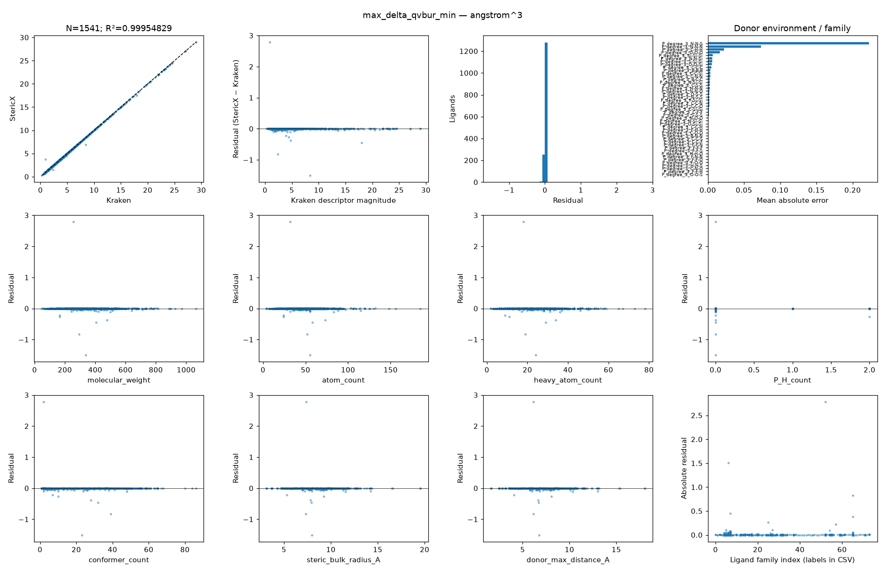
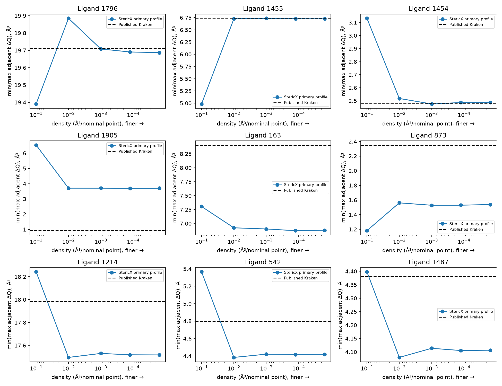

# StericX ↔ Kraken residual forensics

Investigation completed on the fixed historical cohort: **1,541 ligands, 31,611 conformers, 14 native fields × four ensemble reductions = 56 comparisons**. No ligand, conformer or outlier was removed. Percent buried volume is an explicitly derived reference, not a fourteenth independently published quantity.

**Substantially closer reproduction is possible through documented input and convention changes. Universal R² ≥ 0.99999 against the historical library is not supported by the available inputs.** For the original comparison descriptor, `max_delta_qvbur_min`, historical-reference R² improves from **0.985157517886 to 0.999548287583**, MAE from **0.27045059 to 0.00689398259 ų**, and RMSE from **0.490605201 to 0.0855874123 ų**. This is one descriptor, not an aggregate score.

On identical **available** geometries, all 14 direct per-conformer native-versus-Morfeus comparisons exceed 0.99999; the limiting field is sampled B1. This does **not** establish identical historical inputs. The verified exact-historical-geometry subset is **N = 0**, with R² undefined. Some minimum-volume-conformer reductions amplify a one-cell volume difference into a large change in another descriptor.

Every comparison has a machine-readable dossier. Many historical causes remain **UNRESOLVABLE FROM AVAILABLE DATA**. It would be unjustified to claim that every remaining residual has a uniquely identified geometry, conformer or reference-data cause. This report distinguishes measured explanations from those unresolved alternatives.

## 1. Frozen starting point and reference identity

The accepted C2 executable, source, tests, conventions, all input SDFs, request streams, native observations, prior independent observations and reference snapshots are preserved in [frozen/manifest.json](frozen/manifest.json). Source commit: `ce97f6d98b404710eaed38e9af6cad33a0a98e7c`. Native executable SHA-256: `b233501640e4d06555a36a278581fbf9cb011962311f205c81f3fc9a83ae89e6`. Frozen manifest SHA-256: `73ee1518d8ea548662307f3b78fa96435509ef69343d0909e0eae87a6463bc69`.

The baseline is the scientifically validated current implementation, not the older pre-remediation result also preserved in `frozen/historical_1541_predictions.csv`. Its comparison requests already use a 2.28 Å center distance; the general library default remains 2.1 Å. The baseline center direction is the sum of unit donor-bond vectors, its volume density is 0.01 ų, and its public total/near/far volumes average three planes. Raw replay confirms the frozen outputs exactly.

Two reference versions must be kept separate. The earlier campaigns in `baseline/`, `campaigns/` and `results/` score the **frozen current API**. The authoritative historical comparison in this report uses **`frozen/historical_reference.csv`**, matching the original SI wherever SI rows exist. `historical_target/` rescores every stage against that fixed historical snapshot without changing predictions. API and historical reference differ substantively for **821 and 1036**; the largest difference is 1.34503339 ų in ligand 821 far volume. The API-target headline R² is 0.999548287730, MAE 0.0068933035, RMSE 0.0855873998. Both sets remain complete.

The paper SI contains 1,558 ligands, whereas this requested cohort comes from the earlier 1,541-row comparison. Eight cohort IDs—724, 1057, 1058, 2059, 2062, 2063, 2064 and 2067—lack rows in that SI workbook. They remain in the full comparison using the frozen historical CSV; their precise original publication provenance is unresolved. No unavailable SI row is silently replaced or removed.

See [screened reference differences](historical_target/substantive_reference_version_differences.csv), [all snapshot comparisons](provenance_analysis/reference_snapshot_comparison.csv.gz), and [historical-target completion/erratum](historical_target/complete.json). The screening file uses 1e-7 and also flags five SI-absent IDs (2059, 2062, 2063, 2064, 2067) whose smaller differences are explained by CSV decimal precision. An independent [literal-decimal quantization audit](historical_target/reference_precision_v2/complete.json) confirms that only 821 and 1036 differ beyond the sum of half a unit in each source's final serialized decimal place. The older dossier text describing 1e-8 as the maximum reference-snapshot difference was incorrect; its compatibility label is only a descriptive small-error threshold, not a universal uncertainty bound. Also, the older snapshot-audit rows labelled percent volume carry the underlying absolute-volume reference; the historical-target comparison applies the proper percent conversion. Neither issue changes the preserved native outputs.

## 2. Definitions and descriptor-by-descriptor metrics

Residual means StericX minus Kraken. R² is `1 − SSE/SST`, using Kraken variance; it is not Pearson r squared. Slope/intercept describe the ordinary diagnostic regression of StericX on Kraken and are never used to alter predictions. Each descriptor is scored separately in its own units. Min/max span every available conformer; delta is max minus min; `vburminconf` reads the descriptor of the conformer selected by minimum total volume.

All nine requested statistics, plus signed mean error, SSE, SST and the investigative target's SSE budget, are saved for all 56 comparisons. Full baseline and final tables are appended below. [Historical stage metrics](historical_target/stage_metrics.csv), [API stage metrics](results/stage_metrics.csv), [historical final CSV](historical_target/final/metrics.csv), and [baseline CSV](historical_target/baseline/metrics.csv) retain full precision. There are zero missing calculated comparisons: 86,296 rows at every stage.

Boltzmann averages, minimum-energy conformers, electronic descriptors and other Kraken fields outside the implemented comparison are not assigned invented values. Historical corrected energies/weights are unavailable. A complete historical Boltzmann reproduction cannot be established from these data.

## 3. Ranked residuals and distributions

Every metric has a complete rank 1–1541 table with reference, prediction, signed/absolute residual and conformer IDs: [final rankings](historical_target/final/rankings/) and [baseline rankings](historical_target/baseline/rankings/). Top 10, 25, 50 and 100 membership and squared-error concentration are explicitly recorded in [final top-k evidence](historical_target/final/top_10_25_50_100.json). All top-100 rows were traced through geometry, frame, conformer extrema and independent-reference observations; this was an automated full-coverage investigation, supplemented by the focused case diagnoses below, not 5,600 separate manual molecular inspections.

For `max_delta_qvbur_min`, the final top three contribute **94.8011%** of SSE. This concentration is a finding, not grounds for deletion. The complete baseline/API top-k concentration history is in [report_evidence/worst_case_concentration.csv](report_evidence/worst_case_concentration.csv).

| Rank | Ligand | Kraken | StericX | Residual | Absolute residual |
| --- | --- | --- | --- | --- | --- |
| 1 | 1905 | 0.919350191 | 3.705640793 | 2.786290602 | 2.786290602 |
| 2 | 163 | 8.406981613 | 6.902970314 | -1.504011299 | 1.504011299 |
| 3 | 873 | 2.351193663 | 1.529111862 | -0.8220818008 | 0.8220818008 |
| 4 | 1214 | 17.98537644 | 17.53040695 | -0.4549694881 | 0.4549694881 |
| 5 | 542 | 4.798610555 | 4.419993401 | -0.3786171544 | 0.3786171544 |
| 6 | 1487 | 4.380248693 | 4.113543034 | -0.2667056594 | 0.2667056594 |
| 7 | 1522 | 3.885535791 | 3.662757874 | -0.2227779175 | 0.2227779175 |
| 8 | 793 | 1.629519452 | 1.522837639 | -0.1066818131 | 0.1066818131 |
| 9 | 358 | 4.671010187 | 4.571649551 | -0.09936063561 | 0.09936063561 |
| 10 | 1026 | 4.113543006 | 4.016274452 | -0.09726855379 | 0.09726855379 |

Each of the 56 baseline and final plots includes a scatter with y=x, residual versus reference, histogram, and diagnostics versus molecular weight, atom count, heavy-atom count, donor H count, conformer count, bulk radius and donor extent. [Standalone family plots](family_plots_v2/) provide readable labels and every individual residual, plus baseline/final MAE by family, for the frozen API comparison. Its only substantive reference differences are the two ligands identified above. Families are declared structural proxies (donor-neighbor elements and aromatic-neighbor count), not hand-selected classes that optimize correlation.

## 4. Structured chemistry and geometry associations

The baseline error is structured. For the original API comparison, headline absolute error correlates with donor H count (Pearson 0.303) and descriptor magnitude (0.313). Raw-vector and source-grid reproduction reduces those correlations to 0.010 and 0.005. Baseline MAE is 0.781 ų for P–H ligands (N=9) and 1.457 ų for P–H₂ ligands (N=15); final MAEs are 0.00116 and 0.0181 ų. One remaining P–H₂ case, ligand 1487, dominates that small group's error. These observations support a donor-frame convention effect; they do not justify class-specific corrections.

The final headline has weak Pearson associations with molecular weight, atom count, conformer count and bulk (absolute values ≤0.022). Spearman associations can differ and are reported, not suppressed. The pattern is now a narrow central distribution plus a few large historical reconstruction discrepancies, rather than a universal proportional bias. There is no scientific basis for rescaling.

[Stratified metrics](historical_target/final/stratified_metrics.csv), [all feature associations](historical_target/final/residual_associations.csv), [stage-by-family effects](report_evidence/stage_family_metrics.csv) and [geometric proxy associations](report_evidence/geometric_proxy_associations.csv) contain the complete analysis. Historical coordinate RMSD cannot be correlated with residuals because it is unavailable. Present-day intraensemble RMSD is a different quantity: it uses one graph isomorphism and is only an upper bound to symmetry-minimized RMSD, not proof of historical mismatch. No causal inference is made from those proxy correlations.

## 5. Geometry provenance for all 1,541 ligands

[Ligand provenance](provenance_analysis/ligand_provenance.csv) and [31,611 conformer records](provenance_analysis/conformer_provenance.csv.gz) identify the source, atom identities, donor/neighbors, API membership, input hashes, available conformer IDs/counts, measured RMSD and missing historical fields.

| Class | Meaning | Verified N | Interpretation |
| --- | --- | ---: | --- |
| A | Exact historical geometry and relevant ensemble identity | 0 | No affirmative historical mapping recovered |
| B | Demonstrably different DFT geometry of the same ligand | 0 | DFT export labels alone do not establish this |
| C | Regenerated geometry | 0 | StericX did not regenerate this cohort |
| D | Demonstrably different historical conformer | 0 | Historical IDs/coordinates unavailable |
| E | Demonstrably different historical ensemble | 0 | Ligand 369 has supporting evidence, not a retention record |
| F | Historical identity unknown/unrecoverable from available data | 1541 | Public DFT exports exist; exact historical identity unverified |

F does not mean all geometries are necessarily wrong. It means no ligand met the affirmative identity standard. Low residuals were never used to promote a ligand to A. Class F metrics equal the full-cohort metrics; A–E R² values are undefined. See [class metrics including empty classes](report_evidence/provenance_class_metrics.csv) for the API reference and the historical `provenance_class` rows in the stratified CSV.

Atom identities and source/native donor neighbor sets agree for every conformer. Native f32 coordinate conversion produces at most 2.13e-7 Å aligned RMSD, far below a new DFT geometry. The 627 initial canonical-SMILES disagreements in 44 ligands are explained by 383 bond-order/formal-valence and 244 metal-coordination representations; no nonmetal adjacency difference was found. These graph representations do not alter this explicit-geometry calculation. [Graph diagnosis](provenance_analysis/graph_diagnosis/complete.json) preserves every case.

Every one of the 31,611 API XYZ exports was retrieved and retained. Only **27 conformers, all ligand 821**, carry more precision than the four-decimal SDF export. Atom/order and rounding consistency were checked independently of descriptors before admission. Their six-decimal coordinates were used in the final profile and recalculated with all three implementations. This is a legitimate input recovery, not evidence that historical retained membership is known. [Recovery receipt](recovered_xyz/complete.json).

## 6. Conformer and source-data forensics

All current API ensemble memberships/counts match the frozen inputs. Historical energies, retention lists, selected IDs and weighting are null and explicitly marked **UNRESOLVABLE FROM AVAILABLE DATA**. The original code reads the last Gaussian optimization geometry, may reuse cached conformer data/virtual-center coordinates, removes failed or imaginary-frequency cases, and removes near duplicates using energy/RMSD and fallback property criteria. Current exports do not reconstruct that historical process.

For ligand **369**, all 84 present-day conformers remain. The lower-ID block contains 44 conformers; a later block contains 40. Fresh independent calculations give maximum total volume 139.60317 ų in the lower block and 149.96704 ų in all 84, against the historical 139.60212 ų. Maximum far volume similarly changes from 60.35916 to 70.73035 ų. This is strong evidence consistent with ensemble-version mismatch, but it does not prove the original retained list. No trimmed score is reported. [Fresh block dossier](report_evidence/ligand_369.json).

Ligand **1290**, conformer 54301, drives both Lmax (+0.95503 Å) and alpha-max (+1.15600°) disagreements. Native, Morfeus and the independent equations agree on the exported geometry, and the residuals exceed conservative coordinate-rounding intervals. The discrepancy therefore cannot be repaired by more angular/grid precision under the documented fixed ensemble. Which historical geometry or retained conformer produced the published extrema is unknown. The same limitation applies to prominent B5 cases such as **1805**, and B1 cases such as **560**.

The source search checked original repository trees/releases, SI archives, the updated repository, API metadata, conformer XYZ and energy endpoints. All 88 selected energy endpoints returned no per-conformer data; the larger XYZ sweep recovered precision but no historical logs. The updated repository's initial `main`-branch 404 is retained; querying its actual default branch succeeded. Public absence is not proof that authors' private archives lack the files. [Source evidence](source_availability/), [historical dependency/source check](historical_dependencies/), and the linked earlier immutable energy search record delimit what was searched.

## 7. Frame, axis and atom-order conventions

The native comparison uses the normalized sum of **unit** P–neighbor directions. Kraken's source constructs its virtual Pd using the normalized sum of **raw** P–neighbor vectors. P–H and unequal donor-bond lengths make these axes differ systematically; the maximum observed angle is 13.97°. The independently sourced raw-vector profile explains most baseline error.

For buried volume, the center is virtual Pd, P lies along negative z, and each of the three donor neighbors defines the positive-x side of the xz plane. Quadrant/octant extrema and maximum **adjacent**, not diagonal, quadrant difference span all three frames. Kraken's loop leaves total/near/far scalars from the **last** neighbor plane in original atom order. The corrected general StericX API averages the three planes to preserve permutation symmetry. Historical reproduction therefore exposes the last-plane result as an explicit audit view; production behavior is not regressed to atom-order dependence.

Native zero-plane bin assignment differs from Morfeus's strict-open regional masks. At source density 0.001, the 70-point Cartesian axis has no zero coordinate, so this distinction does not explain the cohort's source-grid regional residuals. Finite integration remains orientation sensitive; continuous-volume rotational invariance does not imply identical occupancy under arbitrary grid rotation.

Sterimol uses virtual Pd→P, with explicit radii and the source L correction. Native alignment uses its established shortest-arc transverse basis; Morfeus uses a Kabsch alignment to x. Their finite angular scans have different phase even at the same sample count. This is measured and bounded, not treated as exact equality. [All native/source frames](frame_forensics/all_frames.jsonl.gz) record the complete donor, neighbor order, axes, centers, bases, bins and reduction conventions for every conformer.

## 8. Independently sourced constants

The [convention plan](conventions/plan.json) was sealed before measuring effects (SHA-256 `aa50a95f8e3cdfa7f8955c5aaeefabac074f8a85e2f9595a7975343b391f2951`). No parameter sweep against targets was performed.

| Quantity | Reproduction convention | Independent basis |
| --- | --- | --- |
| Virtual Pd distance | 2.28 Å | Original `add_valence` source |
| Center direction | normalized raw P−neighbor sum | Original source and SI |
| Integration sphere | 3.5 Å | SI and Morfeus defaults |
| Volume radii | Bondi table, ×1.17 | SI and captured source table |
| H occupancy | excluded | SI/default; H still defines donor geometry |
| Volume density | 0.001 ų per nominal point | Historical Morfeus source and SI |
| Sterimol radii | Bondi; entries equal to 1.20 replaced with 1.09 Å | Original explicit code |
| Sterimol L | +0.40 Å convention | Morfeus implementation/documentation |
| Sterimol sampling | 3600 endpoint-inclusive directions | Original explicit argument and historical dependency snapshots |
| Center/axes/regions | as described above | Original code and saved frame reconstruction |
| Ensemble extrema | min, max, max−min, minimum-volume conformer | Original `read_ligand` |
| Boltzmann | historical corrected gas free energies, 298.15 K, R=0.0019872036 kcal mol⁻¹ K⁻¹ | Original code; required energies unavailable |

The SI's “mesh spacing” wording must not be confused with the implementation's volume-density parameter: at 0.001 the axis has 70 samples and actual Cartesian spacing is about 0.10145 Å. The radius table includes implementation fallbacks (e.g. B/Fe 2.0 Å), not an assertion that every entry is a directly measured Bondi value. Direct full-text access to every original radii/Sterimol paper was not recovered; source compatibility is verified, universal physical truth is not claimed.

Date-selected Morfeus commits preceding the [April 2021 preprint](https://chemrxiv.org/engage/chemrxiv/article-details/60c757f9702a9bdb7018cbd4) and [January 2022 paper](https://doi.org/10.1021/jacs.1c09718) confirm the defaults, endpoint-inclusive scan, +0.4, frame construction and relevant equations. Inspection of the journal snapshot versus 0.8.0 found annotation/index-validation changes in these paths, not a new descriptor definition. These snapshots do **not** establish Kraken's actual dependency pin, NumPy/SciPy versions or cached calculations. [Method diff](historical_dependencies/journal_to_current_methods.diff), [original Kraken source](https://github.com/the-matter-lab/kraken/blob/4eaad505c1343e6083032b4a3fda47e004e19734/conf_selection_and_DFT/PL_dft_library_201027.py), [Morfeus BV documentation](https://digital-chemistry-laboratory.github.io/morfeus/buried_volume.html), [Sterimol documentation](https://digital-chemistry-laboratory.github.io/morfeus/sterimol.html).

## 9. Identical-available-input triangulation

All 31,611 conformers were independently evaluated with Morfeus 0.8.0 on the same recovered decimal coordinates and source conventions. A separate, previously sealed mathematical implementation evaluates exact continuous B1 support candidates, analytic L/B5, determinant/signed-angle pyramidalization, and float64 union-of-balls integration. The original consolidated triangulation covers 5,476 adverse conformers, including all final API-reference top-100 extremizers. Fifteen additional cases extend coverage to **5,491**, including every baseline and final historical-reference top-100 extremizer. [Historical coverage receipt](minimal_reference_historical/complete.json).

| Direct field | Conformers | R² vs Morfeus | MAE | RMSE | Max AE |
| --- | --- | --- | --- | --- | --- |
| buried_volume | 31611 | 1 | 1.027032431e-05 | 9.206603609e-05 | 0.002092403554 |
| qvbur_min | 31611 | 0.9999999997 | 2.157473769e-06 | 4.282362889e-05 | 0.001046783861 |
| qvbur_max | 31611 | 1 | 3.268697412e-06 | 5.228969511e-05 | 0.002092505872 |
| max_delta_qvbur | 31611 | 0.9999999999 | 5.180096098e-06 | 6.987831665e-05 | 0.003138315984 |
| ovbur_min | 31611 | 0.9999999999 | 1.04432349e-07 | 1.018954186e-05 | 0.001046030579 |
| ovbur_max | 31611 | 0.9999999998 | 2.276841056e-06 | 4.241848435e-05 | 0.002091459859 |
| near_vbur | 31611 | 0.9999999999 | 8.69415543e-06 | 8.302234983e-05 | 0.002096182518 |
| far_vbur | 31611 | 1 | 1.802481702e-06 | 3.990037528e-05 | 0.001049421998 |
| sterimol_l | 31611 | 1 | 3.090133524e-07 | 3.816547792e-07 | 2.981224323e-06 |
| sterimol_b1 | 31611 | 0.9999982242 | 0.0007530720022 | 0.001001229449 | 0.006078156875 |
| sterimol_b5 | 31611 | 1 | 8.775093227e-07 | 1.165421591e-06 | 5.70044422e-06 |
| pyr_p | 31611 | 1 | 1.832375863e-08 | 2.266611143e-08 | 1.331191709e-07 |
| pyr_alpha | 31611 | 1 | 1.586818553e-06 | 2.093940199e-06 | 1.744534267e-05 |
| percent_buried_volume | 31611 | 1 | 5.718622323e-06 | 5.126331686e-05 | 0.001165071843 |

Morfeus and the minimal implementation give exactly equal finite-grid volumes on those adverse cases. Analytic L/P/alpha differences are near floating-point precision. Native volume differences are generally float representation and rare one-to-three-cell occupancy changes. B1 differs at the expected finite-scan phase scale; native-versus-exact B1 maximum AE is about 0.00552 Å on the adverse subset, and Morfeus is also a sampled approximation. B5's independent analytic value is slightly more exact than Morfeus's sampled maximum. No tool is assumed to be ground truth solely by name.

[Direct metrics](results/exact_available_input_algorithm_metrics.csv) and [ligand-level same-input metrics](results/available_input_algorithm_ligand_metrics.csv) keep these two analyses separate. It would be false to claim every aggregate same-input field exceeds 0.99999: `vburminconf` can amplify selection differences, as the next case shows. These comparisons contain no proof that current exports equal historical inputs.

## 10. Numerical integration and selection floor

The predetermined convergence ladder is 0.1 → 0.01 → 0.001 → 0.000125 → 0.000015625 ų, with complete ensembles for 55 ligands (636 conformers, 3,180 runs), including representative donor environments and large residuals. Both frame-mean and historical-last views are retained. [All grid values](convergence/analysis/ligand_grid_ladder.csv.gz), [finest estimates and last-step sensitivity](convergence/analysis/finest_estimates.csv).

Ligand 1905's headline descriptor is approximately 3.706 at the source grid and 3.704 at the finest grid, versus published 0.91935. Ligand 163 gives 6.903 and 6.879 versus 8.40698; ligand 873 gives 1.529 and 1.539 versus 2.35119. These discrepancies survive grid refinement. Conversely, 51 of the 55 headline cases are closer to the documented source grid than to the finest estimate. Reproducing a published finite-grid number and estimating the continuous descriptor are different questions. No production grid was changed and no convergence order was fitted to the target. Last-step envelopes are empirical sensitivity estimates, not certified numerical error bars.

**Ligand 390 has an exactly localized numerical selection explanation.** In conformer 38849, one carbon-sphere boundary has squared-distance-minus-radius-squared 2.17618e-6 Ų in float64 and 0 in the native f32 calculation. One grid cell changes occupancy: 50,288 versus 50,289 of 171,712 points, each cell 0.00104590465 ų. Native volumes for conformers 38847 and 38849 tie, selecting the first; the float64 reference selects 38849. The two conformers' B5 values differ by 2.023125 Å, although the algorithms agree on each fixed conformer's B5 within roughly 1e-6 Å. P, alpha, L and regional quantities are amplified in the same way.

The [minimal point/sphere witness](selection_boundary_v2/complete.json), actual native dump and [selection decomposition for every ligand](results/vburminconf_selection_forensics.csv.gz) identify the operation. It is finite-precision occupancy plus discontinuous argmin, not a wrong B5 formula or permission to choose whichever conformer matches Kraken. A future precision-aware ensemble-selection API could report ambiguity or use a separately specified higher-precision volume evaluator; this investigation does not silently substitute Morfeus-selected IDs into native results.

## 11. Accepted changes and independently established expected behavior

The raw-bond center, source radii, documented grid and historical scalar reduction are explicit reproduction inputs/views. They do not overwrite general scientific defaults. Recovering 27 more precise XYZ inputs is a separate source-data correction. Each full-library stage retains every member and has all 56 metrics.

The sole production change is optional `SterimolCalculator::compute_with_dummy_with_sampling`. The old 360-direction methods retain their exact arithmetic and outputs. The new method permits the independently documented 3600-direction convention. A frozen three-equal-sphere geometry has continuous B1 exactly equal to the sphere radius (1.7 Å), whereas the old scan yields 1.72617936 Å. The expected bound, established before implementation, is maximum transverse atom distance × π/(sample count−1), apart from roundoff. The adverse-set maximum angular error changes from 0.05655 to 0.00552 Å, with no bound failures, no L/B5 changes and no acceptance based on Kraken R².

This is an optional accuracy/convention capability, **not a newly confirmed defect in the documented coarse-scan API**. No new erroneous core mathematical definition was established. [Pre-edit candidate plan](candidates/angular_sampling/plan_before_edit.json), [frozen witness](candidates/angular_sampling/witness_before.json), [full-library acceptance checks](campaigns/primary_sampling_3600/acceptance_checks.json), [production implementation](../../src/geometry/sterimol.rs), [focused tests](../../tests/sterimol_sampling.rs).

## 12. R² tracked only as an outcome

For the original headline descriptor, against the frozen historical reference:

| Stage | R² | MAE | RMSE | Max AE | Independent reason |
| --- | --- | --- | --- | --- | --- |
| baseline | 0.9851575179 | 0.2704505903 | 0.4906052014 | 4.559474133 | Frozen validated native defaults on the historical cohort |
| raw_center | 0.9993107406 | 0.05317153632 | 0.1057231812 | 2.787230925 | Original source raw-bond sum replaces unit-bond sum in reproduction inputs |
| primary_radii | 0.9993312104 | 0.05222689082 | 0.1041414528 | 2.787230925 | Original source Morfeus Bondi table and Sterimol Paton H substitution |
| primary_grid_mean | 0.9995482876 | 0.006893982591 | 0.08558741227 | 2.786290602 | Original documented 0.001 density; native public frame mean retained |
| historical_frame_reduction | 0.9995482876 | 0.006893982591 | 0.08558741227 | 2.786290602 | Historical source last-plane scalars; explicit reproduction view, not a general default |
| sampling_3600 | 0.9995482876 | 0.006893982591 | 0.08558741227 | 2.786290602 | Source-requested 3600 endpoint-inclusive directions through optional native API |
| recovered_XYZ_precision | 0.9995482876 | 0.006893982591 | 0.08558741227 | 2.786290602 | Use maximum available original API precision for all 31611 IDs; 27 changed |

Stages can affect different fields differently; unchanged headline values do not imply the other 55 comparisons are unchanged. The full stage CSV and family table report those effects. The optional 3600 scan was accepted from its mathematical witness and error bound, not a best-fit scan count. Some individual target residuals worsen after legitimate changes and remain visible.

## 13. Rejected or unsupported explanations

| Hypothesis/action | Finding |
| --- | --- |
| Universal multiplicative or additive correction | Rejected; structured frame differences and case-specific historical gaps do not justify calibration |
| Donor H atoms can be omitted from frame construction | Rejected; occupancy exclusion is distinct from donor geometry |
| Connectivity errors explain all canonical-SMILES differences | Rejected; representation differences explain the audited cases |
| More precise grid resolves the largest residuals | Rejected by the convergence ladder |
| Matching Morfeus proves exact historical geometry | Rejected; it verifies algorithms on the available export only |
| Every current API reference equals the original SI | Rejected for 821 and 1036; both versions retained |
| All differences are SDF rounding | Rejected conditionally by the analytic intervals below |
| All large discrepancies are implementation bugs | Rejected; independent same-input agreement and selection sensitivity distinguish them |
| Ligand 369's higher-ID block can be deleted | Not authorized or scientifically established; all 84 remain |
| A favorable R² proves a convention is correct | Rejected; constants and expected behavior precede outcome calculations |
| Historical software/energy/ensemble identity can be inferred from targets | Unsupported; fields remain unavailable |

## 14. Remaining error and variance attribution

For each metric the exact identity is `native − historical = (native − same-input reference) + (same-input reference − historical)`. The corresponding SSE contains a cross term. For the headline: native SSE **11.28814112**, same-input algorithm SSE **1.423128963e-05**, historical-reconstruction SSE **11.27068344**, cross term **0.01744344474**. The target R² budget is **0.2498966309**. Even the independent reference on these inputs gives only **0.999548986179** against the historical target.

[All metric decompositions](historical_target/remaining_residual_variance_components.csv), [exclusive evidence-status SSE partitions](historical_target/remaining_evidence_class_SSE.csv), and [full API-stage covariance terms](results/all_stage_SSE_cross_terms.csv) quantify what is identifiable. Do not add component SSEs without covariance, or equate an evidence-status partition with proven causal fractions.

| Remaining category | What is established | Quantification/limit |
| --- | --- | --- |
| StericX implementation error | No new confirmed mathematical kernel bug | Cannot assign unexplained errors to a bug by elimination alone |
| Recoverable convention mismatch | Raw/unit center, radii, angular/grid and frame reduction differences measured | Per-stage prediction changes and cross terms retained |
| Numerical discretization/precision | B1 phase/error bound, finite-grid convergence, explicit ligand 390 cell | Same-input deltas; selection component separated |
| Geometry mismatch | Same-input independent agreement; some values beyond rounding bounds | Historical RMSD unavailable, exact causal SSE not identifiable |
| Conformer/ensemble mismatch | 369 ID-block evidence and selection sensitivity | Original retention list absent; no definitive historical SSE fraction |
| Unavailable historical data | Original logs/energies/retention/dependency pins missing | All 1,541 have unverified historical identity |
| Reference-data uncertainty | SI/API differences for 821/1036; eight SI-absent IDs | Explicit version-difference rows and two complete score sets |
| Unresolved | Historical alternatives cannot be uniquely separated | Every residual retains its numeric decomposition and missing-data flags |

The dossier's small-error precision label is descriptive, not a proof that the geometry is exact. Nor does being outside a rounding interval identify which missing historical input is responsible. Those distinctions are necessary for an honest attribution.

## 15. Evidence-supported ceiling and exact-geometry result

There is **no identifiable universal theoretical R² ceiling** without the missing historical inputs. The observed source-profile result is an achieved reconstruction, not a proof that no future source recovery can improve it. Exact-historical-input algorithm reproduction is **N=0, R² undefined**, recorded in [exact subset receipt](results/exact_historical_input_subset.json).

A useful **conditional** ceiling can be calculated. Assume the same complete ensemble, atom identities, donor/neighbors, documented raw-vector center/radii and nearest rounding to four-decimal SDF coordinates (±0.00005 Å per component). Conservative analytic support/determinant/angle perturbation bounds give each ligand an allowed descriptor interval; B1 additionally permits the documented finite-scan phase bound. The minimum possible residual outside that interval yields `R² ≤ 1 − Σ(distance to interval)²/SST`. This does not fit coordinates or constants to targets. The inequalities are evaluated in float64 with an outward guard; they are not a formal interval-arithmetic certificate. Full derivations/assumptions are in [geometry_bounds/plan.json](geometry_bounds/plan.json).

| Descriptor | N | Outside rounding interval | Conditional upper R² | Lower RMSE |
| --- | --- | --- | --- | --- |
| pyr_alpha_delta | 1541 | 3 | 0.9999816653 | 0.01686258128 |
| pyr_alpha_max | 1541 | 2 | 0.9999820491 | 0.0226503297 |
| pyr_alpha_min | 1541 | 3 | 0.9999934476 | 0.01259892005 |
| pyr_p_delta | 1541 | 6 | 0.9999739813 | 0.0001899969405 |
| pyr_p_max | 1541 | 13 | 0.9999867842 | 0.0001314340889 |
| pyr_p_min | 1541 | 6 | 0.999988183 | 0.0001722165588 |
| sterimol_b1_delta | 1541 | 40 | 0.9992202443 | 0.01876148053 |
| sterimol_b1_max | 1541 | 40 | 0.9996819325 | 0.01535123085 |
| sterimol_b1_min | 1541 | 18 | 0.9998804735 | 0.008430547597 |
| sterimol_b5_delta | 1541 | 55 | 0.9996486332 | 0.02196026282 |
| sterimol_b5_max | 1541 | 20 | 0.9999812726 | 0.007486351111 |
| sterimol_b5_min | 1541 | 52 | 0.999771528 | 0.02095172795 |
| sterimol_l_delta | 1541 | 66 | 0.9995911776 | 0.03406719186 |
| sterimol_l_max | 1541 | 41 | 0.9997099235 | 0.02879763259 |
| sterimol_l_min | 1541 | 60 | 0.9997781488 | 0.01689734054 |

These optimistic bounds already fall below 0.99999 for several analytic descriptors. They exclude a universal 0.99999 result from **rounding-only recovery under the documented fixed-ensemble model**. They do not exclude improvement from genuinely recovered historical geometries, membership or reference corrections. Bounds for `vburminconf` intentionally allow any ensemble member and are therefore noninformative (upper R²=1); pretending the historical selected ID is known would create a false bound. No rigorous buried-volume ceiling is claimed from the empirical grid ladder.

The answer to “is ≥0.99999 achievable with scientifically justified corrections and the available original inputs?” is therefore: **not across all 56 historical comparisons on the presently documented inputs and fixed ensemble; no evidence-supported correction closes the remaining gaps.** The exact historical inputs needed to decide a broader claim are unavailable. The final historical descriptor R² values range from 0.997349150 to 0.999994323; 1 of 56 exceed the investigative target. That count is not an acceptance criterion. On identical available per-conformer inputs, the algorithms already agree beyond that target.

## 16. Generality, validation and preserved failures

After the production API edit, all **322 Rust tests** and **124 Python tests** passed. Formatting, Clippy with warnings denied and rustdoc passed. The scientific oracle was rebuilt and all **13 lanes / 128,021 records** replayed with identical raw outputs, IEEE values and private frame/bin observations for the existing APIs. Coverage includes Morfeus equivalence, atom-order, rotation and translation cases, symmetric geometries, non-phosphorus donors, descriptor regression and the broader scientific audit. Option-specific tests add exact-envelope, count/input validation, non-P spherical geometry, atom permutations and rigid transforms with the mathematically justified finite-scan error bound. [Replay comparison](candidates/angular_sampling/full_replay_comparison.json).

Failures are preserved: the initial baseline CSV-parser equality assertion, the interrupted Morfeus stream, the wrong-branch 404, and the first boundary probe's missing-radius error. Their corrected/recovered successors are named separately. The CSV parser issue was checked against raw JSON/IEEE data; the interrupted stream contributed only its complete ordered prefix. No missing calculation was replaced with a fabricated value.

[REPRODUCE.md](REPRODUCE.md) describes execution, immutable outputs, dependency/source receipts and limitations. [REQUIREMENTS_AUDIT.md](REQUIREMENTS_AUDIT.md), `verification.json`, and `BUNDLE_MANIFEST.json` provide the final coverage and integrity checks. Earlier validation evidence is unchanged. Production defaults are unchanged.

## Appendix A. Final historical-reference metrics

Every row has N=1541. Volume fields use ų; Sterimol Å; alpha degrees; P is dimensionless; percent volume uses percentage points. Printed values are rounded for readability; CSVs retain full precision.

| Descriptor/reduction | N | R² | Pearson r | MAE | RMSE | Median AE | Max AE | Slope | Intercept |
| --- | --- | --- | --- | --- | --- | --- | --- | --- | --- |
| buried_volume_delta | 1541 | 0.9998137871 | 0.9999076045 | 0.02293607219 | 0.2867701131 | 0.003136197992 | 10.36492078 | 1.00042332 | 0.0135393586 |
| buried_volume_max | 1541 | 0.9998683613 | 0.9999346385 | 0.01808788368 | 0.2841589544 | 0.002090245527 | 10.36491722 | 1.000550319 | -0.02321841957 |
| buried_volume_min | 1541 | 0.999989842 | 0.9999950226 | 0.005808567887 | 0.03706730221 | 0.001048028818 | 1.058457734 | 0.9998328025 | 0.004021594141 |
| buried_volume_vburminconf | 1541 | 0.999989842 | 0.9999950226 | 0.005808567887 | 0.03706730221 | 0.001048028818 | 1.058457734 | 0.9998328025 | 0.004021594141 |
| far_vbur_delta | 1541 | 0.9996790037 | 0.9998414242 | 0.01326630946 | 0.2686860645 | 0.001045613216 | 10.36700563 | 1.001465906 | -0.002545711598 |
| far_vbur_max | 1541 | 0.9997163305 | 0.9998598027 | 0.01169507385 | 0.2675082023 | 0.001045216348 | 10.36909726 | 1.001401348 | -0.005335705761 |
| far_vbur_min | 1541 | 0.9999721513 | 0.9999862281 | 0.001726002558 | 0.02526604479 | 0 | 0.8890190049 | 0.9995352833 | -0.001007686748 |
| far_vbur_vburminconf | 1541 | 0.9999943227 | 0.9999972468 | 0.001206108248 | 0.01151374418 | 0 | 0.3597914166 | 0.999620855 | -0.0003367666976 |
| max_delta_qvbur_delta | 1541 | 0.9996237244 | 0.9998128832 | 0.01639045831 | 0.1600060421 | 0.002091931687 | 4.639631271 | 0.9996303076 | 0.01520515022 |
| max_delta_qvbur_max | 1541 | 0.9997642528 | 0.9998826699 | 0.01010488193 | 0.13511363 | 0.001046493574 | 4.639632391 | 0.9997347519 | 0.01277412597 |
| max_delta_qvbur_min | 1541 | 0.9995482876 | 0.9997744159 | 0.006893982591 | 0.08558741227 | 0.001045765904 | 2.786290602 | 0.9991498866 | 0.001074857057 |
| max_delta_qvbur_vburminconf | 1541 | 0.9997549893 | 0.9998775509 | 0.00717837098 | 0.06807698315 | 0.0010456457 | 1.976759953 | 0.9994050669 | 0.003586261365 |
| near_vbur_delta | 1541 | 0.9997404517 | 0.999871559 | 0.01475441181 | 0.1390055315 | 0.00209349332 | 4.274613346 | 0.9994411945 | 0.01928031905 |
| near_vbur_max | 1541 | 0.9998607775 | 0.9999307984 | 0.01062090672 | 0.1350858043 | 0.001047756758 | 4.271476131 | 0.9995642483 | 0.03669249476 |
| near_vbur_min | 1541 | 0.9999850832 | 0.9999926647 | 0.004893034234 | 0.0317316977 | 0.001047550381 | 1.058457734 | 0.999959412 | -0.001959229369 |
| near_vbur_vburminconf | 1541 | 0.9999849486 | 0.9999925944 | 0.004975828483 | 0.0321980025 | 0.0010475725 | 1.058457734 | 0.999955261 | -0.001729893016 |
| ovbur_max_delta | 1541 | 0.9984847187 | 0.9992444246 | 0.008176689965 | 0.1130200334 | 0.001045833705 | 4.142827034 | 0.9985401897 | 0.0113971905 |
| ovbur_max_max | 1541 | 0.9989434345 | 0.9994728739 | 0.004714017624 | 0.1068167665 | 1.161245116e-06 | 4.142827258 | 0.9980578076 | 0.04147512703 |
| ovbur_max_min | 1541 | 0.9998316478 | 0.9999160422 | 0.003683081524 | 0.03682910797 | 1.469541015e-06 | 1.088786723 | 0.9997730662 | 0.001654258287 |
| ovbur_max_vburminconf | 1541 | 0.9999189237 | 0.999959572 | 0.003519473563 | 0.02628238149 | 1.414057618e-06 | 0.5794311956 | 1.000083105 | -0.002605514948 |
| ovbur_min_delta | 1541 | 0.9986567595 | 0.9993522629 | 0.002858771271 | 0.06818210336 | 0 | 2.585475924 | 1.00552435 | -0.0004457385753 |
| ovbur_min_max | 1541 | 0.9987382416 | 0.9993906683 | 0.002797685768 | 0.06816253719 | 0 | 2.585475924 | 1.005259919 | -0.0004952386783 |
| ovbur_min_min | 1541 | 0.9999827533 | 0.9999915077 | 6.515751578e-05 | 0.001635053022 | 0 | 0.05752487748 | 0.9994938657 | -4.774931677e-05 |
| ovbur_min_vburminconf | 1541 | 0.9999837529 | 0.9999928477 | 8.551897679e-05 | 0.001767735529 | 0 | 0.05752487748 | 0.998601292 | -3.302991323e-05 |
| percent_buried_volume_delta | 1541 | 0.9998137871 | 0.9999076045 | 0.01277104116 | 0.1596765517 | 0.001746267334 | 5.771294615 | 1.00042332 | 0.007538854277 |
| percent_buried_volume_max | 1541 | 0.9998683613 | 0.9999346385 | 0.01007151988 | 0.1582226316 | 0.001163870232 | 5.771292628 | 1.000550319 | -0.01292825508 |
| percent_buried_volume_min | 1541 | 0.999989842 | 0.9999950226 | 0.003234270408 | 0.02063945554 | 0.0005835532371 | 0.5893601646 | 0.9998328025 | 0.002239265026 |
| percent_buried_volume_vburminconf | 1541 | 0.999989842 | 0.9999950226 | 0.003234270408 | 0.02063945554 | 0.0005835532371 | 0.5893601646 | 0.9998328025 | 0.002239265026 |
| pyr_alpha_delta | 1541 | 0.9999057782 | 0.9999544817 | 0.00709991498 | 0.03822633101 | 0.002843856812 | 1.158859253 | 0.9989733149 | 0.01139500155 |
| pyr_alpha_max | 1541 | 0.9999675193 | 0.9999839083 | 0.003783899933 | 0.03046801048 | 0.001751516973 | 1.156000996 | 0.9997250157 | 0.008478927268 |
| pyr_alpha_min | 1541 | 0.9999791705 | 0.9999898507 | 0.004460481165 | 0.02246328693 | 0.001922080659 | 0.7193178255 | 0.9997338767 | 0.0009006392918 |
| pyr_alpha_vburminconf | 1541 | 0.9997381923 | 0.9998696285 | 0.008849263761 | 0.08412722066 | 0.001774234189 | 2.114142068 | 0.9993969748 | 0.006872956542 |
| pyr_p_delta | 1541 | 0.9999484355 | 0.9999751433 | 5.408837186e-05 | 0.0002674724561 | 2.038663812e-05 | 0.007232129574 | 0.9993590508 | 7.145646656e-05 |
| pyr_p_max | 1541 | 0.9999775724 | 0.9999891215 | 3.215829276e-05 | 0.000171219279 | 1.195990967e-05 | 0.004817062902 | 0.9995533004 | 0.0004457666887 |
| pyr_p_min | 1541 | 0.9999841108 | 0.9999921402 | 3.017507024e-05 | 0.0001996968472 | 1.383379352e-05 | 0.007218747215 | 0.9999153634 | 5.591455799e-05 |
| pyr_p_vburminconf | 1541 | 0.9997009098 | 0.9998510954 | 7.24710823e-05 | 0.000710150207 | 1.310947879e-05 | 0.01713532009 | 0.9992803987 | 0.0007010246064 |
| qvbur_max_delta | 1541 | 0.9998494288 | 0.9999252926 | 0.01012117728 | 0.1132263936 | 0.001048043051 | 4.142827034 | 0.9994877086 | 0.01411390168 |
| qvbur_max_max | 1541 | 0.9998859516 | 0.9999432076 | 0.007072410964 | 0.110992435 | 0.001045696365 | 4.142827258 | 0.9995795025 | 0.01718530094 |
| qvbur_max_min | 1541 | 0.9999618869 | 0.9999811559 | 0.004045518674 | 0.03227105782 | 0.001044780139 | 0.7718781225 | 0.9996607016 | 0.002581183859 |
| qvbur_max_vburminconf | 1541 | 0.9999623356 | 0.9999812335 | 0.004466943907 | 0.0329024617 | 0.001045110498 | 0.7718781225 | 0.999830534 | 0.001040047368 |
| qvbur_min_delta | 1541 | 0.9989910626 | 0.9994986159 | 0.008712864963 | 0.1250254574 | 0.001045402847 | 3.853113221 | 1.000909707 | 0.003967078955 |
| qvbur_min_max | 1541 | 0.9990819795 | 0.9995448058 | 0.007803397761 | 0.1247396969 | 9.061669921e-07 | 3.855204767 | 1.001526606 | -0.01458965846 |
| qvbur_min_min | 1541 | 0.9999712498 | 0.9999858273 | 0.001067231972 | 0.008989416433 | 4.873461918e-07 | 0.2823942386 | 0.9996035178 | 0.003270014165 |
| qvbur_min_vburminconf | 1541 | 0.9994025784 | 0.9997016567 | 0.003292740915 | 0.04325935381 | 4.982812492e-07 | 1.239397224 | 0.9992644208 | 0.006376480916 |
| sterimol_b1_delta | 1541 | 0.9990190043 | 0.9995209792 | 0.003719557674 | 0.02104366407 | 0.0008929963086 | 0.4376124957 | 0.9976210763 | 0.004726259484 |
| sterimol_b1_max | 1541 | 0.9996346615 | 0.9998231437 | 0.002722907206 | 0.01645247615 | 0.0006451196794 | 0.2731447117 | 1.001946229 | -0.006300251311 |
| sterimol_b1_min | 1541 | 0.9998582889 | 0.9999302412 | 0.001420723765 | 0.009179639902 | 0.0005531608845 | 0.2350254466 | 0.9989784982 | 0.002825284678 |
| sterimol_b1_vburminconf | 1541 | 0.9987524903 | 0.9993822761 | 0.003132030535 | 0.02764717965 | 0.0005438756782 | 0.6313283548 | 1.002061488 | -0.007336751428 |
| sterimol_b5_delta | 1541 | 0.9996279733 | 0.9998169045 | 0.002713976168 | 0.02259665893 | 9.753846313e-05 | 0.6492729557 | 0.9988134063 | 0.003777616722 |
| sterimol_b5_max | 1541 | 0.9999806087 | 0.999990359 | 0.0005177406536 | 0.00761787842 | 4.237690845e-05 | 0.2649245127 | 0.9998096427 | 0.001946598526 |
| sterimol_b5_min | 1541 | 0.9997649758 | 0.999884009 | 0.002228919337 | 0.02125003402 | 6.248763452e-05 | 0.6492275508 | 0.999006882 | 0.004495094083 |
| sterimol_b5_vburminconf | 1541 | 0.9983143285 | 0.9991571298 | 0.004513172693 | 0.06292055675 | 5.341933789e-05 | 2.023195787 | 0.998465996 | 0.009757532041 |
| sterimol_l_delta | 1541 | 0.9995763291 | 0.9997912112 | 0.003848843766 | 0.03468033463 | 0.0001743089116 | 0.9548697472 | 0.9985346024 | 0.006401634334 |
| sterimol_l_max | 1541 | 0.9997064022 | 0.9998540103 | 0.002003443692 | 0.02897189452 | 9.226255908e-05 | 0.9550328171 | 0.9991380463 | 0.009794668056 |
| sterimol_l_min | 1541 | 0.9997691286 | 0.9998874872 | 0.001912670594 | 0.01723743097 | 0.0001154158669 | 0.3527618428 | 0.9979811509 | 0.01294773748 |
| sterimol_l_vburminconf | 1541 | 0.99734915 | 0.998675553 | 0.006623369335 | 0.07685607236 | 0.0001009931389 | 2.094249499 | 0.9992658348 | 0.006074813643 |

## Appendix B. Baseline historical-reference metrics

| Descriptor/reduction | N | R² | Pearson r | MAE | RMSE | Median AE | Max AE | Slope | Intercept |
| --- | --- | --- | --- | --- | --- | --- | --- | --- | --- |
| buried_volume_delta | 1541 | 0.9991028058 | 0.9995565405 | 0.3314211106 | 0.6294659896 | 0.1444118893 | 9.73718946 | 0.997468024 | -0.01008882144 |
| buried_volume_max | 1541 | 0.9990671497 | 0.9995572684 | 0.4301623228 | 0.7564417455 | 0.2149576618 | 9.780108866 | 0.9924981927 | 0.5925901999 |
| buried_volume_min | 1541 | 0.9981692814 | 0.9992288247 | 0.2657581375 | 0.4976186928 | 0.1362275166 | 4.483833205 | 0.98415384 | 0.9535311582 |
| buried_volume_vburminconf | 1541 | 0.9981692814 | 0.9992288247 | 0.2657581375 | 0.4976186928 | 0.1362275166 | 4.483833205 | 0.98415384 | 0.9535311582 |
| far_vbur_delta | 1541 | 0.9981710688 | 0.9990982743 | 0.3099884116 | 0.6413480904 | 0.09168564529 | 9.748832029 | 0.9957833842 | -0.02467925224 |
| far_vbur_max | 1541 | 0.9977069658 | 0.9989056008 | 0.373563109 | 0.7605644992 | 0.1121842119 | 9.663614777 | 0.9914399855 | -0.02899603406 |
| far_vbur_min | 1541 | 0.9940194473 | 0.9979930565 | 0.09008260774 | 0.3702589699 | 0 | 4.681531575 | 0.9534866655 | 0.0009246987781 |
| far_vbur_vburminconf | 1541 | 0.9934768016 | 0.9976881676 | 0.1001613473 | 0.3902789229 | 0 | 4.681531575 | 0.9534385257 | 0.0069262074 |
| max_delta_qvbur_delta | 1541 | 0.9942569408 | 0.9971327914 | 0.3337740104 | 0.6251079158 | 0.1438500305 | 7.630637053 | 0.9983328558 | 0.01050187388 |
| max_delta_qvbur_max | 1541 | 0.9941469235 | 0.9970740505 | 0.3852628733 | 0.6732370061 | 0.1930624929 | 4.717058348 | 0.9910818502 | 0.1234045642 |
| max_delta_qvbur_min | 1541 | 0.9851575179 | 0.9926731335 | 0.2704505903 | 0.4906052014 | 0.111543009 | 4.559474133 | 0.9700921557 | 0.1400162501 |
| max_delta_qvbur_vburminconf | 1541 | 0.97892198 | 0.9894832968 | 0.3410504166 | 0.63142627 | 0.1480605086 | 6.313376079 | 0.9667502465 | 0.1837265188 |
| near_vbur_delta | 1541 | 0.9985157856 | 0.9992595545 | 0.1667143851 | 0.3324078738 | 0.08142620789 | 4.166661229 | 0.9983380425 | 0.03293501532 |
| near_vbur_max | 1541 | 0.9982175791 | 0.9992460095 | 0.2422690175 | 0.483348193 | 0.1313491476 | 4.690599941 | 0.9943661253 | 0.5313192041 |
| near_vbur_min | 1541 | 0.9974275614 | 0.9989215699 | 0.2244830523 | 0.4167045421 | 0.1287359659 | 4.483833205 | 0.9959186357 | 0.3793043107 |
| near_vbur_vburminconf | 1541 | 0.997091053 | 0.9987396815 | 0.2347725835 | 0.4476185993 | 0.1306928743 | 4.483833205 | 0.995788644 | 0.3826021307 |
| ovbur_max_delta | 1541 | 0.9852667265 | 0.9926553518 | 0.1778723389 | 0.3524182789 | 0.07397967152 | 3.985884697 | 0.9937991234 | 0.03640416057 |
| ovbur_max_max | 1541 | 0.987053213 | 0.9937299905 | 0.1616452758 | 0.3739144211 | 0.05493565425 | 4.251487956 | 0.9750267519 | 0.5324084098 |
| ovbur_max_min | 1541 | 0.9844854331 | 0.9923473061 | 0.1871651603 | 0.3535506132 | 0.0810539718 | 2.783331093 | 0.9771874714 | 0.3966944729 |
| ovbur_max_vburminconf | 1541 | 0.981255229 | 0.9907013065 | 0.2208996754 | 0.3996297815 | 0.1025421552 | 2.972639843 | 0.9773075687 | 0.4023089316 |
| ovbur_min_delta | 1541 | 0.9967554491 | 0.9984019883 | 0.0240942761 | 0.10596704 | 0 | 2.062338831 | 1.003775368 | -0.004781848771 |
| ovbur_min_max | 1541 | 0.9971202255 | 0.9985775476 | 0.0239766002 | 0.1029762063 | 0 | 2.062338831 | 1.002910344 | -0.005242299904 |
| ovbur_min_min | 1541 | 0.9981853087 | 0.9991409761 | 0.0009180802023 | 0.01677180066 | 0 | 0.6140298114 | 0.9886518465 | -0.0005636855378 |
| ovbur_min_vburminconf | 1541 | 0.9878459656 | 0.9940088972 | 0.00210333979 | 0.0483492537 | 0 | 1.804123597 | 1.002336453 | 0.0004291909416 |
| percent_buried_volume_delta | 1541 | 0.9991028062 | 0.9995565407 | 0.1845385804 | 0.3504930588 | 0.08040806243 | 5.421769627 | 0.997468043 | -0.005617517488 |
| percent_buried_volume_max | 1541 | 0.99906715 | 0.9995572685 | 0.2395189531 | 0.4211944961 | 0.1196913755 | 5.445666579 | 0.9924982169 | 0.3299603667 |
| percent_buried_volume_min | 1541 | 0.9981692806 | 0.9992288249 | 0.1479772715 | 0.2770792781 | 0.07585463459 | 2.496646129 | 0.9841538745 | 0.5309357168 |
| percent_buried_volume_vburminconf | 1541 | 0.9981692806 | 0.9992288249 | 0.1479772715 | 0.2770792781 | 0.07585463459 | 2.496646129 | 0.9841538745 | 0.5309357168 |
| pyr_alpha_delta | 1541 | 0.9999057781 | 0.9999544814 | 0.007100722602 | 0.03822634433 | 0.002843856812 | 1.158859253 | 0.9989731929 | 0.01139483656 |
| pyr_alpha_max | 1541 | 0.9999675193 | 0.9999839082 | 0.0037843876 | 0.03046801661 | 0.001751516973 | 1.156000996 | 0.9997250277 | 0.008478181768 |
| pyr_alpha_min | 1541 | 0.9999791704 | 0.9999898507 | 0.00446080112 | 0.02246329045 | 0.001922080659 | 0.7193178255 | 0.9997338364 | 0.000901606942 |
| pyr_alpha_vburminconf | 1541 | 0.986706957 | 0.9933687948 | 0.08370986485 | 0.5994562892 | 0.001908000493 | 8.871246331 | 0.9950134558 | 0.1117241713 |
| pyr_p_delta | 1541 | 0.9999484355 | 0.9999751434 | 5.40896342e-05 | 0.0002674724608 | 2.038663812e-05 | 0.007232129574 | 0.9993590639 | 7.145721373e-05 |
| pyr_p_max | 1541 | 0.9999775724 | 0.9999891214 | 3.216007201e-05 | 0.0001712192932 | 1.195990967e-05 | 0.004817062902 | 0.9995532713 | 0.0004457922822 |
| pyr_p_min | 1541 | 0.9999841108 | 0.9999921402 | 3.017811547e-05 | 0.0001996968831 | 1.383379352e-05 | 0.007218747215 | 0.9999153548 | 5.591926367e-05 |
| pyr_p_vburminconf | 1541 | 0.9844899217 | 0.9922990805 | 0.000695471524 | 0.005113946 | 1.397919775e-05 | 0.08410814719 | 0.9971175965 | 0.002504522899 |
| qvbur_max_delta | 1541 | 0.9959318856 | 0.9979654043 | 0.3024257492 | 0.5885363657 | 0.119328913 | 6.608376135 | 0.9967895812 | 0.04383565034 |
| qvbur_max_max | 1541 | 0.996212349 | 0.9981243495 | 0.3595606536 | 0.6396372052 | 0.1797256513 | 4.270920681 | 0.9902544748 | 0.2714120505 |
| qvbur_max_min | 1541 | 0.9925519774 | 0.9965299752 | 0.2435504809 | 0.4511248784 | 0.1042285584 | 4.270920681 | 0.9703767907 | 0.4952767229 |
| qvbur_max_vburminconf | 1541 | 0.9905011429 | 0.9954529205 | 0.2870947346 | 0.5225149973 | 0.1345449281 | 5.280856051 | 0.9704534593 | 0.5055343058 |
| qvbur_min_delta | 1541 | 0.9955252685 | 0.997836512 | 0.1241163205 | 0.2632993813 | 0.05534739567 | 3.771523522 | 1.001773219 | 0.03721791983 |
| qvbur_min_max | 1541 | 0.9962215243 | 0.9982189632 | 0.1347033297 | 0.2530677493 | 0.06609472654 | 3.596697992 | 1.005935139 | -0.03198090322 |
| qvbur_min_min | 1541 | 0.9900233276 | 0.9951623157 | 0.0890285463 | 0.1674571019 | 0.04448976586 | 1.978099711 | 1.00807604 | -0.07978746961 |
| qvbur_min_vburminconf | 1541 | 0.9807027882 | 0.9906456015 | 0.1251208016 | 0.2458594101 | 0.05957218432 | 3.096168778 | 1.006477086 | -0.05980274688 |
| sterimol_b1_delta | 1541 | 0.9932011379 | 0.9968936797 | 0.03299923805 | 0.05539951109 | 0.01896409523 | 0.4998366478 | 1.004928613 | 0.01119584874 |
| sterimol_b1_max | 1541 | 0.9824817203 | 0.9987742806 | 0.1064199009 | 0.1139276928 | 0.1146771233 | 0.3666070111 | 1.016232413 | 0.03376750254 |
| sterimol_b1_min | 1541 | 0.9814527716 | 0.9976340589 | 0.09629101421 | 0.1050178589 | 0.1091341866 | 0.4378860903 | 1.010935529 | 0.04975877497 |
| sterimol_b1_vburminconf | 1541 | 0.9647883584 | 0.9906027573 | 0.1160971891 | 0.1468831606 | 0.1139954339 | 1.06658542 | 1.011797995 | 0.05004386853 |
| sterimol_b5_delta | 1541 | 0.9973225571 | 0.9986813068 | 0.03044753462 | 0.06062019038 | 0.009793128123 | 0.6481175793 | 0.9967646898 | 0.01055990116 |
| sterimol_b5_max | 1541 | 0.995523075 | 0.9995298462 | 0.1046124666 | 0.1157499604 | 0.1096591341 | 0.3993948019 | 0.9964040872 | 0.130307832 |
| sterimol_b5_min | 1541 | 0.9926519369 | 0.9986959153 | 0.1025993388 | 0.118820072 | 0.1074420453 | 0.7770996714 | 0.992835767 | 0.1433995822 |
| sterimol_b5_vburminconf | 1541 | 0.985090271 | 0.9944867749 | 0.1211304496 | 0.1871289416 | 0.108798605 | 3.230828623 | 0.9830560909 | 0.2165254125 |
| sterimol_l_delta | 1541 | 0.9964187839 | 0.9982267245 | 0.05775710611 | 0.1008287158 | 0.0275766921 | 0.9521760941 | 0.9988999226 | 0.01147068873 |
| sterimol_l_max | 1541 | 0.9935462756 | 0.9984642431 | 0.1123568199 | 0.1358331263 | 0.1092264089 | 0.9863800919 | 1.005040742 | 0.05146212113 |
| sterimol_l_min | 1541 | 0.986282784 | 0.9962294111 | 0.1111035807 | 0.1328680161 | 0.1096322727 | 0.7599016907 | 1.006087465 | 0.0433007687 |
| sterimol_l_vburminconf | 1541 | 0.9774617623 | 0.9907833235 | 0.1361742277 | 0.2241019264 | 0.1097796735 | 2.773188215 | 1.003627456 | 0.05926498478 |
