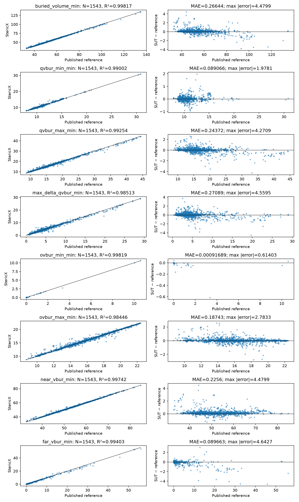
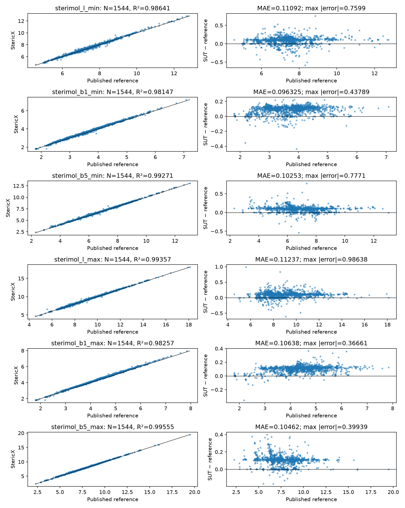
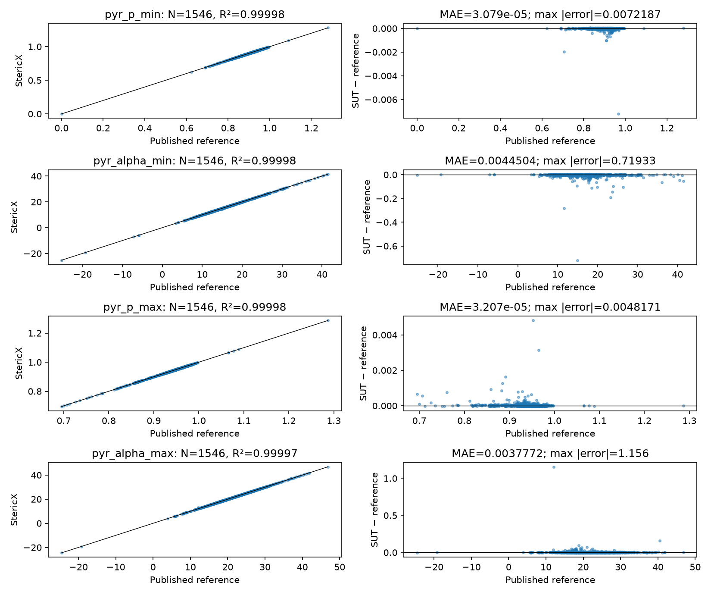

| Component | Status | Independent reference | Max error | Important limitation |
|---|---|---|---:|---|
| Sterimol L | VERIFIED WITH NUMERICAL LIMIT, for a fixed valid axis | Independent projection; Morfeus 0.8.0 | 0.00369313 Å across 31,713 successful Kraken axes | Near-Z quaternion approximation; automatic tied bond axes separately change L by 2.57 Å on atom permutation |
| Sterimol B1 | VERIFIED WITH NUMERICAL LIMIT | Analytic support-envelope minimization; Morfeus | 0.0441019 Å in the direct Morfeus matrix; 0.0261794 Å in the isolated analytic scan witness | Angular sampling and approximate alignment are distinct errors; short-axis zero sentinels have still larger errors |
| Sterimol B5 | VERIFIED WITH NUMERICAL LIMIT, for a fixed valid axis | Independent radial envelope | 0.00417690 Å across 31,713 successful Kraken axes | Near-Z alignment approximation; tied automatic axes and extreme finite inputs have larger errors or infinity |
| %Vbur | VERIFIED WITH NUMERICAL LIMIT, matched center/radii/default grid | Independent union of spheres; Morfeus; analytic sphere intersection | 0.00649437 percentage points across 2,372 matched real cases; 0.149266 pp versus analytic continuum witness | One-cell occupancy differences occur; matching a lattice does not establish continuum accuracy; symmetric valid geometries can be rejected |
| Quadrants | VERIFIED WITH NUMERICAL LIMIT at default grid; differing convention on odd grids | Independent sign regions; Morfeus | 0.0116561 ų in real matched-default cases; 9.62 ų in a coarse boundary witness | Zero-plane assignment and regional normalization differ; regions need not sum to total on odd grids |
| Octants | VERIFIED WITH NUMERICAL LIMIT at default grid; differing convention on odd grids | Independent sign regions; Morfeus | 0.0116561 ų in real matched-default cases; 2.90 ų in odd-grid cases | Near/far inherit octant normalization limits; continuum boundaries do not choose a unique finite-grid rule |
| Pyramidalization | VERIFIED WITH NUMERICAL LIMIT for ordinary nondegenerate triads | Independent determinant/plane angles; Morfeus | Same exported Kraken geometries: P 3.20e-7; alpha 4.89e-5° | Nearly collinear input gives a 30° zero-sentinel error; published-reference extrema differ much more |
| Donor detection | SUPPORTED in tested ordinary graphs; INCORRECT for some inferred bonds | Explicit molecular graphs and primary SDF connectivity | Eight fresh Kraken conformers have a spurious fourth inferred P neighbor | Distance thresholds are heuristics; chemical donor availability is not established by coordination count |
| Conformer weighting | VERIFIED WITH NUMERICAL LIMIT for supplied energies/weights; INCORRECT temperature handling in one path | Decimal Boltzmann populations; analytic ensembles | MMFF weighting 1.94e-16; CREST temperature counterexample 0.111613 population | Electronic/potential energy weighting is not experimental free-energy population validation |
| Eyring kinetics | VERIFIED WITH NUMERICAL LIMIT for the equation; INCORRECT absolute-rate interpretation in simulate | IUPAC equation; exact SI constants; Decimal | 6.92e-8 relative rate error in tested normal f32 range | A barrier difference alone cannot identify an absolute rate; extreme inputs overflow/underflow |
| Kraken reproduction | SUPPORTED numerical reproduction with convention and ensemble mismatches | Fresh primary corpus, original code/SI and published values | Headline statistic: 4.55947 ų; BV conformer range: 9.79936 ų | 1,543 complete available BV ensembles; no trimming; original selected ensembles and protocol differ |
| Reaction models | Mixed; predictive claims UNCERTAIN | Primary tables/notebooks; independent numerical fitting | Published Ni-hDA held-out error 0.373008 kcal/mol | Ten training ligands; feature search is not externally validated; complete native nested workflow fails 7/10 folds |
| Uncertainty | TERMINOLOGY ISSUE and demonstrated undercoverage | OLS/t formulas; joint bootstrap; held-out row checks | Nominal 95% PI covers 92/141 rows, 65.25% | These repeated small-data splits are not independent experimental calibration; coefficient boxes are not joint prediction intervals |
| Applicability domain | SUPPORTED mathematics, conditional on well-defined geometry | NumPy/SciPy synthetic geometry | Normal-case comparisons in model report; singular witness discussed below | Descriptor proximity is not validated prediction reliability; singular/off-manifold behavior needs care |
| Screening | SUPPORTED objective/ranking arithmetic; predictive validity UNCERTAIN | Independent objective sorting, frozen predictions, held-out rows | Fit/screen discrepancy reaches 1.209761 kcal/mol in recorded study rows | Single-geometry screening and ensemble training differ; ranking is not experimental validation |

# Independent scientific accuracy audit of StericX

Inputs frozen: 19 September 2026. Final review: 21 September 2026. Frozen commit: `6393aafe0d983e504baf8abc1e18dc2a0f0d40e7`. This report examines that system, not later versions. No production scientific algorithm was changed during the audit.

The table identifies the comparison scope for each error; these are not universal bounds or unqualified comparisons with every published value. Published-protocol discrepancies, including much larger Sterimol/pyramidalization extrema, appear in section5 and the full Kraken tables. Every comparison, failure and outlier remains available in the linked artifacts. Exact claim classifications and source/implementation/method/confidence/limitation fields are in [CLAIMS.md](CLAIMS.md).

## 1. Executive summary

StericX implements substantial parts of the intended descriptor and regression mathematics accurately on ordinary, explicitly controlled inputs. That supports its use as a computational research tool with declared conventions. It does **not** support blanket claims of exact Kraken equivalence, unrestricted scientific validity, calibrated screening predictions, or experimental generalization.

The audit found reproducible failures rather than simply confirming existing tests:

- Valid symmetric occupied geometries can be rejected as degenerate. An ordinary PH3 public-API case has independently calculated volume 31.9372145173 ų and zero quadrant asymmetry; zero asymmetry is not a geometrical invalidity.
- Automatic bond-axis selection can change L and B5 by 2.57 Å when identical atoms are reordered. B1 has a separate angular-discretization error reaching 0.0261794 Å in a four-atom witness. Approximate near-Z axis alignment also produces real-corpus L/B5 errors up to 0.00369/0.00418 Å.
- The published Kraken DFT protocol uses a raw bond-vector sum for its virtual metal, hydrogen radius 1.09 Å for Sterimol, and volume-per-point density 0.001 ų. StericX's compared defaults use a unit-vector sum, H=1.20 Å, and 0.01 ų. The previous explanation invoking an electronic LMO center for the DFT reference is contradicted by the original source.
- Odd integration grids expose different plane-assignment conventions and substantial regional nonadditivity. Both StericX and Morfeus have finite-grid limitations; Morfeus is not physical truth.
- The Eyring equation is well reproduced, but `simulate` uses one input as both an absolute activation barrier and a barrier difference. Those meanings do not identify the same quantity. The CREST table-weight path can ignore a requested temperature.
- Most Ni-hDA targets correspond to approximately 80 °C while the stored temperature is 25 °C. Another target/ee pair is inconsistent in the upstream data as well. Corrected primary SI and dataset provenance matter.
- Fixed-feature regression diagnostics do not validate the feature-selection process. Actual native outer-fold fitting fails in seven of ten Ni-hDA training folds. Existing screening results show substantial prediction-interval undercoverage and a fit/screen feature-construction mismatch.
- A preserved `evaluate` CSV containing a NaN prediction exits successfully and emits null JSON accuracy metrics. Infinity and a finite inconsistent prediction are rejected, isolating a missing NaN validation check.

These findings establish what needs correction or qualification. They do not establish that an alternative model will predict new chemistry better, and this audit makes no production changes to force agreement.

## 2. Methods and frozen system

[manifest_initial.json](manifest_initial.json) records the commit, original executable, 701 repository input/source files, the 24-file installed Morfeus source snapshot and software versions. The executable SHA256 is:

`b577c49d3e98b4745213fce0e70e93a55fc61120c5abe6fdb0658547c43cab94`

The audit environment uses Rust 1.97.0, Cargo 1.97.0, Python 3.12.13 through `uv`, NumPy 2.5.1, SciPy 1.18.0, scikit-learn 1.9.0, RDKit 2026.3.4 and Morfeus 0.8.0. The system Python is separately recorded as 3.14.4; it was not substituted for the scientific environment. Complete installed versions, command outputs and hashes are in the manifest.

Inputs generated or downloaded after the initial freeze have component acquisition and experiment manifests. Raw native CLI and observation-adapter outputs were captured separately from independent analysis. Their original phase hashes, later replay checks and final consolidation hashes are distinguished explicitly: a post-analysis inventory does not prove a pre-analysis freeze. The adapter links the frozen scientific source and exposes hidden grid/bin observations through a byte-identical source prefix plus visibility-only functions. It is explicitly the **system under test**, never the independent reference. Its identity is in [observer/manifest.json](observer/manifest.json).

Three complementary datasets were used:

1. **Geometry campaign:** 829 primary molecular cases and 15 raw predicate witnesses, plus separately frozen focused, CLI and numerical cases. These include explicit molecular graphs, synthetic counterexamples, six representatives with at least 100 random rotations each, atom permutations, boundaries and density studies.
2. **Fresh Kraken corpus:** all 1,566 IDs in the primary comparison universe were attempted; 1,546 had DFT data and all 31,721 available conformers were downloaded and evaluated. Connectivity eligibility came from molecular graphs, not a duplicate of StericX's cutoff. All missing data and operation failures remain recorded.
3. **Models/ensembles/kinetics:** independent primary-table fits, synthetic linear and domain problems, native held-out workflows, manual energy ensembles, analytic molecular pairs and a 195-request kinetic grid. No target, threshold, integration default or outlier selection was adjusted to improve agreement.

Statistics include N, MAE, RMSE, maximum and median absolute error, slope, intercept and identity-line R² where defined. A constant reference has undefined R²/slope rather than an invented perfect score. Undefined scientific references and failed operations are coverage failures, not zero-error rows. Full-precision data are retained even where this report rounds for readability.

All six frozen native request streams, including the full 31,721-conformer corpus, reproduced byte for byte. The model reference scripts replayed successfully, and a separate scratch replay reproduced 19 Kraken interpretation artifacts, with only a recorded creation timestamp excluded where applicable. These are reproducibility checks, not independent proof of the science. [REPRODUCE.md](REPRODUCE.md) provides commands; [the final manifest](manifest_final.json), [package verification](reproducibility/package_verification.json) and [coverage checklist](COMPLETION_CHECKLIST.md) make the evidence reviewable.

## 3. Primary sources

Primary source bodies, retrieval failures, dates, hashes and rendered verification pages are retained under the component `sources/` or `raw_sources/` directories.

| Topic | Primary/reference source | What it establishes and access limitation |
|---|---|---|
| Sterimol | [Verloop, Hoogenstraaten and Tipker, 1976](https://doi.org/10.1016/B978-0-12-060307-7.50010-9); [official Morfeus documentation](https://digital-chemistry-laboratory.github.io/morfeus/sterimol.html) and frozen source | Historical citation and runnable conventions. Original chapter full-text access was incomplete; no claim of original-page verification |
| Atomic radii | [Bondi, 1964](https://doi.org/10.1021/j100785a001); [Cordero et al., 2008](https://doi.org/10.1039/B801115J) | Original full tables were not accessed; official reference-code tables and publisher information establish the tested conventions. Br variants remain unadjudicated; 1.3 bond tolerance and fallbacks are implementation choices |
| Buried volume | [Poater et al., 2009](https://doi.org/10.1002/ejic.200801160); [Falivene et al., 2016](https://doi.org/10.1021/acs.organomet.6b00371); [official SambVca manual](https://www.aocdweb.com/OMtools/sambvca2.1/help/help.html) | Sphere, radius scaling, hydrogen and orientation conventions; implementations still require explicit finite-grid rules |
| Kraken | [Gensch et al., JACS 2022](https://doi.org/10.1021/jacs.1c09718), official SI and [original immutable DFT source](https://github.com/the-matter-lab/kraken/blob/4eaad505c1343e6083032b4a3fda47e004e19734/conf_selection_and_DFT/PL_dft_library_201027.py) | DFT geometry, raw-vector virtual-metal construction, Paton H-radius adjustment, grid density and descriptor reductions |
| Pyramidalization | [Radhakrishnan and Agranat, 1991](https://doi.org/10.1007/BF00676621); official Morfeus source | Runnable determinant/angle convention. Original article full text was not obtained; historical-definition confidence remains qualified |
| Statistical thermodynamics / kinetics | [IUPAC Green Book](https://iupac.org/wp-content/uploads/2019/05/IUPAC-GB3-2012-2ndPrinting-PDFsearchable.pdf), printed pp.45–46 and65–67; [NIST CODATA2022](https://physics.nist.gov/cuu/Constants/Table/allascii.txt) | Canonical populations, Eyring equation, standard-state/transmission assumptions and physical constants; formula pages visually checked |
| CREST | [Official keyword documentation](https://crest-lab.github.io/crest-docs/page/documentation/keywords.html) and frozen v2.12 source | Population temperature, default 298.15 K and user temperature option; no full external CREST run is claimed by the injected-weight audit |
| Ni-hDA | [Official author repository](https://github.com/SigmanGroup/Ni-Catalyzed-hDA) and [published correction, DOI10.1021/jacs.5c18763](https://doi.org/10.1021/jacs.5c18763) with corrected SI | Dataset identity, 80 °C reaction and corrected table; original author CSV is not automatically a current corrected experimental record |
| Ni/Pd cross-coupling | [Author's primary preprint and SI](https://doi.org/10.26434/chemrxiv.14388557.v1); [official Threshold notebook](https://github.com/SigmanGroup/Threshold) | Reaction tables and active-label/weighted-stump definition. Final Science SI access failed; the preprint/final distinction is retained |

The model component adds the original statistical references and official numerical-library sources for resampling, regularization and validation in its claim inventory. A retrieved DOI alone is not treated as having read a paper. Morfeus, author spreadsheets and StericX are all subject to convention and numerical limits.

## 4. Independent reference implementations

[geometry/METHODS.md](geometry/METHODS.md) specifies the projection and region equations. Sterimol L is an axial support maximum; B5 is a radial envelope maximum. The independent B1 reference enumerates stationary points and pairwise support-curve intersections instead of copying either angular scan. Virtual-dummy L includes the stated +0.40 Å reporting convention; raw API L is kept separate. Coordinates, radii, hydrogen treatment and selected axis are explicit.

Volume references use a float64 union-of-balls calculation and a separately executed Morfeus implementation. A single-atom sphere-intersection case supplies an analytic continuum reference independent of both programs. Every quadrant and octant of all three orientations is compared, together with totals, percentages, near/far and extrema. Holding the same center fixed isolates the integration algorithm; separately constructed centers investigate the axis convention. A matched-center comparison does not validate the chemical meaning of that center.

There is no single center-distance default across all StericX entry points. The public `BuriedVolumeConfig::default()` and standalone `buried-volume` command use 2.1 Å; `descriptors`, screening and database paths use 2.28 Å. This audit's Kraken comparison explicitly uses 2.28 Å. The standalone help's statement that Kraken uses density 0.01 is contradicted by the primary DFT SI's 0.001 convention. Path-specific defaults are kept distinct throughout the raw requests.

Independent model fitting uses NumPy linear algebra/SVD, scikit-learn regularized models and SciPy distribution functions; native predictions, fits and errors are observations. Cross-validation refits preprocessing within the training fold and distinguishes a fixed selected feature set from an independently repeated selection workflow. The Boltzmann and Eyring references use Decimal calculations derived from primary equations and SI constants. Full details and equations are in [kinetics/KINETICS_CONFORMERS.md](kinetics/KINETICS_CONFORMERS.md).

## 5. Descriptor results

The [geometry report](geometry/REPORT.md) reports every ordinary/base descriptor separately with all requested statistics. Its [full residual table](geometry/descriptor_comparisons.csv), [individual region table](geometry/bin_comparisons.csv), [metrics by population](geometry/metrics.json) and [failures](geometry/failures.csv) preserve all cases. The favorable default-grid values in the opening table are conditional numerical comparisons; they are not used to discard harder cases.

The fresh [Kraken coverage](kraken/analysis/coverage.json) includes 31,721 observations. Complete ligand ensembles are available for 1,543 buried-volume results, 1,544 coordination Sterimol results and 1,546 pyramidalization results. There are 17 per-operation errors: eight cases each for BV and coordination Sterimol from four inferred donor neighbors, plus one symmetric-volume rejection. Twenty universe IDs have no available DFT conformers. Different descriptor coverage is reported explicitly instead of imposing a successful-only intersection.

For the historical headline `min_conformer(max_orientation adjacent-quadrant difference)`, fresh native reproduction gives N=1,543, MAE≈0.270887 ų, RMSE≈0.490778 ų, maximum absolute error≈4.55947 ų, identity R²≈0.985129. All requested metrics for 56 descriptor/reduction comparisons are in [kraken/analysis/metrics.json](kraken/analysis/metrics.json), with molecule-by-molecule values in [comparisons.csv](kraken/analysis/comparisons.csv). [All 56 residual plots](visuals/kraken_all_metrics/INDEX.md) retain every row and highlight each metric's twenty largest errors. The authoritative [1,120 outlier dossiers](kraken/delta_interpretation/all_top20_outlier_dossiers.json) include both extremizing conformers for all 280 conformer-range entries. No trimming or automatic reassignment of blame is used.

Boltzmann reductions of the entire downloaded Kraken corpus cannot be independently regenerated from ligand-level aggregate values: the geometry exports and tested conformer endpoint do not provide individual energies/populations. Official supplemental archives were checked. Those reductions are **UNCERTAIN/unreproduced**, not assumed correct from min/max agreement. Unimplemented distal/total-volume or electronic descriptors are explicitly outside StericX's reproduced subset; “the entire Kraken family” is too broad.

The [Kraken report](kraken/REPORT.md) also isolates numerical causes on identical geometries. Recomputing every conformer of the twenty largest headline outliers with the primary raw-vector center and 0.001 density reduces their maximum residual to 0.00627543 ų; the largest original error of 4.55947 ų becomes about 0.00418 ų. This supports a convention explanation for those particular outliers. It does not erase other unexplained residuals: independent Morfeus on the same complete exported corpus also disagrees with some published Sterimol/pyramidalization extrema. Published alpha differences reach about 1.156° despite same-geometry native/Morfeus alpha agreement within 4.89e-5°. Such reference/geometry-provenance differences remain unresolved rather than being blamed automatically on either program.

The expanded conformer-range investigation independently evaluates all 2,009 available conformers of the 77 implicated ligands. Ligand369 illustrates a separate ensemble problem: StericX gives a BV range of 76.1714249 ų versus published 66.3720635 ų; matched-convention Morfeus gives 76.1714222 ų. Using the original center and density on all 84 exported conformers gives 76.7369786 ų. The export contains two contiguous conformer-ID blocks with the same independently canonicalized connectivity graph, excluding stereotags absent from the API SMILES. A diagnostic using the lower-ID 44-member block gives 66.3731094 ų, only 0.0010459 ų from the published value; an additional-block conformer sets the larger full-ensemble maximum. This strongly supports a mismatch between exported and property-reference ensembles, without establishing the blocks' dates or original retention decisions. All 84 remain in the main comparison. The [focused dossier](kraken/delta_interpretation/ligand_369_dossier.json) preserves the evidence.

The original Kraken workflow removes failed, imaginary-frequency and duplicate conformers before reduction. Current exports lack the original selection/error/energy records needed to reproduce those decisions. “All available geometries” therefore does not establish identity with the historical retained ensemble. For the persistent pyramidalization-P discrepancy in ligand1290, an independently derived perturbation bound below 0.000624 rules out ordinary four-decimal coordinate rounding as the sole cause of a roughly 0.007219 discrepancy, conditional on the same atoms and ensemble. It does not identify the missing historical cause; [the bound and assumptions](kraken/focused_diagnosis/pyramidalization_rounding_bound.json) are retained.

Across the enlarged matched-default comparison of 2,372 conformers, total-volume error reaches 0.0116614 ų and percentage error 0.00649437 percentage points. These approximately one-cell occupancy differences are larger than the arithmetic residual in the original smaller matrix. Regional maximum errors remain about 0.0116561 ų. The [expanded metrics](kraken/delta_interpretation/expanded_matched_default_metrics.json) replace the smaller matrix as the broadest measured matched-default scope; they are still not universal accuracy bounds.

## 6. Adversarial tests

The campaign separately tests explicit hydrogens, primary/secondary/tertiary phosphines, nitrogen donors, small and bulky substituents, asymmetry, nearly planar/collinear geometries, close contacts, finite extremes, missing/ambiguous donors and unknown radius elements. Synthetic shapes are labeled; being a finite coordinate file does not make a geometry chemically stable.

The historical nearest-heavy frame bug was independently reconstructed from explicit connectivity. A tertiary trimethylphosphine control gives the same old and bonded-neighbor frame. Primary/secondary phosphines with nearby nonbonded carbons move the incorrectly constructed center by about 2.43 and 2.06 Å. Their independent maximum-adjacent descriptors change substantially. Current StericX includes donor-bound H and matches those declared graphs. This supports that particular fix without asserting universal bond inference accuracy.

The exact historical dataset is separately reconstructed in [geometry/historical](geometry/historical/), covering six original zero-result ligands and twenty conformers. Those preserved historical inputs and independent reconstructions connect the synthetic mechanism to the original reported failure instead of relying on the existing regression test's assertion.

Six representatives each underwent 100 random rigid rotations plus separate X/Y/Z rotations and translations. All nine BV outputs were bit-identical across that particular default-grid campaign; this does not prove boundary-independent invariance. Coordination B1 varies by up to 0.0199442 Å, while L/B5 normally vary around 1e-5 Å or less. Pyramidalization alpha varies by up to 0.0002594°. Means, standard deviations and maxima appear per molecule/descriptor in [invariance.csv](geometry/invariance.csv).

Twenty mapped atom permutations per representative preserve a chosen chemical axis; actual CLI permutations with tied bond lengths expose the separate 2.57 Å axis-selection effect. Boundary cases use exact/adjacent representable floats on occupancy and bond thresholds, signed zero and coordinate planes. These establish numerical inequalities and expose convention differences; a continuum measure-zero boundary does not dictate a universally correct floating-point inclusion rule.

## 7. Numerical convergence and precision

The independent analytic PH3 sphere intersection is 31.6691417136 ų. Its unvalidated internal SUT lattice estimate converges as follows; the public BV call rejects this symmetric case, which is separately documented.

| Volume per grid point setting, ų | Actual sphere points | Lattice minus analytic volume, ų |
|---:|---:|---:|
| 0.1 | 1,419 | +1.6172009073 |
| 0.01, current default | 15,408 | +0.2680721841 |
| 0.001 | 171,712 | −0.0284346976 |
| 0.0001 | 1,766,741 | +0.0006218515 |

The oscillating sign is ordinary discretization behavior; finer is not a monotonic guarantee. Across four multi-atom representatives, default-versus-very-fine total differences reach 0.197105 ų and maximum-adjacent differences 0.149140 ų. [Convergence data](geometry/convergence.csv) retain every density, including 0.008 chosen to expose an odd grid. Defaults were not altered for the primary comparison.

At density 0.1 for triphenylphosphine, StericX total volume is 53.156895 ų but near+far is 59.733269 ų. Morfeus also has nonadditivity: its regional sum is 56.565159 ų against total 53.156899 ų. Both independently normalize finite regional populations, but assign/exclude boundary planes differently. This is an approximation/convention limitation, not proof that one continuum boundary inequality is physical truth. At 0.0001 the respective gaps decrease to approximately 0.579083 and 0.291112 ų.

The measured B1 rotation change is about 1.93% of the comparison library's B1 interquartile range but over 33 times its median nearest univariate spacing. The analytic default BV error of 0.149266 percentage points is about 1.34% of the library %Vbur interquartile range and about 25 times its median nearest spacing. These library values are only a scale comparison. Errors small compared with a full-library range can still change close-candidate rankings; there is no basis to call them universally negligible.

Float64 references separate rounding from angular/grid discretization and convention changes. Ordinary L/B5 and matched-lattice volume errors are small; the lattice floor is much larger than those arithmetic residuals. Extreme translations can erase coordinate differences in f32, a short nonzero axis can trigger a zero sentinel, and an accepted finite remote coordinate can overflow B5. A near-collinear pyramidalization input has a roughly 30° sentinel discrepancy. These failures are preserved rather than treated as support for an indiscriminate f64 conversion.

The full same-center/same-radius Kraken analytic check finds a larger, specific L/B5 mechanism than the small graph-generated base set: the approximate near-singular branch of `glam::Quat::from_rotation_arc` does not align axes close to ±Z exactly. Across 31,713 successful axes, maximum L error is 0.00369312853 Å (ligand16/conformer31923) and B5 error is 0.00417690438 Å (ligand1407/conformer54385). The independent reference uses dot products and perpendicular projections on the identical observed f32 coordinates/radii/center, so this difference cannot be attributed to source-coordinate precision or a different center. Minimized donor-plus-active-atom witnesses and an exact 90° coordinate permutation isolate the operation; the rotation reduces selected L/B5 residuals to about 1.6e-8/1.1e-6 Å. See [geometry/alignment](geometry/alignment/) and the complete Kraken analytic comparisons. This is an alignment-algorithm limit, not evidence that every calculation simply needs higher precision.

## 8. Statistical and reaction-model audit

The model audit checks R², Q², MAE, RMSE, OLS, feature scaling/interactions, VIF, BIC selection, fixed-feature LOO, leave-group-out, bootstrap, permutation tests, ridge and LASSO separately. Agreement of numerical formulas does not validate how a reported statistic is interpreted. The component claim inventory records exceptions and conditioning assumptions for each.

The published Ni-hDA single-feature fit is independently reproduced: training N=10, R²≈0.819306, RMSE≈0.292828 kcal/mol; fixed-feature LOO Q²≈0.752101 and RMSE≈0.342988. The historical 723 holdout error is 0.373008 kcal/mol. This is one historical held-out datum, and its Murcko scaffold is shared with training ligands 1057/1058. It is not evidence of scaffold extrapolation or a prospective blind experimental trial. The author's original notebook searched 191 features using the same labels before identifying the published descriptor; fixed-feature LOO conditions on that choice.

Native fitted descriptors produce a different model: training R²≈0.362546, fixed-feature LOO Q²≈0.002042 and RMSE≈0.688173. When the actual frozen CLI repeats feature selection inside each outer training fold, seven of ten folds fail because no feature improves the intercept model. Thus there is **no completed native full-workflow LOO score**. An independent diagnostic with an explicitly declared training-mean fallback for those folds gives Q²≈−1.536964 and RMSE≈1.097232; this is not relabeled as a StericX score. Full fold inputs, selected features and errors are retained.

Likewise, independent permutations holding the selected model fixed give p≈0.0675 in the specified experiment, versus p≈0.2514 when selection is repeated. These finite-resample results quantify different null procedures. They do not establish causality or a transferable physical mechanism.

Each of the twelve Ni/Pd cross-coupling reaction reproductions is audited separately against primary tables and the official notebook. The notebook defines an active response with `yield >= cutoff`; historical StericX study code uses `yield > cutoff`. Observations exactly at the threshold change labels in reactions I, II, IV, V, VII and VIII. Fits evaluated on their training observations are resubstitution metrics. Bootstrap fitting/scoring on the same sampled rows does not convert them into held-out prediction metrics. The component report preserves primary/preprint source differences and per-reaction results.

After correcting the audit's multiline-table parser, the complete primary comparison contains 746 ligand–reaction rows (479 Ni, 267 Pd), with no missing fresh StericX descriptors among those rows. All 72 independently constructed weighted-Gini fits agree with scikit-learn at the prediction level. Nevertheless, reactions VII and IX already fail the published summary reproduction using independent reference descriptors; source/subset/precision provenance remains unresolved. The corrected [model report](models/REPORT.md) separates that uncertainty from the definite strict-versus-inclusive inequality difference. Leave-one-reaction-out target withholding is real, but ligand identities overlap training: all 89 test ligands recur in five folds and 20 of 34 in the remaining fold. That tests reaction transfer on familiar ligands, not new-ligand or scaffold-disjoint generalization.

Study007's assertion that molecular-formula matching rejects isomer mismatches is false. Independently specified n-propylphosphine and methylethylphosphine both have formula C3H9P but different connectivity and phosphorus neighbors. Both cross-isomer pairings pass the frozen formula helpers. The [preserved counterexample](models/results/formula_identity_counterexample.json) falsifies the claimed safeguard; it does not establish that any of the historical eighteen mappings was actually wrong. Separately, the study calls an ensemble mean a fair comparison for a single geometry, but does not claim mathematical equality. The methodological suitability of that comparison remains uncertain rather than being misrepresented as a stated equality claim.

## 9. Predictive validation, uncertainty and applicability

For a prespecified ordinary linear model, StericX's residual/t-based interval formulas and normal-case leverage calculations can be reproduced independently. A classical observation prediction interval contains a residual-variance term; a mean-response confidence interval does not. Neither automatically includes feature-selection uncertainty, descriptor convention error, missed conformers, model discrepancy or new-reaction domain shift. A box built from marginal coefficient intervals is not a joint bootstrap prediction interval and is not guaranteed conservative; the synthetic counterexample is retained.

The current bootstrap-replicate output is explicitly labeled as mean-response uncertainty, which is appropriate. The audit does not claim that this correctly labeled output is called a prediction interval. The separate marginal-coefficient fallback and any general claim of calibrated predictive coverage require their own evidence.

Independent recomputation of the existing Study011 raw rows gives 92/141 observations inside nominal 95% intervals (65.2482%), MAE≈0.988485 kcal/mol and RMSE≈1.218585. These rows reuse a small dataset across splits, so a binomial confidence claim treating all 141 as independent would be unjustified. Nonetheless they directly contradict a claim that these recorded intervals are already demonstrated to have 95% coverage. The “interpolation” subset also undercovers (about 64.8%).

Of 57 recorded screening splits, 47 succeed and 10 fail; top-one success across all 57 is 9/57≈15.7895%. A fit/screen value disagreement reaches 1.209761 kcal/mol because feature construction differs between ensemble training and a representative geometry. These are independently recomputed historical observations, not newly obtained experimental validation.

Applicability-domain standardization, range checks, nearest-neighbor thresholds, leverage and Mahalanobis calculations are tested using known synthetic geometry. A singular-covariance API witness can have a huge Mahalanobis value yet receive an interpolation label under another configured rule; these diagnostics are different rules, not interchangeable guarantees. “Reliable” trust wording is stronger than a geometric proximity check can establish. No domain flag rescues an inaccurate or miscalibrated model.

Ranking tests cover objective direction, negative predictions, ties, exclusions, missing descriptors, diverse selection and out-of-domain candidates. Diversity selection does not silently rewrite the frozen point prediction in the tested cases. Correct sorting only establishes consistency with model metadata. It does not establish that the ordering predicts experimental outcomes.

## 10. Discrepancies and failed validation

Every major component discrepancy records the requested eight items: failing input, SUT value/error, independent value, reference definition, likely cause, scientific magnitude, affected claims and proposed correction. Consult [geometry/REPORT.md](geometry/REPORT.md), [kinetics/KINETICS_CONFORMERS.md](kinetics/KINETICS_CONFORMERS.md), the model discrepancy records and Kraken outlier evidence. Raw failures remain alongside successful observations.

The largest practical issues concern convention/eligibility, provenance and validation methodology, not ordinary floating-point rounding. Unknown-element radii silently falling back to 1.8 Šcan create a multi-ų volume discrepancy; a different Morfeus fallback is not by itself a better physical value. Nearly degenerate geometry can return a plausible-looking zero sentinel. Supplied tiny positive conformer weights can be rejected despite a valid ratio, and a direct public aggregate call can accept NaN descriptor data. These have different reach and are not all claims about the normal CLI path. Separately, the actual `evaluate` CLI accepts a NaN prediction and returns successful null JSON metrics; [the failing input and controls](models/results/evaluate_edge_cases.json) isolate the nonfinite comparison failure. Sixteen model findings have explicit eight-part dossiers in [models/DISCREPANCIES.md](models/DISCREPANCIES.md).

Audit failures are also disclosed. An early independent-reference adapter used the wrong Morfeus dictionary indexing; a separate explicit-radii adapter initially omitted the 1.17 scale. Those invalid attempts remain preserved, and corrected reference campaigns supply the final results. The first cross-coupling extraction omitted eight rows with multiline names; the corrected extraction includes them all. A convergence-plot axis was initially reversed incorrectly and was corrected without changing data. Several original full texts or final SI URLs returned access errors; alternatives are identified explicitly. Missing per-conformer thermodynamic data prevented a full Kraken Boltzmann reconstruction. None of these limitations was converted into a pass.

## 11. Known scientific limitations and four distinct kinds of correctness

| Kind | Question | Evidence available here | What it cannot establish |
|---|---|---|---|
| **A. Optimization correctness** | Does the optimized implementation reproduce its predecessor? | Prior performance work's frozen parity evidence; the current audit does not optimize or rerun that study as its scientific oracle | Scientific definitions, chemical validity or predictive generalization |
| **B. Implementation correctness** | Are the stated equations/conventions implemented? | Independent equations, reference implementations, primary source code, numerical cases and constructive counterexamples | That the descriptor is the right physical representation for a reaction |
| **C. Methodological validity** | Are the definitions and assumptions appropriate to the interpretation? | Explicit radii/axis/ensemble assumptions, validation-method analysis and primary conventions | Actual unseen experimental performance without suitable evidence |
| **D. Predictive/experimental validity** | Do predictions generalize to new chemistry and measurements? | Limited historical held-out diagnostics, including negative results | Prospective chemical validation, calibrated broad-domain accuracy or experimental success |

No evidence from A is used as proof of B, C or D. Strong numerical agreement is conditional on inputs and conventions; force-field/electronic-energy conformers do not establish experimental populations. A high R² on a few training observations is not predictive validation. The adversarial set finds failure mechanisms, but does not estimate their frequency in all chemistry.

## 12. Claims StericX can safely make

- It is a reproducible computational tool whose ordinary fixed-axis L/B5, sampled B1, matched-lattice BV and specified regression equations can be compared quantitatively against independent implementations.
- It implements explicit geometric conventions with measurable angular, lattice and f32 limits. Those conventions and input domain must accompany accuracy claims.
- The current bonded-neighbor frame includes donor-bound hydrogens and corrects the reconstructed nearest-heavy failure cases.
- The fresh complete-ensemble Kraken headline comparison has approximately 0.271 ų MAE and 0.491 ų RMSE, with the full coverage, convention differences and 4.56 ų maximum discrepancy disclosed.
- Published model tables and conditional fixed-feature fits can be reproduced to stated numerical accuracy. Screening produces model-based hypotheses requiring experimental validation.

## 13. Claims StericX should not currently make

- Exact implementation of every original Kraken convention, or exact scientific correctness inferred from optimization parity or aggregate R².
- Universal atom-order/rotation invariance or universal bond/donor correctness across accepted finite geometries.
- That zero quadrant asymmetry proves an invalid molecular frame, or that arbitrary fallback radii are scientifically validated atomic sizes.
- That a ΔΔG input identifies an absolute reaction rate, or that every configured ensemble temperature is respected in the CREST population path.
- That the current Ni-hDA temperature labels and every upstream target are mutually consistent.
- That a fixed-feature LOO score validates the feature-selection workflow, or that in-sample/bootstrapped training metrics establish new-reaction prediction.
- Calibrated 95% prediction coverage, guaranteed conservative uncertainty from marginal coefficient boxes, or experimental reliability from an applicability-domain label.
- Independent full Kraken Boltzmann reproduction, experimental conformer-population accuracy, or prospective experimental validation without the missing evidence.

## 14. Recommended fixes and follow-up experiments

These are recommendations supported by the audit, not implemented changes.

1. **Resolve conventions and provenance first.** State and version radius tables, H treatment, metal/axis construction, L correction, density and bin boundaries. Distinguish a Kraken-compatible mode from StericX-specific defaults. Correct the DFT-center provenance explanation. Reconcile Ni-hDA corrected SI, temperature metadata, missing ligand and inconsistent target against primary experimental records.
2. **Correct validated failure mechanisms.** Replace descriptor-value-based symmetry rejection with geometric validity checks; provide explicit stable axis selection; distinguish undefined descriptors from physical zeros; validate finite outputs and aggregate inputs. Review normalization's scale invariance and accepted relative-energy metadata. Preserve exact failing cases as future regression inputs.
3. **Separate kinetic quantities and respect ensemble temperature.** Require an absolute barrier for rates and a difference for selectivity; pass/verify CREST population temperature and define degeneracy/free-energy assumptions. Treat censored 100% ee as a bound with measurement provenance.
4. **Make full modeling workflows auditable.** Repeat feature selection and preprocessing inside validation folds; define an intercept-only fallback or report failures; rerun selection inside permutations. Match fit and screening feature construction. Use independently held-out chemistry for interval calibration and avoid calling geometric proximity reliability.
5. **Then conduct prospective validation.** Freeze models, objectives, exclusions, uncertainty and thresholds before new experimental outcomes. Use enough independent ligands/scaffolds/reaction settings to measure useful errors, coverage and ranking, with failed predictions included. Numerical reproduction alone cannot substitute for this experiment.

The audit's conclusion is conditional: much of the core arithmetic is sound in a well-specified ordinary domain, while several important interface, convention, validation and predictive claims fail or remain unsupported. The appropriate next step is a reviewed scientific correction plan followed by fresh validation, not a performance optimization or a declaration that the system passes.
