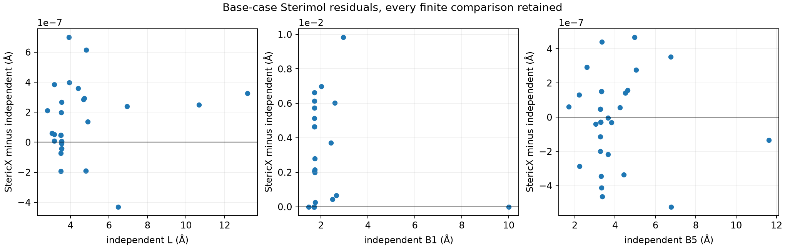
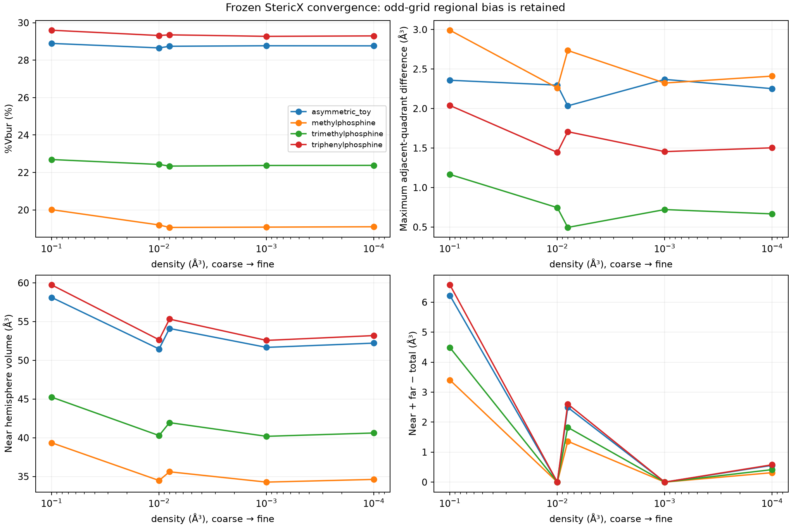

# Geometry audit results

This audit found both strong numerical agreement in a restricted ordinary-geometry domain and constructive failures of broader claims. Production scientific code was not changed. The frozen SUT is commit `6393aafe0d983e504baf8abc1e18dc2a0f0d40e7`; executable and observer identities are recorded in the parent manifests.

## Scope and independent evidence

829 molecular cases and 15 one-point/raw-occupancy witnesses were frozen before reference comparison. The base population contains 32 cases: 12 graph-generated molecular structures, two graph-derived structures with added nonbonded contacts, ordinary/degenerate synthetic donors, and four small-substituent probes. Six representatives each received 100 random rotations, separate X/Y/Z rotations, and random translations; 120 mapped permutations and four-molecule density studies are retained. An additional 15 focused analytic/frame/axis cases, 35 actual CLI cases, and 11 numerical-input/boundary cases are separately frozen. No failing case or outlier was removed.

The independent support-envelope B1 calculation is analytic in float64. Buried volume uses independent union-of-balls quadrature and separately Morfeus 0.8.0; all controlled volume comparisons hold the observed center fixed, so they do not validate the physical correctness of that center. The report also preserves independently inferred centers to expose the distinction. Equations, source access limitations and exact conventions are in [METHODS.md](METHODS.md).

The historical reconstruction adds 20 conformers of six actual previously failing Kraken ligands. Two real Kraken conformers also supply four full/minimized alignment probes, followed by four exact 90-degree rotations. These late failures are reported separately below; favorable base-case maxima must not be read as maxima over the complete audit.

## Descriptor-by-descriptor base results

All finite base-case pairs appear below, including unusual geometries; failure/error counts are in [failures.csv](failures.csv). Undefined references are not counted as passing comparisons. Identity-line R² measures numerical agreement, not predictive validation. Raw full-precision values are in [descriptor_comparisons.csv](descriptor_comparisons.csv); every individual quadrant/octant of every orientation is in [bin_comparisons.csv](bin_comparisons.csv).

| Component / field | N | MAE | RMSE | Max absolute error | Median absolute error | Slope | Intercept | Identity R² |
|---|---:|---:|---:|---:|---:|---:|---:|---:|
| sterimol_bond/l | 31 | 2.030350457e-07 | 2.675568851e-07 | 6.994274599e-07 | 1.907348635e-07 | 1.000000015 | 4.671632309e-08 | 1 |
| sterimol_bond/b1 | 31 | 0.002252203481 | 0.003596556059 | 0.009841284919 | 0.0004296461153 | 0.9999203321 | 0.00242170436 | 0.9999940846 |
| sterimol_bond/b5 | 31 | 1.975833255e-07 | 2.500454203e-07 | 5.233771221e-07 | 1.517937931e-07 | 0.9999999954 | 9.884091929e-09 | 1 |
| sterimol_coordination/l | 25 | 4.60042987e-07 | 1.020316248e-06 | 4.681404465e-06 | 1.868846615e-07 | 0.9999999796 | 2.881255801e-07 | 1 |
| sterimol_coordination/b1 | 25 | 0.004635312035 | 0.00635544353 | 0.01225243732 | 0.002851713427 | 1.000841733 | 0.00209109361 | 0.9999867799 |
| sterimol_coordination/b5 | 25 | 1.092033551e-05 | 5.069560543e-05 | 0.0002531822851 | 2.297007438e-07 | 0.9999976402 | 2.19868753e-05 | 0.9999999996 |
| pyramidalization/pyr_p | 27 | 4.944932756e-08 | 6.261852978e-08 | 1.293838185e-07 | 4.020675159e-08 | 0.9999999768 | 1.638136649e-08 | 1 |
| pyramidalization/pyr_alpha | 27 | 1.111112092 | 5.773488253 | 29.99992497 | 4.94755502e-06 | 1.013788459 | -1.686825496 | 0.9648066954 |
| buried_volume/buried_volume | 23 | 1.675000712e-06 | 2.028222842e-06 | 3.621527e-06 | 1.587510049e-06 | 1.000000001 | -1.222954757e-06 | 1 |
| buried_volume/percent_buried_volume | 23 | 1.22118881e-06 | 1.467292551e-06 | 3.287849147e-06 | 9.922966413e-07 | 1.000000087 | -1.80803115e-06 | 1 |
| buried_volume/near_vbur | 23 | 1.814542464e-06 | 2.208649969e-06 | 4.026476432e-06 | 1.757627786e-06 | 0.9999999287 | 1.894587347e-06 | 1 |
| buried_volume/far_vbur | 23 | 2.172710092e-09 | 7.406281799e-09 | 2.753589584e-08 | 0 | 0.9999999818 | -6.086706812e-10 | 1 |
| buried_volume/qvbur_min | 23 | 4.121779328e-07 | 4.805504864e-07 | 8.204791584e-07 | 4.674069238e-07 | 0.9999999358 | 3.397347243e-07 | 1 |
| buried_volume/qvbur_max | 23 | 5.179422006e-07 | 6.650711819e-07 | 1.931390791e-06 | 5.077925085e-07 | 0.9999999237 | 6.227988856e-07 | 1 |
| buried_volume/ovbur_min | 23 | 0 | 0 | 0 | 0 | undefined | undefined | undefined |
| buried_volume/ovbur_max | 23 | 4.992285029e-07 | 6.367652889e-07 | 1.839128007e-06 | 5.077925085e-07 | 0.9999999574 | 2.20483406e-07 | 1 |
| buried_volume/max_delta_qvbur | 23 | 4.146211956e-07 | 4.911125217e-07 | 9.375131516e-07 | 3.193264462e-07 | 0.9999999743 | 8.187927629e-08 | 1 |

The 14 graph-derived base cases have max ordinary P error 1.29384e-7 and alpha error 6.12238e-6°, while the nearly-collinear synthetic donor contributes a 29.999925° alpha discrepancy to the all-base table. Separating these populations explains the difference; the outlier remains present. Radius-extension cases are in the all-case metrics rather than hidden in a single favorable average.



## Constructive discrepancies and proposed follow-up

### G22: valid symmetry is rejected

`phosphine_PH3` has a chemically ordinary trivalent P–H graph and valid frame. With H excluded from occupancy, its only occupied sphere is phosphorus, giving an axisymmetric sphere intersection. Independent and Morfeus default-lattice values are 31.937214517315244 ų, 17.782969885773625%, equal quadrants 7.984303629328811 ų, and maximum adjacent difference 0. StericX computes 31.937213897705078 ų internally then rejects it as a degenerate frame. A fully covered sphere and a small integration sphere wholly inside the ordinary donor radius are further witnesses. Zero asymmetry does not imply unphysical geometry.

**Affected claims:** G22 and validation eligibility. **Likely cause:** descriptor-value-dependent validation replaces a geometrical degeneracy test. **Scientific magnitude:** complete loss of a valid result, not a small numerical error. **Proposed correction after review:** validate the frame geometrically; retain scientifically valid symmetric occupied sets. This audit makes no production change. The CLI also separately disallows PH3 because it requires a heavy reference atom; that is a scope restriction, not the cause of the public BV API counterexample.

### G06: automatic bond-axis ordering sensitivity

The frozen CLI on `focused/xyz/tied_axis*.xyz` selects one of three equal-length P–C bonds by atom index. Six permutations of exactly the same geometry exchange L = 6.0699997 Å / B5 = 3.5 Å with L = 3.5 Å / B5 = 6.0699997 Å. B1 = 1.7 Å is unchanged. An explicitly fixed chemical axis is well defined; selecting a chemically different axis on reordering is not a rigid-body numerical error. **Proposed follow-up:** expose/record an explicit chemically identified reference atom or define a chemically justified canonical axis. There is no unique universal best bond axis for an asymmetric whole ligand.

### G02: minimized angular-scan discrepancy

`focused/minimal_b1_half_degree` has a dummy, an on-axis carbon and two equal-radius carbon spheres on opposite transverse directions. Analytic B1 is 1.7000000000000002 Å. StericX reports 1.7261793613433838 Å; Morfeus reports 1.7000072748730852 Å. The exact operation is minimization over 360 one-degree support directions rather than the continuum; B5 is analytic in StericX and itself approximate in Morfeus. The one-degree B1 error is documented in code but limits exact-equivalence and strict invariance claims. **Proposed follow-up:** specify a scientific tolerance/uncertainty for B1 or review an analytic/adaptive calculation separately; no audit-time optimization was performed.

The 0.0261794 Å minimal-case error is not an audit-wide upper bound. The retained full Kraken conformer 963/48394 has B1 error 0.0416578313 Å. Its exactly rotated copy still has error 0.0402549764 Å after the separate alignment issue below is removed, demonstrating that angular discretization is the dominant B1 error in that case.

### G39: near-Z alignment changes valid real-geometry L and B5

**Failing inputs:** [alignment/requests.jsonl](alignment/requests.jsonl) retains full Kraken conformers 963/48394 and 1075/49864 with explicitly controlled SUT-rounded coordinates, radii and center, plus each minimized to its donor and the atom setting the disputed extent. The full structures are ordinary DFT geometries; the reduced cases are mathematical witnesses, not independently stable molecules. Their axis directions lie 0.0323875° from +Z and 0.0251818° from −Z, respectively.

**SUT and independent results:** full-case L is 6.859999656677246 versus 6.858277336508549 Å (error +0.001722320168697 Å); full-case B5 is 7.116985321044922 versus 7.114215709601416 Å (error +0.002769611443506 Å). Direct projection equations in [METHODS.md](METHODS.md), not another quaternion routine, define the independent answer. The minimized cases preserve the same disputed L or B5 value.

**Exact operation and cause:** `Quat::from_rotation_arc` in frozen glam 0.30.10 uses special approximate branches when `|dot| > 1−2*f32::EPSILON`. The +Z branch returns the identity; the −Z branch applies a 180-degree rotation about a perpendicular vector. These do not exactly align a merely near-parallel supplied axis. The dependency explicitly documents near-singular accuracy around 0.001; the problem is StericX's accuracy assumption about that operation. The pinned [dependency source](alignment/glam_0.30.10_sse2_quat.rs) and [source hash](alignment/dependency_source_manifest.json) preserve this evidence.

**Causal check:** the exact coordinate permutation `[x,y,z] → [x,−z,y]` rotates each structure and center 90° around X without trigonometric input-rounding changes. Independent L/B5 remain unchanged. SUT L changes by −0.001722335815430 Å for 963/48394 and B5 by −0.002768516540527 Å for 1075/49864. Their errors fall to −1.56467e−8 Å and +1.09490e−6 Å. All four rotated outputs were frozen before reference comparison in [alignment/rotation/](alignment/rotation/).

**Scientific magnitude and affected claims:** these roughly 0.002 Å errors are small relative to broad ligand-library variation but exceed the ordinary base-case f32 residuals by orders of magnitude and falsify unrestricted fixed-axis exactness/invariance (G01, G03, G07, G37, G39). The controlled full-case L/B5 errors are about 0.1045%/0.1823% of their library IQRs and 2.15/3.08 times rounded median nearest-neighbor spacings; those spacings are not experimental resolution. No downstream prediction error is inferred from this alone. **Proposed correction after review:** use a mathematically axis-preserving projection/frame construction or separately establish a documented alignment error bound over near-parallel and near-antiparallel inputs. No production algorithm was modified.

### G17–G20: odd-grid region boundaries and normalization

Morfeus excludes zero coordinate planes from octant regions; StericX assigns them to positive regions. Each region is independently rescaled to an equal geometric volume despite unequal point counts. For triphenylphosphine at density 0.1, total 53.15689468383789 ų but near+far 59.73326873779297 ų, a 6.576374053955078 ų (+12.37%) discrepancy. At 0.008 the gap is 2.603424072265625 ų; at 0.0001 it is 0.5790824890136719 ų. At default 0.01 the even grid partitions within rounding. A coarse n5 witness gives qvbur_min = 12.828169822692871 versus Morfeus 22.449297503777064 ų. Both finite-grid conventions approximate a continuum whose boundary planes have measure zero; neither numerical implementation is physical truth. **Proposed follow-up:** specify a consistent integration/partition convention and convergence criterion, then validate it.

**Classification scope:** G14, G17, G18 and G20 classify the stronger audit propositions of exact all-density grid compatibility, identical finite-grid regional conventions and exact partition additivity as **INCORRECT**. These are explicitly identified audit questions, not attributed quotations promising universal exactness. The favorable default-grid comparisons remain numerical evidence within their measured limits; neither implementation is thereby declared physically exact.

### G12–G13: radius conventions and unsupported elements

StericX uses Br 1.85 Å versus Morfeus Bondi 1.83 Å. The original Bondi table was not directly accessible; this establishes implementation incompatibility without adjudicating the printed historical value. StericX boron radius 1.92 Å is the later [Mantina et al. extension](https://doi.org/10.1021/jp8111556), while Morfeus has no Bondi B entry and silently uses 2.0 Å. Thus the Morfeus fallback is not a legitimate arbiter of boron accuracy. Fe also lacks a Morfeus Bondi entry. For He/Xe/Na/Se the StericX unknown-element 1.8 Å fallback differs from explicit reference-table values; Na produces a 6.0727368 ų volume difference in the toy case. **Proposed follow-up:** declare/version the complete radius table and warn/reject unsupported elements or require explicit user radii; do not change values merely to maximize agreement.

### G35–G36: numerical/degenerate limits

A nearly-collinear valid mathematical triad yields alpha 29.99992497364023° independently and in Morfeus, while StericX returns the documented all-zero sentinel because a plane-normal threshold fires. Short nonzero attachment axes likewise return zero Sterimol. NaN/Inf atom inputs return zero Sterimol but a BV error. A finite remote coordinate 1e38 Å produces B5=+Inf in the public API; the observer preserves its IEEE bits and explicit `_nonfinite` tag. Huge translations eventually erase molecular differences in f32. These are validation limits, not evidence that ordinary molecular geometries require f64. **Proposed follow-up:** separate undefined/ill-conditioned descriptor errors from physically meaningful zeros and check arithmetic results for finiteness.

## Convergence and discretization floor

The analytic single-atom PH3 sphere-intersection lens volume is 31.669141713568127 ų (17.633704188427185%). Its lattice errors are:

| Density ų | Points in sphere | Error ų |
|---:|---:|---:|
|0.1|1,419|+1.6172009072814824|
|0.01 default|15,408|+0.2680721841369511|
|0.001|171,712|−0.02843469757691608|
|0.0001|1,766,741|+0.0006218514953495458|

This exact continuum reference is independent of both implementations. It shows convergence with an oscillating error sign and a default error 0.14926569734644 percentage points, much larger than f32 implementation residuals. Across four multi-atom representatives, default-versus-very-fine total differences reach 0.19710540771484375 ų (0.10975074768066406 percentage points); maximum-adjacent differences shift by up to 0.1491403579711914 ų. Regional values converge less cleanly because grid parity changes. No universal error guarantee is inferred from these cases.

The measured errors are established numerical results. The stronger scientific-resolution proposition G23 is **UNCERTAIN**: no application-specific evidence establishes that default-grid outputs resolve chemical distinctions below those errors. Error cancellation for a particular difference and experimental effect sizes require separate evidence. No explicit such resolution promise is attributed to the kernel documentation.



Full numeric results: [convergence.csv](convergence.csv), [focused/reference_results.json](focused/reference_results.json). Published Kraken SI specifies 0.001 while this StericX CLI defaults 0.01; matching a 0.01 Morfeus comparison does not establish exact published-protocol reproduction.

## Rigid transformations and atom order

All 103 transformations of each of six representatives are retained. Max observed deviations: bond L 3.814697265625e-6 Å; coordination L 1.0013580322265625e-5 Å; B5 4.76837158203125e-6 Å; bond B1 0.018358230590820312 Å; coordination B1 0.019944190979003906 Å; pyr_P 3.874301910400391e-6; alpha 0.0002593994140625°. All nine public BV outputs are bit-identical over this campaign. Mean, mean absolute and standard deviation for every descriptor/molecule are in [invariance.csv](invariance.csv). This favorable BV result does not establish invariance at every possible grid boundary. Mapped-axis atom permutations are stable, whereas the actual CLI tied-axis case above is not.

## Historical frame reconstruction and donor inference

The graph-derived tertiary trimethylphosphine control has the same three heavy/bonded neighbors and zero center difference. Primary and secondary phosphines with deliberately nearby nonbonded carbons expose the historical heavy-only selector: wrong centers move 2.430238251035403 Å and 2.056376257153287 Å. Independent maximum-adjacent differences change 10.501981854051472→6.585593504482887 ų and 11.294584258130827→21.843189783010498 ų. Current SUT neighborhoods include bound H and match the declared graphs. Exact arrays and values are preserved in the focused reference JSON. This independently reproduces the mechanism; it does not use the existing regression assertion as evidence.

All 12 standard explicit-SMILES graphs match the SUT neighbor set. The 1.3×Cordero criterion is nevertheless a heuristic, not an electronic bond assignment. At the P–C threshold, one representable float above changes eligibility as expected. Close/coincident atoms can initially count as bonds before later validation; stretched synthetic bonds cannot be chemically adjudicated from a distance alone. The actual CLI multiple-P case rejects ambiguity. PH3 is outside its heavy-reference-axis scope. Charge state, lone-pair availability and coordination mode remain unverified beyond these selected geometries.

## Reproduction and limitations

Run from repository root with the frozen environment:

```bash
uv run --extra science python docs/scientific_accuracy_audit/scripts/geometry_inputs.py
uv run --extra science python docs/scientific_accuracy_audit/scripts/geometry_supplement.py
OPENBLAS_NUM_THREADS=1 uv run --extra science python docs/scientific_accuracy_audit/scripts/geometry_run.py freeze
OPENBLAS_NUM_THREADS=1 uv run --extra science python docs/scientific_accuracy_audit/scripts/geometry_run.py compare
uv run --extra science python docs/scientific_accuracy_audit/scripts/geometry_summarize.py
OPENBLAS_NUM_THREADS=1 uv run --extra science python docs/scientific_accuracy_audit/scripts/geometry_focused.py
uv run --extra science python docs/scientific_accuracy_audit/scripts/geometry_numerical.py
OPENBLAS_NUM_THREADS=1 uv run --extra science python docs/scientific_accuracy_audit/scripts/geometry_historical.py
OPENBLAS_NUM_THREADS=1 uv run --extra science python docs/scientific_accuracy_audit/scripts/geometry_alignment.py
OPENBLAS_NUM_THREADS=1 uv run --extra science python docs/scientific_accuracy_audit/scripts/geometry_alignment_rotation.py
uv run --extra science python docs/scientific_accuracy_audit/scripts/geometry_selfcheck.py
uv run --extra science python docs/scientific_accuracy_audit/scripts/geometry_scale.py
uv run --extra science python docs/scientific_accuracy_audit/scripts/geometry_report.py
uv run --extra science python docs/scientific_accuracy_audit/scripts/geometry_claims.py
```

The commands require the distributed frozen observer, executable, reference environment and Kraken input artifacts; the historical reconstruction reuses its hash-verified archived source/CSV; local Git history at `f9a8ac8^` is required only if creating that initial archive anew. Review the parent reproduction instructions and verify the final audit manifest first. The frozen initial observer/CLI outputs are never replaced by these evaluation commands. Reference calculations may be regenerated from those captures. The first attempted reference adapter incorrectly indexed Morfeus quadrant dictionary keys; its captured failures remain in `reference_first_attempt_harness_errors.jsonl.gz`. This was an audit-harness bug, not a StericX scientific failure. Corrected comparisons explicitly map geometric region signs. An earlier independently inferred-center calculation is preserved in `reference_inferred_centers_original.jsonl.gz`; final kernel comparisons control the same observed center and separately retain independently inferred-center results. Small-substituent axis annotations are not full connectivity graphs and are not counted as donor-detection failures.

Original Verloop, Radhakrishnan, Bondi and Cordero full-text access was incomplete; the audit verifies runnable official-reference equations and transparent geometry rather than claiming original-page textual confirmation. [Source-access details](sources/SOURCE_ACCESS.md) identify which claims rest on official abstracts, full documentation or versioned software. The corpus is designed to find failures, not to estimate their population frequency. It includes physically unrealistic finite values and shapes, clearly labeled. Geometry agreement establishes neither catalytic mechanism nor out-of-sample experimental prediction.

## Additional exact historical reconstruction

The historical comparison at the parent of commit f9a8ac8 identifies six actual zero-asymmetry ligands: 575, 1485, 1487, 1490, 1491 and 1495. Their 20 primary SDF conformers were frozen and re-evaluated independently. Explicit SDF bond graphs include two P-bound hydrogens; the historical selector replaces those with heavy atoms. Every reconstructed historical frame gives zero adjacent-quadrant difference again. Current chemically bonded-frame values match independent values within rounding. For ligand 575 / conformer 42572, the incorrect center is displaced 2.343006132603731 Å; independent current asymmetry is 5.874582524352877 ų and SUT is 5.874582290649414 ų. Current radius-based neighbors match the explicit molecular bond graph. This closes the exact historical-case reconstruction in addition to the deliberately controlled synthetic examples. Full old source/CSV, input hashes, raw SUT outputs and independent results are in [historical/](historical/). The old CSV only identifies cases; it is never used as scientific ground truth.

## Scientific scale of observed numerical deviations

The frozen 1,541-row repository ligand table is used only to estimate descriptor scale, not as accuracy truth. B1's 0.0199442 Å rigid-rotation deviation is 1.925% of its 1.036 Å interquartile range, but 33.24 times the median univariate nearest-neighbor spacing of 0.0006 Å. The analytic default-lattice volume error is 0.149266 percentage points, 1.335% of the library's 11.1836-point IQR and 24.88 times its 0.006-point median spacing. The observed default-to-fine maximum-adjacent shift of 0.1491404 ų is 2.058% of that descriptor's 7.2457 ų IQR. L/B5 rigid-rotation errors are about 0.0006% / 0.0003% of their IQRs. These errors are small relative to broad library variation but can matter for distinguishing close candidates. A dense rounded database's nearest spacing is neither an experimental resolution nor a chemical effect size; no universal scientific-negligibility claim follows. See [scientific_scale.json](scientific_scale.json).

## Both numerical region conventions are nonadditive on odd grids

For triphenylphosphine, the comparison below explicitly retains the reference implementation's own finite-grid limitation. SUT computes quadrants directly while Morfeus sums its octants. Equal geometric-region volumes combined with unequal or omitted boundary-plane samples need not partition the independently estimated global volume. Closed versus open boundary membership has zero effect on the continuum integral, but changes finite-grid estimates.

| Density | SUT total | SUT summed quadrants | SUT summed octants | Morfeus total | Morfeus summed regions |
|---:|---:|---:|---:|---:|---:|
| 0.1 | 53.156894684 | 53.454825401 | 59.733269691 | 53.156898952 | 56.565159065 |
| 0.01 | 52.649780273 | 52.649777412 | 52.649777412 | 52.649780283 | 52.649780283 |
| 0.008 | 52.714965820 | 52.901553154 | 55.318393707 | 52.654106044 | 54.009991031 |
| 0.001 | 52.570301056 | 52.570304871 | 52.570304871 | 52.570305648 | 52.570305648 |
| 0.0001 | 52.612396240 | 52.660807610 | 53.191479683 | 52.612882466 | 52.903994232 |

At density 0.1, Morfeus is also nonadditive by +3.4082601 ų, while SUT's octant gap is +6.5763741 ų. The audit therefore reports a quantified numerical limitation and an exact convention mismatch, rather than labeling one inequality physically true. Neither should support unwarranted precision at these coarse/odd settings.
