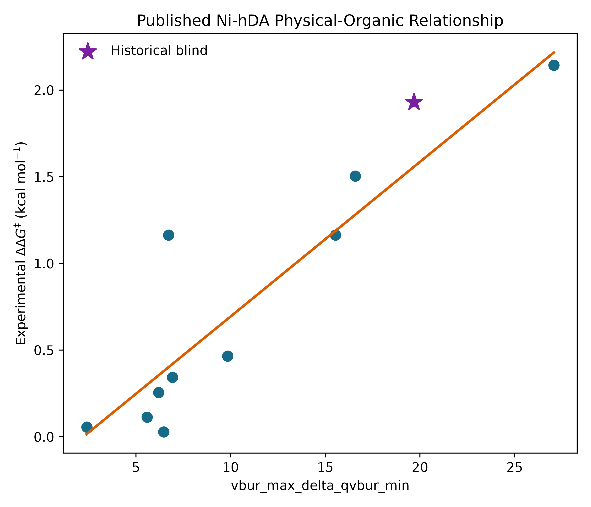
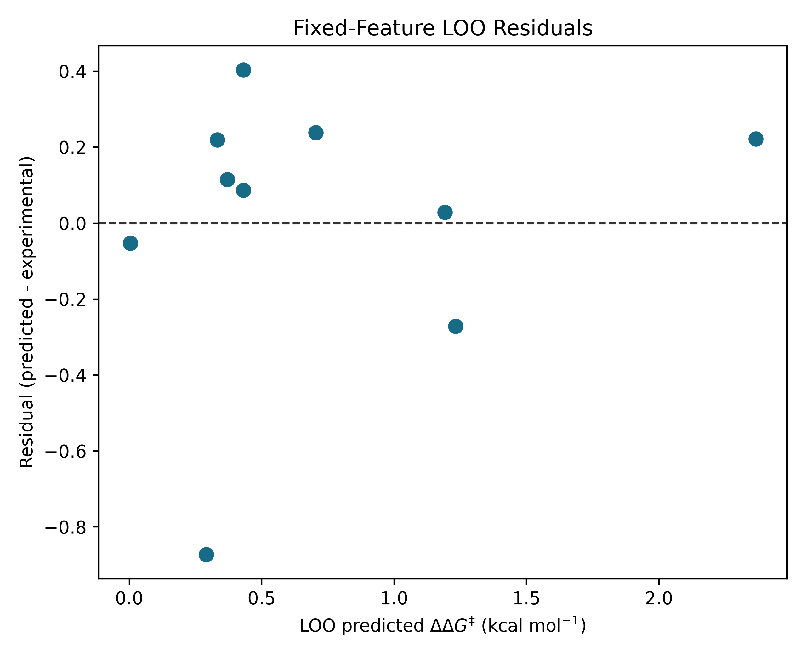

# StericX Study 001

## Reproduction target

This study reproduces the enantioselectivity analysis in the Sigman Group's
[Ni-catalyzed homo-Diels-Alder repository](https://github.com/SigmanGroup/Ni-Catalyzed-hDA/blob/main/Enantioselectivity_Model.ipynb). The
complete official Kraken table contains 1,566 ligands, but
only 11 have experimental enantioselectivity labels. The published notebook
defines ten training ligands; source ligand 723 is reserved here as a
historical blind holdout.

## Preregistered model

The descriptor `vbur_max_delta_qvbur_min` was fixed from the published notebook
before model fitting. No StericX feature search used the blind target.

| Quantity | Value |
|---|---:|
| Training observations | 10 |
| Training R² | 0.8193 |
| Training RMSE | 0.2928 kcal/mol |
| Fixed-feature LOO Q² | 0.7521 |
| Fixed-feature LOO RMSE | 0.3430 kcal/mol |
| Response-permutation p-value | 0.0015 |
| Slope | 0.089204 |
| Intercept | -0.197934 |

## Frozen historical holdout

The prediction was written to `frozen_predictions.csv` before the target was
joined. Its SHA-256 digest is
`f79e24353ee61123d13e68b826abf081d6c3f4349b5e821f4a48de654f8d89bb`.

| Source ID | Predicted ΔΔG‡ | Experimental ΔΔG‡ | Absolute error | Domain |
|---:|---:|---:|---:|---|
| 723 | 1.5578 | 1.9308 | 0.3730 | inside_training_range |

## Native StericX descriptor ablation

The native StericX model uses only the ETKDGv3/MMFF94 ensemble Sterimol
descriptors and reported donor NBO charge. The source has no reaction-specific
IR measurement, so its constant 1650 cm⁻¹ placeholder is automatically rejected
as non-informative. This deliberately tests whether the compact StericX
descriptor set can replace the published Kraken buried-volume feature.

| Quantity | Value |
|---|---:|
| Selected term | `B5_x_nbo_charge` |
| Training R² | 0.3625 |
| Fixed-feature LOO Q² | 0.0020 |
| Scaffold-group LOO Q² | 0.0013 |
| Fixed-feature LOO RMSE | 0.6882 kcal/mol |
| Historical blind MAE | 0.6978 kcal/mol |

This ablation does **not** match the published Kraken model. The negative result
is retained because it identifies the missing scientific capability:
coordination-aware buried-volume descriptors are more consequential here than
additional inference optimization.

## Statistical controls

- Descriptor scaling for ridge and LASSO is learned within every inner
  cross-validation fold.
- Regularization is selected by nested leave-one-out cross-validation.
- Bootstrap intervals and Y-scrambling use deterministic recorded seeds.
- Correlation and VIF tables are saved as machine-readable CSV files.
- Applicability is reported against the training descriptor range.

## Interpretation and limitations

The primary descriptor measures conformer-sensitive variation in buried-volume
anisotropy. Its positive coefficient is consistent with increasing asymmetric
steric differentiation accompanying larger ΔΔG‡ in this reaction family.

This is a faithful **historical reproduction**, not a new prospective
experiment. Ten training points cannot establish broad catalyst
generalizability, and one holdout cannot support a population-level R².
The holdout error must be reported as-is. A publication-grade prospective claim
requires predictions recorded before new reactions are performed, preferably
across an entire ligand scaffold or mechanistic regime.

## Provenance

- Source: https://raw.githubusercontent.com/SigmanGroup/Ni-Catalyzed-hDA/main/data/kraken.csv
- Source SHA-256: `4af1a776378a1f1aa369e076c9b35de2afa8c60e30841ec63cd13d95ccb8f00d`
- Generated: 2026-07-26T00:00:56.996612+00:00
- No workstation specifications are recorded.
