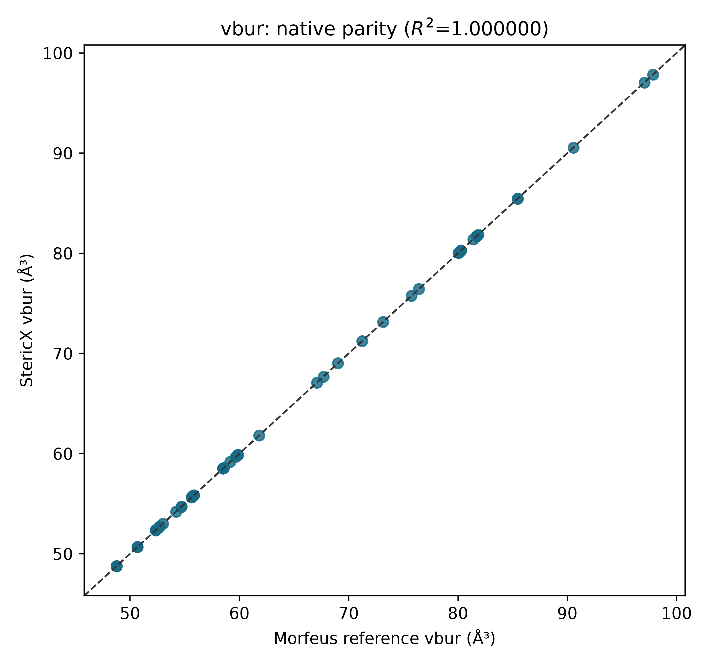
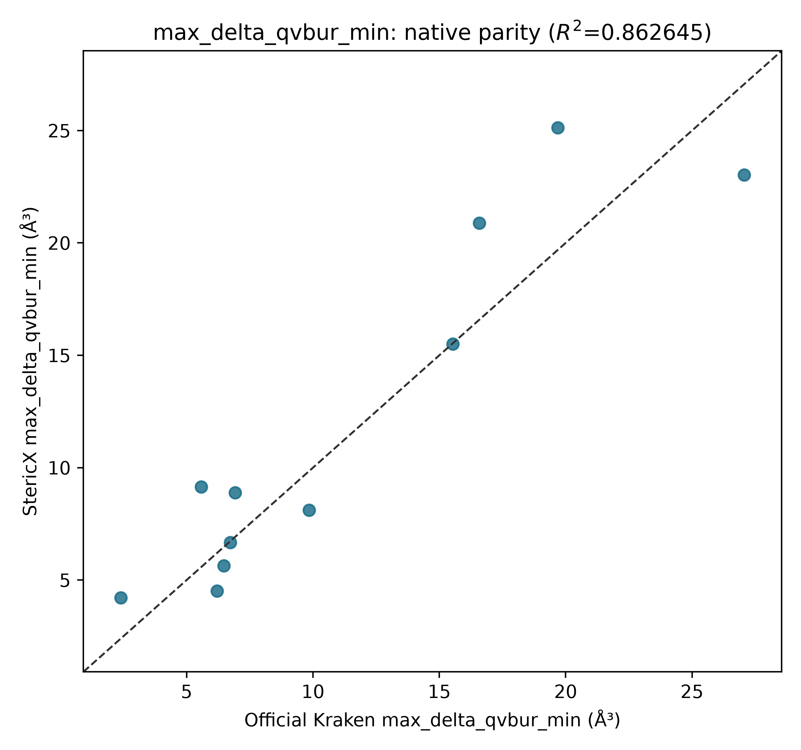

# StericX Study 002

## Coordination-aware buried volume

This study implements the public Kraken three-orientation quadrant protocol and
validates the native Rust voxel engine against Morfeus on exactly the same
geometries. The complete convention and its approximation boundary are frozen
in [DESCRIPTOR_SPEC.md](DESCRIPTOR_SPEC.md).

The version-two matrix contains 11 reaction records and
aggregates 56 retained conformers. Version one remains
readable and unchanged.

| Per-conformer descriptor | R² vs Morfeus | RMSE (ų) | Mean relative error |
|---|---:|---:|---:|
| vbur | 1.000000 | 3.33325e-06 | 0.000004% |
| qvbur_min | 1.000000 | 5.42634e-07 | 0.000004% |
| qvbur_max | 1.000000 | 1.14658e-06 | 0.000004% |
| max_delta_qvbur | 1.000000 | 1.02421e-06 | 0.000008% |
| near_vbur | 1.000000 | 3.37565e-06 | 0.000004% |
| far_vbur | 1.000000 | 4.54235e-07 | 0.000003% |

## Official Kraken comparison

The native geometry uses ETKDGv3/MMFF94 conformers and an inferred lone-pair
direction. Official Kraken uses CREST/xTB/DFT ensembles and xTB localized
molecular-orbital centres. This comparison therefore tests the complete
approximate workflow, not the Rust voxel arithmetic alone.

| Quantity | Value |
|---|---:|
| R² against official `vbur_max_delta_qvbur_min` | 0.8626 |
| RMSE | 2.8740 ų |
| Slope | 0.9576 |
| Intercept | 1.2649 ų |

## Locked Ni-hDA rerun

The model uses only the native ensemble minimum of `max_delta_qvbur`. The ten
published training IDs and historical blind ligand 723 are unchanged.

| Quantity | Value |
|---|---:|
| Training R² | 0.7693 |
| Training RMSE | 0.3309 kcal/mol |
| Fixed-feature LOO Q² | 0.6549 |
| Fixed-feature LOO RMSE | 0.4047 kcal/mol |
| Blind prediction | 2.0837 kcal/mol |
| Blind experimental | 1.9308 kcal/mol |
| Blind absolute error | 0.1529 kcal/mol |

## Preregistered success gates

| Gate | Result |
|---|---|
| `morfeus_mean_relative_error_below_1_percent` | PASS |
| `official_kraken_descriptor_r2_above_0_99` | FAIL |
| `native_fixed_feature_loo_q2_at_least_0_752` | FAIL |
| `historical_blind_error_at_most_0_373_kcal_mol` | PASS |

Failed gates are retained as scientific results. Passing the same-geometry
Morfeus gate establishes implementation fidelity; it does not imply that
approximate RDKit geometries reproduce the official quantum-chemical
descriptor.

## Next experimental boundary

This remains a historical reproduction. A prospective claim requires a frozen
ranked ligand deck followed by new measurements performed without refitting to
those outcomes.
