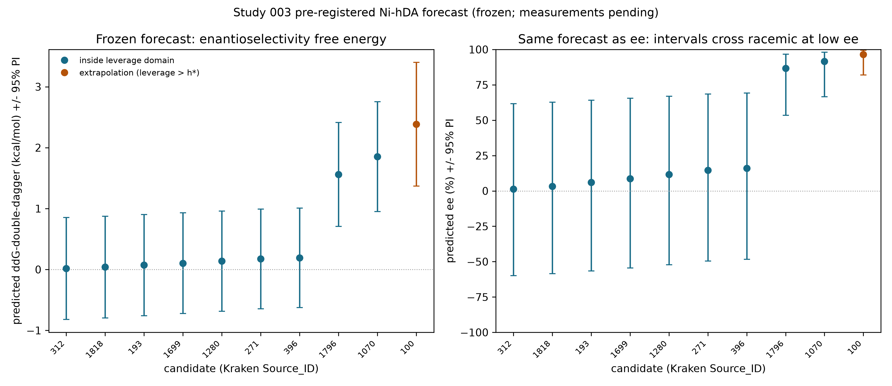

# StericX Study 003

## Production CREST ensemble

All 322 CREST 2.12/GFN2-xTB conformers were resampled and evaluated with the pinned xTB 6.4.0 Kraken property profile. The Rust engine was required to consume an explicit center for every conformer; geometric fallback was disabled.

| Quantity | Value |
|---|---:|
| R² against official Kraken descriptor | 0.9254 |
| Study 002 R² | 0.8626 |
| R² change | +0.0627 |
| Descriptor RMSE | 2.8354 ų |

## Historical model replay

Ligand 723 is explicitly a historical replay because its target was revealed
in earlier studies. It is not called blind or prospective.

| Quantity | Value |
|---|---:|
| Training R² | 0.7163 |
| Fixed-feature LOO Q² | 0.5941 |
| Fixed-feature LOO RMSE | 0.4389 kcal/mol |
| Historical 723 absolute error | 0.1107 kcal/mol |

## Frozen prospective deck

The target-free deck contains 10 unlabeled ligands.
Its SHA-256 is `564d7b87567a036582ecd7a2a0bd4f43ad2e1b33a61452ab6ae87b16e6ef457a`. Predictions are frozen and
measurements remain pending. Candidates require expert experimental review;
this artifact is not a synthesis or safety instruction.

[Prospective ligand deck](prospective_ligand_deck.csv)

## Pre-registered, falsifiable prediction

The frozen deck is elevated to a full **pre-registration** in
[`PREREGISTRATION.md`](PREREGISTRATION.md): every point prediction now carries a
95% ordinary-least-squares prediction interval and an applicability-domain
judgement (OLS leverage against `h* = 3p/n = 0.60`; 9 of 10 candidates inside),
and the document commits — by the frozen deck's SHA-256 — to an exact experimental
protocol and a pre-registered falsification rule (measured ΔΔG‡ within the 95%
interval for ≥6 of 8 primary candidates **and** positive predicted-vs-measured
rank correlation, else falsified). It also states the honest limit: for 7 of 10
candidates the 95% ee interval spans both signs of enantioselectivity, so those
near-racemate predictions are not meaningfully falsifiable on ee. Regenerate with
`uv run --extra science python scripts/preregister_prediction.py`; the point
predictions are verified byte-for-byte against the frozen deck.

## Success gates

| Gate | Result |
|---|---|
| `all_conformers_have_xtb_lmo_centers` | PASS |
| `official_descriptor_r2_improves_over_study_002` | PASS |
| `official_descriptor_r2_above_0_99` | FAIL |
| `fixed_feature_loo_q2_at_least_published` | FAIL |
| `prospective_deck_is_frozen_and_target_free` | PASS |

## Ensemble provenance

This report reflects the complete eleven-ligand CREST 2.12 production ensemble, which replaces the Study 002 ETKDGv3/MMFF94 conformers. Gates are declared only from measured results, and the failed gates above are retained rather than hidden.
