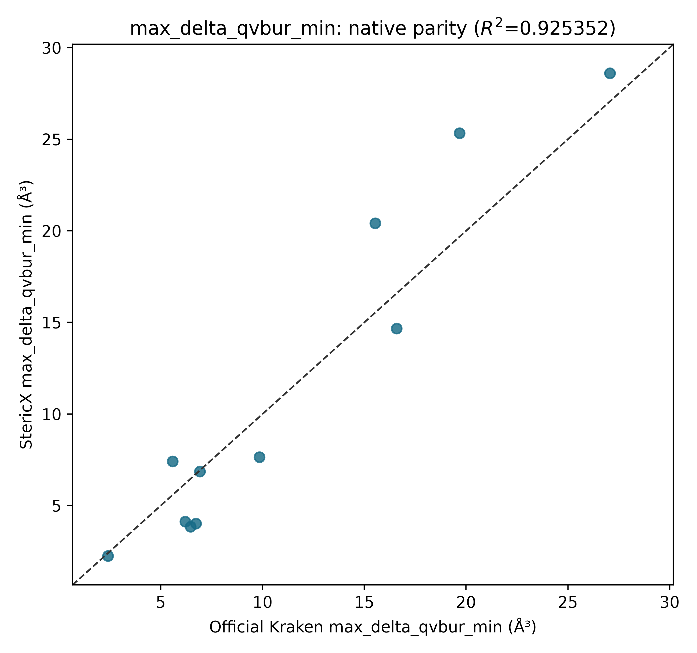
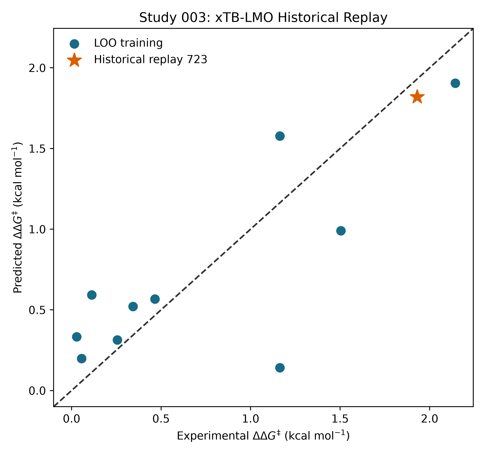

# StericX Study 003

## Phase A: exact xTB LMO centers

All 322 existing conformers were evaluated with the pinned
xTB 6.4.0 Kraken property profile. The Rust engine was required to consume an
explicit center for every conformer; geometric fallback was disabled.

| Quantity | Value |
|---|---:|
| R² against official Kraken descriptor | 0.9254 |
| Study 002 R² | 0.8626 |
| R² change | +0.0627 |
| Descriptor RMSE | 2.8354 ų |

## Historical model replay

Ligand 723 is explicitly a historical replay because its target was revealed
in earlier studies. It is not called blind or prospective.

| Quantity | Value |
|---|---:|
| Training R² | 0.7163 |
| Fixed-feature LOO Q² | 0.5941 |
| Fixed-feature LOO RMSE | 0.4389 kcal/mol |
| Historical 723 absolute error | 0.1107 kcal/mol |

## Frozen prospective deck

The target-free deck contains 10 unlabeled ligands.
Its SHA-256 is `564d7b87567a036582ecd7a2a0bd4f43ad2e1b33a61452ab6ae87b16e6ef457a`. Predictions are frozen and
measurements remain pending. Candidates require expert experimental review;
this artifact is not a synthesis or safety instruction.

[Prospective ligand deck](prospective_ligand_deck.csv)

## Success gates

| Gate | Result |
|---|---|
| `all_conformers_have_xtb_lmo_centers` | PASS |
| `official_descriptor_r2_improves_over_study_002` | PASS |
| `official_descriptor_r2_above_0_99` | FAIL |
| `fixed_feature_loo_q2_at_least_published` | FAIL |
| `prospective_deck_is_frozen_and_target_free` | PASS |

## Remaining production phase

This phase isolates the LMO-center effect while retaining the Study 002
ETKDGv3/MMFF94 conformers. The production CREST 2.12 ensemble backend is
implemented and checksum-pinned, but the complete eleven-ligand CREST run is
reported separately when those expensive calculations finish. No gate is
declared passed merely because the execution path exists.
