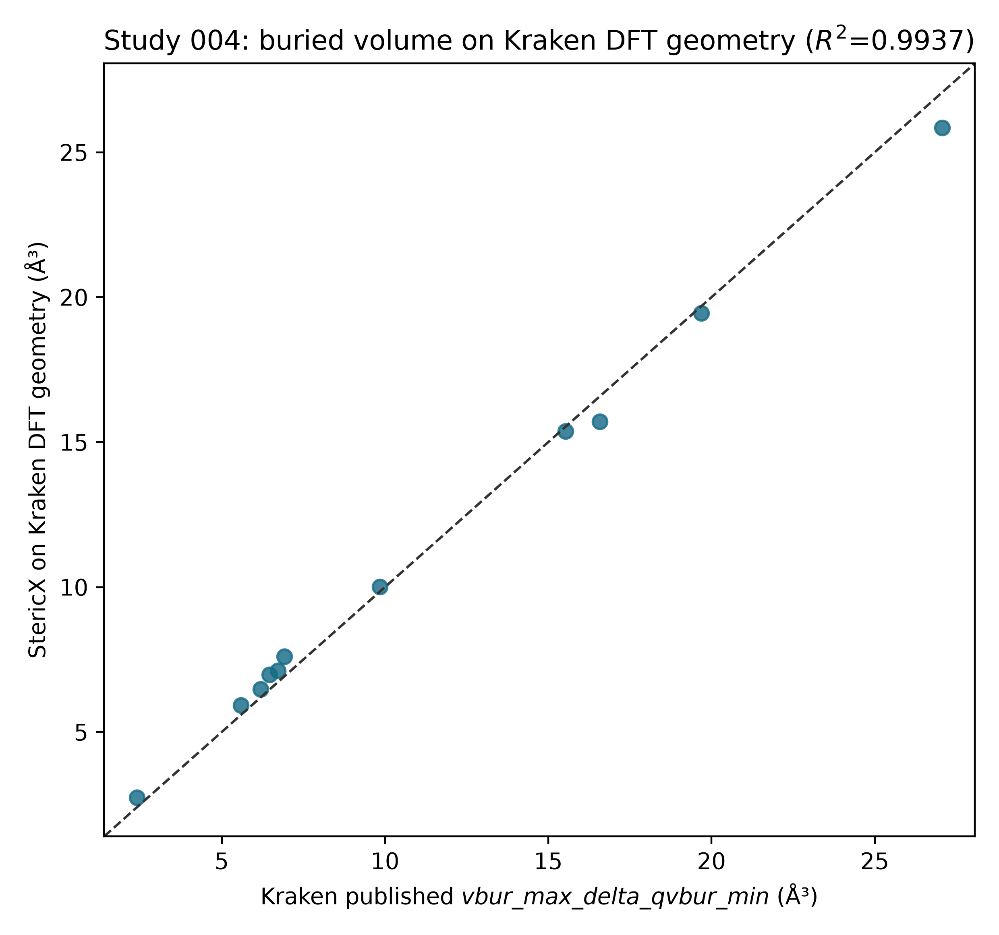

# StericX Study 004

## Buried volume on Kraken's own DFT geometries

The StericX voxel kernel was run, unchanged, on Kraken's public DFT-optimized
conformer geometries (PBE/6-31+G(d,p), GD3BJ), downloaded from the MolSSI
descriptor-library REST API. The geometric-centre convention is identical to
Study 002, so the only variable relative to that study is the geometry source.
`vbur_max_delta_qvbur_min` is the minimum over the ensemble of each conformer's
`max_delta_qvbur`, requiring geometries only.

| Quantity | Value |
|---|---:|
| Ligands | 11 |
| Conformers | 135 |
| R² vs published (1:1) | 0.9937 |
| Pearson r | 0.9993 |
| RMSE | 0.5682 ų |
| Study 002 R² (RDKit/MMFF geometry) | 0.8626 |
| Study 003 R² (CREST/GFN2-xTB geometry) | 0.9254 |

## Per-ligand comparison

| Kraken ID | Published | StericX on DFT | Absolute error (ų) |
|---|---:|---:|---:|
| 401 | 2.3962 | 2.7391 | 0.3430 |
| 498 | 5.5820 | 5.9212 | 0.3392 |
| 723 | 19.6818 | 19.4421 | 0.2398 |
| 724 | 27.0649 | 25.8412 | 1.2237 |
| 785 | 6.7199 | 7.1218 | 0.4018 |
| 1057 | 16.5828 | 15.7122 | 0.8706 |
| 1058 | 15.5317 | 15.3742 | 0.1575 |
| 2062 | 6.9239 | 7.5997 | 0.6758 |
| 2063 | 6.1959 | 6.4807 | 0.2848 |
| 2064 | 6.4647 | 6.9702 | 0.5055 |
| 2067 | 9.8409 | 10.0008 | 0.1599 |

## Interpretation

Holding the coordination-centre method fixed and swapping only the geometry
source raises agreement with the published descriptor from Study 002's
0.8626 to 0.9937. The residual is a near-constant offset
(Pearson r = 0.9993), consistent with the difference between
StericX's geometrically inferred lone-pair centre and Kraken's exact
coordination-centre convention rather than the structures. This localizes the
Study 002/003 shortfall to conformer geometry generation and confirms the voxel
kernel reproduces the published buried-volume descriptor on identical DFT
geometries.

## Provenance

Geometries and reference descriptors were downloaded from the public MolSSI
Kraken descriptor library REST API (`https://descriptor-libraries.molssi.org/api/kraken`). The API's per-conformer
`vbur_max_delta_qvbur` minimum matches the published `vbur_max_delta_qvbur_min` value,
confirming the retrieved geometries correspond to the published dataset. StericX
is an independent reproduction; cite the original Kraken work (see the README).
