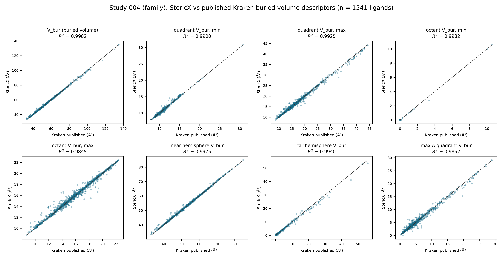

# StericX Study 004 — Buried-Volume Descriptor Family

## Reproducing the whole `vbur` family, not one descriptor

Study 004 validated a single Kraken descriptor across the full set. The same buried-volume kernel run produces Kraken's entire `vbur` family, so this study compares all of it against Kraken's *published* values over 1541 ligands. Each descriptor is reduced to its minimum over the conformer ensemble, matching Kraken's `*_min` convention. StericX values are read from the committed per-conformer table; Kraken values come from the public MolSSI API. Nothing is recomputed.

| Descriptor | Kraken property | R² | Pearson r | RMSE (ų) | Median abs. err (ų) |
|---|---|---:|---:|---:|---:|
| V_bur (buried volume) | `vbur_vbur` | 0.9982 | 0.9992 | 0.4957 | 0.1367 |
| quadrant V_bur, min | `vbur_qvbur_min` | 0.9900 | 0.9952 | 0.1674 | 0.0445 |
| quadrant V_bur, max | `vbur_qvbur_max` | 0.9925 | 0.9965 | 0.4512 | 0.1042 |
| octant V_bur, min | `vbur_ovbur_min` | 0.9982 | 0.9991 | 0.0168 | 0.0000 |
| octant V_bur, max | `vbur_ovbur_max` | 0.9845 | 0.9923 | 0.3536 | 0.0811 |
| near-hemisphere V_bur | `vbur_near_vbur` | 0.9975 | 0.9989 | 0.4131 | 0.1315 |
| far-hemisphere V_bur | `vbur_far_vbur` | 0.9940 | 0.9980 | 0.3707 | 0.0000 |
| max Δ quadrant V_bur | `vbur_max_delta_qvbur` | 0.9852 | 0.9927 | 0.4906 | 0.1115 |

Across the eight descriptors the mean R² is **0.9925**. The single buried-volume kernel reproduces not just the headline `max_delta_qvbur` but the buried volume itself, the quadrant and octant extremes, and the near/far hemispheres — each against Kraken's own published numbers, across the whole library. The near/far hemispheres match in the correct sense (no axis swap), confirming the octant partitioning is oriented as Kraken's.

*Figure. StericX vs published Kraken value for each buried-volume descriptor. Generated by `study_kraken_vbur_family.py`.*
