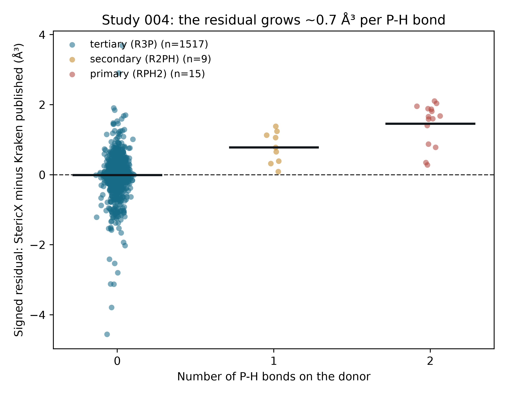

# StericX Study 004 — Residual Anatomy

## Where the last cubic ångström of error lives

The scaled Study 004 reproduces Kraken's `vbur_max_delta_qvbur_min` across 1541 ligands at `R^2 = 0.9852`. This note dissects the remaining residual by the coordination of the phosphorus donor, classified with the same covalent-radius bond detection the kernel uses. The signed residual is StericX minus the published value, so a positive number is an overestimate.

| Donor class | Ligands | Mean residual (ų) | Median residual (ų) | Mean abs. residual (ų) |
|---|---:|---:|---:|---:|
| tertiary (R3P) | 1517 | -0.010 | -0.001 | 0.256 |
| secondary (R2PH) | 9 | +0.781 | +0.778 | 0.781 |
| primary (RPH2) | 15 | +1.457 | +1.658 | 1.457 |

## Interpretation

**Tertiary phosphines — 1517 ligands, 98.4% of the set — are essentially unbiased** (mean residual -0.010 ų, median -0.001 ų; class `R^2` = 0.9869). The entire systematic bias lives in the 24 primary and secondary phosphines (1.6% of the set), and it is **monotonic in the number of P-H bonds**: roughly +0.7 ų per hydrogen (0 → ~0, 1 → +0.78, 2 → +1.46 ų).

That monotonic signal points at a single, already-documented cause. The buried-volume centre is placed along a **geometrically inferred** lone-pair direction — the negated sum of the three P-substituent bond vectors — as a stand-in for Kraken's **xTB localized-molecular-orbital** centre. For a tertiary phosphine the three bulky substituents pin that direction tightly, and the two centres coincide. Each P-H bond replaces a heavy substituent with a short, light one: the geometric construction weights that P-H direction exactly like a P-C bond, whereas the true electronic lone pair (and Kraken's LMO centre) does not. The centre shifts, the integration sphere captures slightly more ligand, and the descriptor reads high — by an amount that scales with the count of P-H bonds, exactly as observed.

This is a genuine limit of the geometric-centre approximation, not a bug and not something to tune away: closing it would require the xTB LMO centre itself, which is outside the free, reproducible pipeline. It affects 1.6% of the library and none of the tertiary phosphines that make up the Ni-hDA reaction family. The honest headline is unchanged; this note simply shows the residual is understood down to its mechanism.

*Figure. Signed residual against the number of P-H bonds on the donor (bars = class means). Generated by `studies/study_004_frame_residual.py`.*
