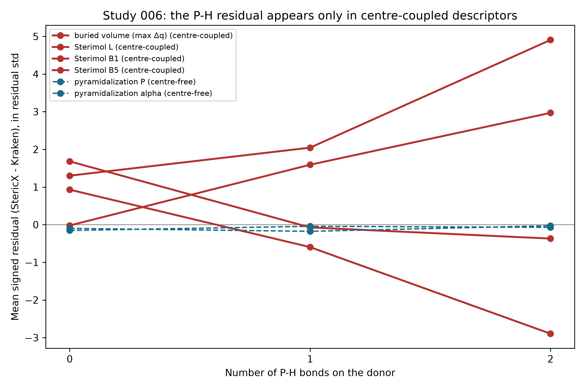

# StericX Study 006 - Localizing the Residual to the Coordination Centre

## An internal control: which descriptors carry the P-H residual?

Study 004 showed the full-set buried-volume residual is confined to the 24 primary/secondary phosphines and grows ~0.7 ų per P-H bond, and attributed it to StericX's geometric lone-pair centre standing in for Kraken's xTB localized-molecular-orbital centre. This study tests that attribution directly. StericX computes six descriptors from the same 1541 DFT geometries, split by how they depend on the coordination centre:

- **Centre-coupled** - buried volume and Sterimol `L`/`B1`/`B5` are anchored on the coordination centre / lone-pair axis, so a wrong centre moves them.
- **Centre-free** - pyramidalization (`pyr_P`, `pyr_alpha`) is computed purely from the three donor→substituent bond vectors and never references the coordination centre at all.

If the P-H residual is genuinely a coordination-centre artefact, it must appear in the centre-coupled descriptors and vanish in pyramidalization - on the *same* ligands. It does.

| Descriptor | Centre | Residual, P-H 0/1/2 | Std slope/P-H | Outlier x |
|---|---|---|---:|---:|
| buried volume (max Δq) | coupled | -0.010 / +0.781 / +1.457 | +1.51 | 4.71x |
| Sterimol L | coupled | +0.092 / -0.059 / -0.287 | -1.86 | 1.88x |
| Sterimol B1 | coupled | +0.091 / -0.004 / -0.020 | -1.12 | 0.35x |
| Sterimol B5 | coupled | +0.092 / +0.145 / +0.349 | +1.67 | 2.73x |
| pyramidalization P | free | -0.000 / -0.000 / -0.000 | +0.02 | 0.79x |
| pyramidalization alpha | free | -0.003 / -0.001 / -0.002 | +0.05 | 0.59x |

The residual moves by a mean **1.54 residual-SD per P-H bond** across the four centre-coupled descriptors, versus **0.04 residual-SD per P-H bond** for the two centre-free pyramidalization descriptors -- an order-of-magnitude separation. The signs of the centre-coupled slopes differ because a mis-placed axis lengthens some measures and shortens others; what they share is a large *systematic* shift with P-H count, which pyramidalization does not have. For the buried volume the primary/secondary phosphines are also 4.7x larger outliers than tertiary donors, while for pyramidalization they are ordinary ligands. (The Sterimol outlier ratios are noisier than the slope because the minimum-over-conformers reduction interacts with the small P-H sample; the systematic per-P-H slope is the robust signal.)

Because pyramidalization shares the donor, the geometries, the covalent-radius frame, and the `f32` kernel with the buried volume - differing *only* in that it never places the coordination centre - this rules out the kernel, the frame construction, and the geometries as the source. The residual is specifically the geometric lone-pair centre diverging from Kraken's xTB LMO centre, exactly where a P-H bond replaces a bulky substituent with a short, light one. It is a bounded, understood property of the free reproduction pipeline, affecting 1.6 % of the library and none of the tertiary phosphines that make up the Ni-hDA family - not a bug, and not tuned away.

*Figure. Mean signed residual (in each descriptor's own residual-sd) against P-H count. Centre-coupled descriptors (solid) diverge with P-H count; centre-free pyramidalization (dashed) stays flat. Generated by `study_residual_localization.py`.*
