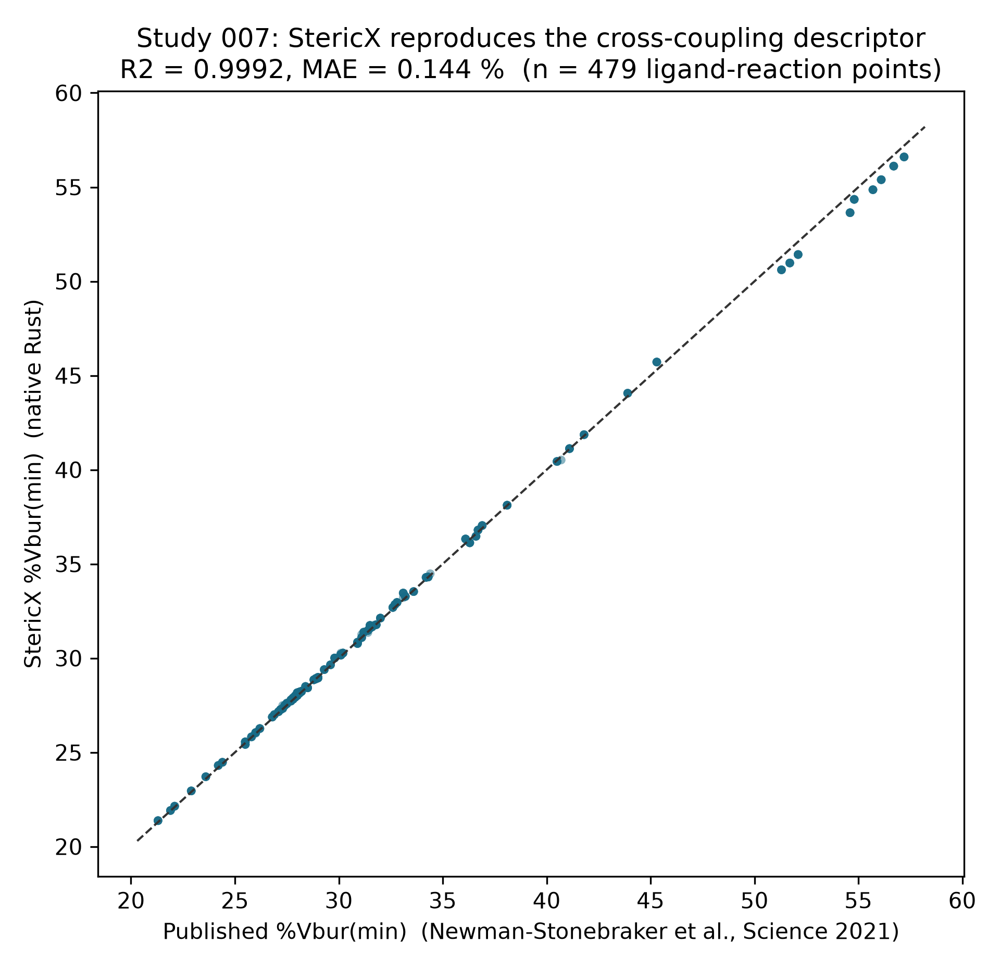
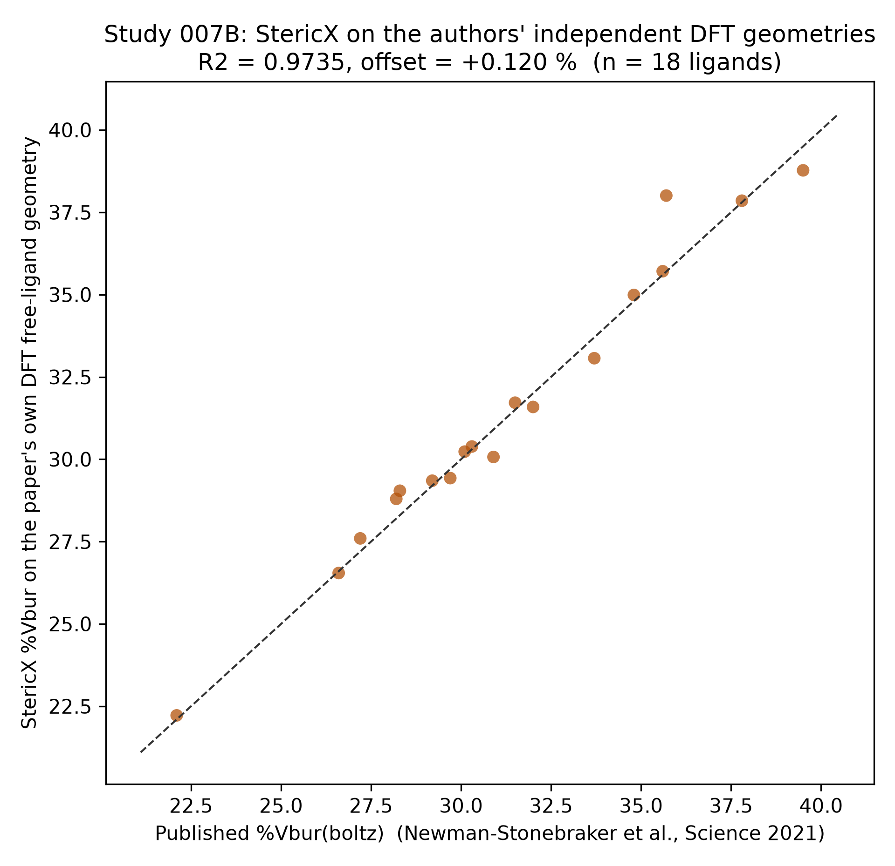

# StericX Study 007 - An Independent Second Reaction Model

## Reproducing a cross-coupling reactivity classifier

Newman-Stonebraker, Smith, Borowski, Peters, Gensch, Johnson, Sigman and Doyle (*Science* **2021**, *374*, 301, [DOI: 10.1126/science.abj4213](https://doi.org/10.1126/science.abj4213)) showed that a single ligand descriptor -- the minimum percent buried volume, %Vbur(min) -- classifies monodentate phosphines as active or inactive across a family of Ni cross-coupling reactions, through a single-node decision-tree threshold. This study asks whether StericX, an independent from-scratch Rust kernel, reproduces both the descriptor and the classifier on the authors' own high-throughput datasets (Reactions I-V and RS1).

It extends the project's validation beyond the single Ni-hDA reaction (Study 001) to real, lab-measured cross-coupling reactivity, using a descriptor StericX already validated at library scale (Study 004). Sections 1-2 reproduce the descriptor and the in-sample classifier; sections 3-4 then push past reproduction -- testing whether the ~32% steric cliff transfers **out-of-sample** across reactions (section 3), and re-running StericX on the authors' **own** DFT geometries to remove the shared-coordinate circularity (section 4). The paper's supplementary data is third-party copyrighted (AAAS); it is read locally and never redistributed here -- only StericX's computed values and the comparison are shown, with the paper's Table S11 numbers cited for comparison.

### 1. Descriptor fidelity

Across **479 ligand-reaction data points** spanning the six reactions, StericX's independently-computed %Vbur(min) reproduces the paper's published %Vbur(min) at **R2 = 0.9992**, mean absolute error **0.144 %**. StericX computes, from scratch, the exact descriptor the reactivity model is built on -- on a ligand set assembled by a different group for a different reaction.

### 2. Reproducing the univariate classifier (paper Table S11)

For each reaction, a single-node decision tree (the paper's method and `{0:1, 1:20}` class weighting) is fit on **StericX's** %Vbur(min) with the paper's per-reaction yield cutoff. The recovered threshold, direction, accuracy and Matthews correlation (MCC) are compared to the values the paper reports. `baseline` is the majority-class accuracy -- the score of always predicting the larger class. The bracketed range is a bootstrap **95% CI** on MCC (2,000 resamples), added because n is only 34-89 per reaction:

| Reaction | n | active | baseline | StericX thr / dir | StericX acc / MCC | MCC 95% CI | Paper acc / MCC |
|---|---:|---:|---:|---|---:|---:|---:|
| I | 34 | 18 | 0.53 | 32.5 / Left | 0.76 / 0.59 | [+0.39, +0.85] | 0.79 / 0.62 |
| II | 89 | 35 | 0.61 | 32.0 / Left | 0.72 / 0.56 | [+0.44, +0.69] | 0.70 / 0.53 |
| III | 89 | 27 | 0.70 | 31.8 / Left | 0.64 / 0.47 | [+0.38, +0.68] | 0.67 / 0.50 |
| IV | 89 | 30 | 0.66 | 32.0 / Left | 0.66 / 0.50 | [+0.38, +0.63] | 0.64 / 0.45 |
| V | 89 | 50 | 0.56 | 50.8 / Left | 0.65 / 0.36 | [+0.00, +0.63] | 0.66 / 0.36 |
| RS1 | 89 | 34 | 0.62 | 32.0 / Left | 0.71 / 0.55 | [+0.43, +0.68] | 0.70 / 0.54 |

StericX's classifier reaches a mean accuracy of **0.69** (mean MCC **0.50**) across the six reactions, against the paper's **0.69** / **0.50** -- recovering the same thresholds (near ~32% %Vbur(min) for the Ni datasets), the same `Left` direction (active below the threshold), and matching both metrics per reaction.

**Reading these numbers honestly.** Accuracy is a poor lens for imbalanced binary data: for Reactions III and IV the classifier's accuracy sits at or below the majority-class `baseline`, because the paper's 20:1 active weighting deliberately trades raw accuracy to avoid missing active ligands. The honest metric is MCC, which is positive throughout (0.36-0.59) -- a real but moderate signal, though the bootstrap 95% CIs are wide at these sample sizes (Reaction V's reaches down to ~0.00). That is expected, not a shortfall: this is a deliberately *univariate* model (one steric number, one threshold) that cannot see electronics, substrate, or conditions. The point of Study 007 is not that the model is highly accurate but that StericX's from-scratch descriptor reproduces the published model exactly -- its successes and its documented limitations alike -- while the descriptor itself matches to R2 = 0.9992.

*Figure. StericX %Vbur(min) vs the published values for every tested ligand across Reactions I-V and RS1. Generated by `studies/study_007_crosscoupling.py`.*

### 3. Out-of-sample transferability of the ligation cliff

The paper's central claim is not six separate thresholds but that a *single* steric cliff near ~32 %Vbur(min) governs Ni ligation across the family. The per-reaction fits above are all in-sample; this section tests the shared threshold **out-of-sample** on StericX's descriptor. Each reaction still labels 'active' by its own yield cutoff -- only the %Vbur(min) threshold is treated as the shared, transferable quantity.

**Pooled fit.** Fitting one universal single-node threshold across all **479** (reaction, ligand) points gives a cliff at **32.8 %Vbur(min)** (accuracy 0.68, MCC 0.49) -- squarely in the ~32% regime the paper reports for the Ni datasets.

**Leave-one-reaction-out.** The threshold is fit on five reactions and used to predict the sixth fully out-of-sample. `trained thr` is the threshold learned from the other five; `own thr` is the held-out reaction's own best-fit threshold, for reference:

| Held-out reaction | n | trained thr | own thr | OOS acc | OOS MCC |
|---|---:|---:|---:|---:|---:|
| I | 34 | 33.1 | 32.5 | 0.74 | 0.54 |
| II | 89 | 33.1 | 32.0 | 0.67 | 0.50 |
| III | 89 | 33.1 | 31.8 | 0.58 | 0.41 |
| IV | 89 | 33.1 | 32.0 | 0.62 | 0.45 |
| V | 89 | 32.4 | 50.8 | 0.74 | 0.47 |
| RS1 | 89 | 33.1 | 32.0 | 0.66 | 0.49 |

The threshold learned from five reactions lands near ~33% for every held-out reaction, and out-of-sample MCC stays positive throughout (0.41-0.54), close to the in-sample values in section 2. The ~32% steric cliff is therefore a real, transferable feature of the descriptor, not six coincidences fit one reaction at a time -- the paper's central claim, reproduced out-of-sample on StericX's own numbers.

**Where the honest tension is.** The outlier is not a reaction that fails to transfer but **Reaction V's own best-fit threshold**: fit on V alone it jumps to **51 %Vbur(min)** (matching the paper's reported 51.5), far above the ~32% shared by the other five. V uses a higher yield cutoff (20%) and tolerates bulkier ligands, so its 20:1-weighted fit prefers a much looser threshold. Yet applying the shared ~32% cliff to V out-of-sample still predicts it with MCC 0.47 -- as well as V's own in-sample fit (51%-threshold, MCC 0.36 in section 2), because that in-sample threshold optimizes weighted recall rather than MCC. So V is a genuine outlier in *threshold space* exactly as the paper documents, while the universal cliff still carries predictive signal on it. Both facts are reported; neither is smoothed away.

### 4. An independent-geometry check (removing the circularity)

The fidelity in section 1 used Kraken's *own* cached conformer coordinates, so 'StericX matches the published %Vbur' partly reflects a shared geometry source. This section closes that gap: StericX is run on the **paper's own DFT free-ligand geometries** (supplied in the SI, optimized by a different group with a different DFT stack) for the **18** ligands that also appear in the reaction tables. Every geometry is matched to its Kraken id by molecular formula before comparison, so a mis-mapped or isomeric structure is rejected rather than scored.

A free-ligand structure is a single conformer, so the fair published reference is the Boltzmann-averaged %Vbur(boltz), not the ensemble extreme %Vbur(min) (the single geometry sits **+2.34 %** above the min, as expected of a ground-state rather than most-open conformer). Against %Vbur(boltz), StericX on the authors' own geometries reproduces the published value at **R2 = 0.9735** (Pearson r = 0.9872), MAE **0.446 %**, with a negligible offset of **+0.120 %** -- agreement driven purely by the shared kernel, with no shared coordinates. For **16 of 18** ligands the paper-geometry value also falls inside the %Vbur range StericX itself computes across Kraken's conformers for that ligand: the two independent geometry sources are mutually consistent to within conformational spread.

*Figure. StericX's %Vbur on the paper's own DFT free-ligand geometries vs the published %Vbur(boltz). A truly independent path -- the authors' structures through StericX's kernel -- with no shared coordinates.*

### Reproducing this study

The experimental yields and published descriptors live in the paper's supplementary PDF, which is copyrighted (AAAS) and therefore **not** included in this repository. To re-run, download the Science abj4213 supplementary materials and place `science.abj4213_sm.pdf` (and, for section 4, `science.abj4213_data_s1.zip` of DFT geometries) in `data/external/` (gitignored), then run `studies/study_007_crosscoupling.py`. StericX's own %Vbur(min) values are computed from Kraken's public DFT geometries.
