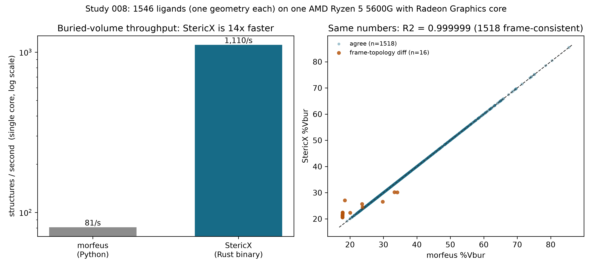

# StericX Study 008 - A Head-to-Head Speed Benchmark vs morfeus

## Same descriptor, same geometries, same core -- how much faster?

Studies 002 and 005 show StericX's descriptors *match* morfeus (buried volume and Sterimol to R2 >= 0.9999; pyramidalization to machine precision). Fidelity is only half of what makes a reproduction useful in practice -- the other half is cost. This study times StericX against morfeus, the reference Python implementation, computing the flagship **buried-volume** descriptor on the same geometries and the same single CPU core.

The benchmark runs on **1546 ligands (one geometry each)** from the Kraken DFT set, on a single CPU core (AMD Ryzen 5 5600G with Radeon Graphics). Both tools read the same files from a warm OS cache and are timed end-to-end (file on disk to descriptor value); the fastest of 3 repetitions is reported. The buried-volume convention (3.5 A sphere, Bondi radii x1.17, virtual Ni centre at 2.28 A, octant analysis) is the exact one validated in Study 002, reused here verbatim for morfeus (morfeus-ml 0.8.0).

### Result

| | Wall time | Throughput | Relative |
|---|---:|---:|---:|
| morfeus (Python) | 19.15 s | 81 / s | 1x |
| **StericX** (Rust binary) | **1.39 s** | **1,110 / s** | **14x** |

StericX is **14x faster** on a single core. The comparison is deliberately conservative: StericX computes Sterimol L/B1/B5 and pyramidalization *in the same timed pass*, while morfeus is timed for buried volume alone -- so the real end-to-end advantage of reproducing StericX's full descriptor panel with morfeus is larger than the figure above.

### The speedup is not from computing something cheaper

On the identical geometries, the two tools return the same number. Of the 1534 phosphines morfeus can frame (it requires three heavy substituents), **1518** agree to **R2 = 0.999999** (max absolute difference 0.42 %Vbur) -- StericX's buried volume *is* morfeus's, to well within a hundredth of a percent.

The remaining **16** ligands (1.0%) differ, and the reason is not the arithmetic but the frame: morfeus's reference here takes the *three nearest heavy atoms* as the donor substituents, while StericX uses covalent-radius bonding. Where those disagree -- an atom that is close but not bonded, or a bonded hydrogen that a heavy-atom rule ignores -- the integration sphere is centred differently. This is exactly the frame issue the StericX frame fix corrected and Study 006 characterizes; on these ligands StericX's bonded frame is the more defensible one. They are shown in a separate colour in the figure rather than averaged away. Overall (all 1534 ligands, both conventions mixed) the agreement is still R2 = 0.9985, MAE 0.037 %Vbur.

*Figure. Left: single-core buried-volume throughput (log scale). Right: StericX vs morfeus %Vbur on every benchmarked structure; the 16 orange points are frame-topology differences (see above), not compute errors. Generated by `study_speed_benchmark.py`.*

### Why this matters beyond the multiplier

StericX ships as a single **1.9 MB** native binary with no runtime dependencies -- no Python, no NumPy, no environment to resolve. morfeus is a Python library that requires an interpreter and a scientific stack. For a one-off calculation the difference is convenience; at library scale, or embedded in a screening pipeline, the combination of a large constant-factor speedup and zero deployment surface is the point. The descriptor `descriptors` subcommand is single-threaded here for a fair per-core comparison; on this 12-core machine the wall-clock throughput scales further with trivial parallelism across files.

### Honest caveats

- **Single descriptor.** Only buried volume is timed head-to-head. It is the flagship descriptor (Study 004) and the most expensive of the panel, but morfeus's Sterimol and pyramidalization are not separately timed here.
- **Warm cache, steady state.** Both tools are timed after the files are in the OS cache, measuring compute throughput rather than cold disk I/O.
- **One machine.** Absolute numbers are specific to the CPU above; the ratio is the portable quantity and will vary with hardware.

### Reproducing this study

The Kraken DFT SDF cache is a local, gitignored artifact. With it in place and the release binary built (`cargo build --release`), run `uv run --extra science python study_speed_benchmark.py`. Only StericX's own timings and the aggregate agreement are committed.
