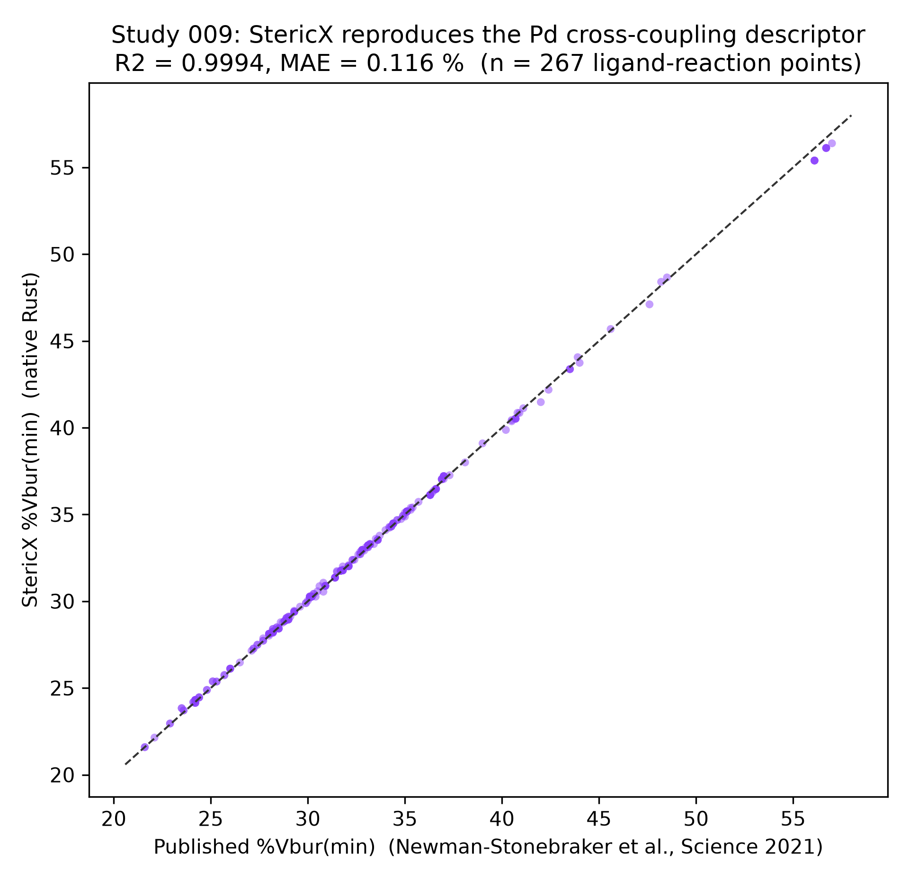
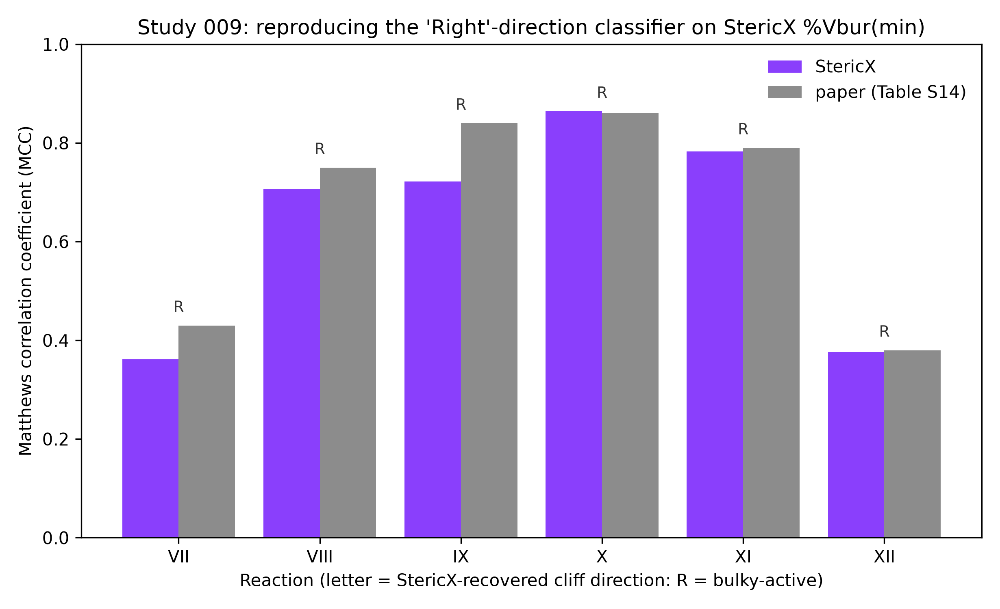

# StericX Study 009 - The Other Direction of the Ligation Cliff

## Reproducing the palladium cross-coupling classifier (bulky = active)

Study 007 reproduced the Newman-Stonebraker, Smith, Borowski, Peters, Gensch, Johnson, Sigman and Doyle result (*Science* **2021**, *374*, 301, [DOI: 10.1126/science.abj4213](https://doi.org/10.1126/science.abj4213)) for six **nickel** cross-coupling reactions, where the *small* phosphines are active and a %Vbur(min) threshold near ~32% separates them ('Left' of the cliff). The same paper reports a second family -- **palladium** couplings (Reactions VII-XII) -- in which the relationship runs the opposite way: the *bulky*, high-%Vbur ligands are the active ones ('Right' of the cliff). This study asks whether StericX, the same from-scratch Rust kernel, reproduces that opposite direction on the identical descriptor.

Two of the six reactions (XI, XII) are drawn by the paper from **other groups'** published datasets (Zhao et al., *Science* 2018; Stambuli et al.), so they are a genuinely independent test -- different laboratories, substrates, and chemistry, run through StericX's kernel. The classifier is fit with the paper's own mechanistically-preferred **'balanced'** class weight (its Tables S12/S14, the weighting used for the main-text Fig. 6); Study 007's Ni set used {0:1, 1:20} to match Table S11. The paper's supplementary data is third-party copyrighted (AAAS); it is read locally and never redistributed here -- only StericX's computed values and the comparison are shown, with the paper's table numbers cited for comparison and no per-ligand yields emitted.

### 1. Descriptor fidelity

Across **267 ligand-reaction data points** spanning the six Pd reactions, StericX's independently-computed %Vbur(min) reproduces the paper's published %Vbur(min) at **R2 = 0.9994**, mean absolute error **0.116 %** -- the same rock-solid descriptor agreement Study 007 found on the Ni set (R2 = 0.9992), now on a different, bulkier region of ligand space (Buchwald-type biaryl phosphines).

*Figure. StericX %Vbur(min) vs the published values for every tested ligand across Reactions VII-XII. Generated by `studies/study_009_pd_crosscoupling.py`.*

### 2. Reproducing the 'Right'-direction classifier (Tables S12/S14)

For each reaction, a single-node decision tree (the paper's method, 'balanced' class weight) is fit on **StericX's** %Vbur(min) with the paper's per-reaction yield cutoff. `dir` is the cliff direction StericX independently recovers -- **Right** means active *above* the threshold (bulky = active). `baseline` is the majority-class accuracy. The bracketed range is a bootstrap **95% CI** on MCC (2,000 resamples), because n is only 28-71 per reaction:

| Reaction | context | n | active | baseline | StericX thr / dir | StericX acc / MCC | MCC 95% CI | Paper thr / dir | Paper acc / MCC |
|---|---|---:|---:|---:|---|---:|---:|---|---:|
| VII | Pd Suzuki, aryl triflate electrophile (authors' HTE screen) | 55 | 28 | 0.51 | 26.7 / Right | 0.65 / 0.36 | [+0.26, +0.59] | 32.4 / Left | 0.67 / 0.43 |
| VIII | Pd Suzuki, benzyl chloride electrophile (authors' HTE screen) | 53 | 26 | 0.51 | 28.9 / Right | 0.85 / 0.71 | [+0.54, +0.89] | 28.9 / Right | 0.86 / 0.75 |
| IX | Pd medium-throughput screen (authors) | 30 | 20 | 0.67 | 30.6 / Right | 0.87 / 0.72 | [+0.59, +1.00] | 28.6 / Right | 0.93 / 0.84 |
| X | Pd medium-throughput screen (authors) | 28 | 15 | 0.54 | 30.6 / Right | 0.93 / 0.86 | [+0.68, +1.00] | 30.5 / Right | 0.93 / 0.86 |
| XI | literature: Zhao et al., Science 2018 (Pd, enantiodivergent C-C) | 30 | 19 | 0.63 | 29.1 / Right | 0.90 / 0.78 | [+0.60, +1.00] | 28.8 / Right | 0.90 / 0.79 |
| XII | literature: Stambuli et al. (Pd, Heck) | 71 | 39 | 0.55 | 29.7 / Right | 0.68 / 0.38 | [+0.29, +0.60] | 29.6 / Right | 0.68 / 0.38 |

StericX independently recovers the **'Right' (bulky = active) direction for 6 of the 6** reactions -- the opposite of the Ni 'Left' cliff, from the same one descriptor fit the same way. Its classifier reaches a mean MCC of **0.64** (accuracy 0.81) against the paper's **0.67** / 0.83. Where the classification is well-conditioned -- Reactions VIII, IX, X, XI -- StericX recovers the paper's threshold and MCC nearly exactly, including the two external-literature reactions.

*Figure. Per-reaction MCC, StericX vs the paper's Table S14 %Vbur(min) value; the letter above each pair is the cliff direction StericX recovered (R = bulky-active).*

### The honest tension: Reaction VII, and where the fit is fragile

This is not a clean sweep, and the failures are the same ones the paper documents. **Reaction VII** is the outlier: the paper classifies it 'Left' (and flags in its SM section 5b that VII's threshold sits at a *local* rather than global MCC maximum, the one reaction where weighting choice materially changes the answer). StericX's independent fit lands on a different, weak 'Right' split (MCC 0.36 vs the paper's 0.43) -- the reproduction inherits the reaction's genuine instability rather than papering over it. **Reaction IX**'s threshold is also sensitive: StericX recovers the right direction and a positive MCC (0.72) but places the boundary a couple of %Vbur above the paper's, because a MAE of ~0.1 %Vbur is enough to move a boundary ligand under a hard single-node split. The bootstrap CIs make the small-sample spread explicit: even the weakest reactions (VII, XII) hold a 95% MCC interval bounded above zero (lower edge ~+0.26), but the intervals are wide -- roughly 0.3 MCC across -- so the point estimates should be read as moderate signal, not precision.

**Reactions XI and XII are the most interesting for a different reason.** Both come from other groups' published work, so they test whether StericX's descriptor transfers off the authors' own bench. XI (Zhao et al.) reproduces strongly (MCC 0.78, matching the paper); XII (Stambuli Heck data) is genuinely weak for everyone (StericX 0.38, paper 0.38) -- a univariate steric model has little to say about a Heck reaction, and both the paper and this reproduction report that honestly rather than dropping the dataset.

As in Study 007, the takeaway is not that a one-number model is highly accurate everywhere -- it cannot see electronics, substrate, or conditions -- but that StericX's from-scratch descriptor reproduces the published model faithfully in *both* directions of the cliff: its strong classifications, its documented instabilities, and its genuine failures alike, while the descriptor itself matches to R2 = 0.9994.

### Reproducing this study

The experimental yields and published descriptors live in the paper's supplementary PDF, which is copyrighted (AAAS) and therefore **not** included in this repository. To re-run, download the Science abj4213 supplementary materials, place `science.abj4213_sm.pdf` in `data/external/` (gitignored), and run `studies/study_009_pd_crosscoupling.py`. StericX's own %Vbur(min) values are computed from Kraken's public DFT geometries; only StericX's values and the aggregate comparison are committed.
