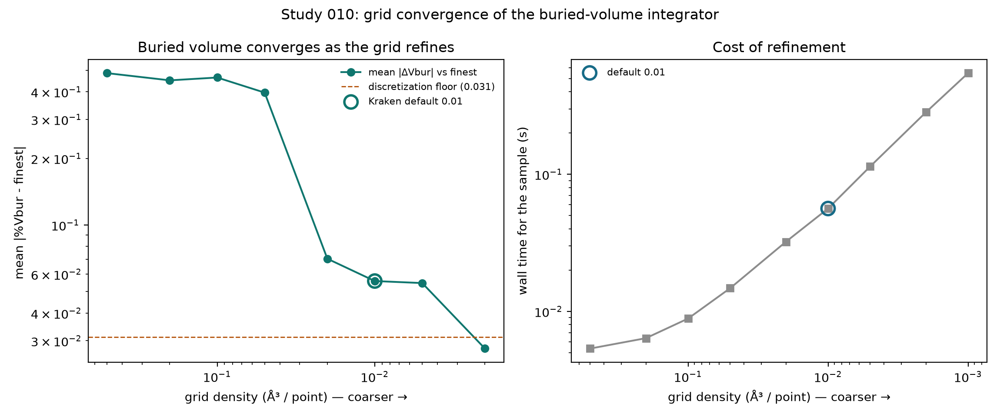

# StericX Study 010 - Grid Convergence of the Buried-Volume Integrator

## Is the descriptor converged, or grid-lucky?

Studies 002-004 show StericX's buried volume matches morfeus (R2 = 1.0 on identical geometries) and Kraken's published values (R2 = 0.9852 across 1,541 ligands). But every one of those runs used a **single** grid resolution -- Kraken's convention of 0.01 A^3 per integration point. This study asks whether that agreement is a property of the descriptor or an artifact of one lucky grid, by sweeping the integration grid from coarse to fine on a diverse sample of **60 Kraken ligands** and measuring convergence in the flagship %Vbur.

The finest grid tested (0.001 A^3/point) is taken as the converged reference; every coarser grid is measured against it.

## Result

| Grid density (ų/point) | mean \|ΔVbur\| | max \|ΔVbur\| | signed bias | time (s) |
|---|---:|---:|---:|---:|
| 0.5 | 0.4856 | 1.6929 | +0.1721 | 0.005 |
| 0.2 | 0.4505 | 1.4460 | +0.3274 | 0.006 |
| 0.1 | 0.4639 | 0.8818 | +0.4551 | 0.009 |
| 0.05 | 0.3965 | 0.7762 | +0.3875 | 0.015 |
| 0.02 | 0.0704 | 0.2370 | -0.0183 | 0.032 |
| 0.01 **(default)** | 0.0558 | 0.1604 | +0.0298 | 0.056 |
| 0.005 | 0.0546 | 0.1196 | -0.0530 | 0.114 |
| 0.002 | 0.0276 | 0.0751 | +0.0261 | 0.283 |
| 0.001 *(reference)* | 0.0000 | 0.0000 | +0.0000 | 0.546 |

**The descriptor converges.** As the grid refines, the mean deviation from the finest grid falls sharply -- from **0.486 %Vbur** at the coarse 0.5 A^3/point down to **0.056 %Vbur** at Kraken's default 0.01. The default sits inside the converged regime, not on the steep part of the curve.

**There is an irreducible floor.** Refining past the default does not drive the error to zero: the two finest grids still differ by an RMS of **0.031 %Vbur**. This is the discretization floor of any voxel integrator -- refinement only reshuffles which grid points fall inside the sphere near its surface, so a small registration jitter remains at every resolution. The default's mean error (0.056 %Vbur) sits within about 2x this floor -- close enough that further refinement chases jitter, not signal.



*Figure. Left: mean |%Vbur - finest| vs grid density (both axes log; coarser to the right), with the discretization floor and the Kraken default marked. Right: the wall-time cost of refinement. Generated by `studies/study_010_grid_convergence.py`.*

## Why this matters

It is worth being precise about what this does and does not say about the Study 004 reproduction. The full-set residual there is a median 0.11 A^3, or ~0.06 %Vbur on a 3.5 A sphere -- which is about the *same* size as the default grid's own uncertainty here (0.056 %Vbur vs the finest grid). So grid discretization is not negligibly small in absolute terms.

What makes the reproduction robust anyway is that **both sides use the same 0.01 grid**: Kraken's published values come from a voxel integrator at the same resolution, so the discretization is largely common-mode and cancels in the StericX-vs-Kraken comparison rather than adding to it. And the residual that remains does not behave like grid noise -- Study 006 localizes it to specific primary/secondary phosphines and the coordination centre, a structured effect a finer grid would not touch. Refining past 0.01 costs ~10x the wall time for no meaningful gain, while a coarser grid -- tempting for speed -- would visibly degrade the descriptor (the 0.5 A^3/point grid is off by 0.49 %Vbur). The default is the honest speed/accuracy sweet spot, and the sweep confirms the reproduction studies were run in the converged regime, not a grid-lucky one.

## Reproducing

```bash
uv run --extra science python studies/study_010_grid_convergence.py
```

Requires the Kraken DFT SDF cache (local, gitignored) and the release binary. Only StericX's own convergence measurements are written out.
