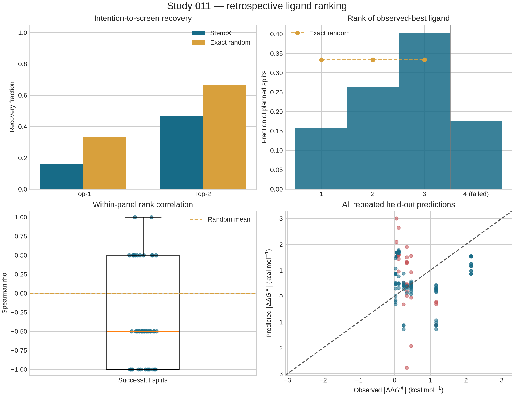
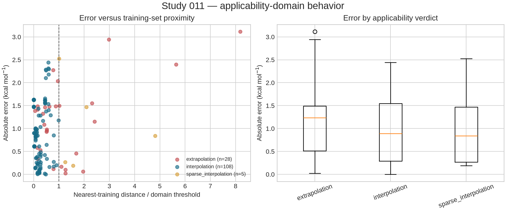

# Study 011: retrospective ligand ranking

## Result

StericX did not exceed the exact random baseline for top-1 recovery. Across all 57 preregistered screens, top-1
recovery was **0.158** versus **0.333** for exact random selection
(enrichment **0.474x**). Top-2 recovery was **0.465** versus
**0.667** (enrichment **0.697x**), and the mean rank of the
best held-out ligand was **2.596** versus **2.000** at
random. These are intention-to-screen
metrics: any failed screen receives the penalties fixed in `DESIGN.md`.

Of 57 planned splits, **47**
produced a complete three-ligand ranking and **10** failed.
Among successful rankings, mean Spearman rho was **-0.340**,
mean nDCG was **0.748**, pooled MAE was
**0.988 kcal/mol**, and pooled RMSE was
**1.219 kcal/mol**. The same ligand is predicted repeatedly,
so pooled errors and fold averages are descriptive rather than independent estimates.



## Predefined strata

| Holdout stratum | Planned | Successful | Top-1 recovery | Top-2 recall | Mean rho |
|---|---:|---:|---:|---:|---:|
| one_three_member_scaffold | 1 | 0 | 0.000 | 0.000 | not defined |
| three_singleton_scaffolds | 56 | 47 | 0.161 | 0.473 | -0.340 |

The single three-member-scaffold fold is shown separately because the exhaustive
design includes it once, while each singleton ligand appears in 21 distinct panels.
No stratum or split was selected after outcomes were revealed.

## Applicability-domain behavior

StericX predictions were ranked without filtering extrapolations. The continuous
nearest-training distance, leverage, range status, and categorical verdict for every
candidate are retained in `rankings.csv`.

| Domain verdict | Repeated predictions | MAE | RMSE | 95% PI coverage |
|---|---:|---:|---:|---:|
| extrapolation | 28 | 1.189 | 1.448 | 0.679 |
| interpolation | 108 | 0.933 | 1.144 | 0.648 |
| sparse_interpolation | 5 | 1.057 | 1.367 | 0.600 |

The descriptive Spearman association between absolute error and normalized nearest-
training distance was **-0.004**; the association with leverage ratio was
**0.284**.
Small and repeated samples prevent a calibrated claim about these domain strata.



## Method

The design was written and checksum-locked before this study accessed held-out
`ddG_abs` values. The design-lock SHA-256 is `efae084de2df171b971dc0308674b5e93bffeb6e8d91f8dd5682357ed130f920`. Exact split
membership is in `split_definitions.json` and `splits.csv`; seeds are in `seeds.json`.

For each split, the driver changed only row-aligned split labels, ran `stericx fit`
on the eight allowed observations, built a target-free three-ligand candidate CSV,
then called `stericx screen`. All predictions were completed before target reveal.
The frozen-prediction SHA-256 is `b7f5f34fdfbf9389ac4bf7d1cb4afcab419f3c5b7314f9c23aa818ec81051cd1`. The greatest absolute difference
between `fit`'s frozen prediction and the actual `screen` prediction was
**1.209761 kcal/mol**; screen predictions are the values evaluated.
The difference is expected from the locked practical-screening path: `fit` consumes
Boltzmann-averaged conformer Sterimol descriptors in the sigpack, whereas `screen`
recomputes Sterimol from each candidate's representative `Ligand_XYZ_Path`. It is a
real limitation of this experiment, not silently reconciled after target reveal.

The response is published `ddG_abs` at 298.15 K and larger is treated as more useful
enantioselectivity. Each candidate panel contains exactly three fully held-out
ligands. Native StericX descriptors and its constrained OLS/BIC training workflow
were used without post-result model changes. The exact random comparator enumerates
all six possible rankings for every panel; `random_baseline_metrics.csv` keeps every
one.

## Post-lock implementation QA

After the first outcome reveal, quality assurance changed only plot typography,
removed volatile timing text from a model audit file, and expanded the explanation
of the already-recorded screen-versus-fit descriptor mismatch. The original design
lock is preserved. `implementation_amendments.json` records both driver hashes and
the hashes proving that predictions, rankings, metrics, and baselines did not change.

## Failed and unfavorable results

- `S037` failed during `fit`: exit 2: error: no non-constant descriptor improved the intercept model
- `S042` failed during `fit`: exit 2: error: no non-constant descriptor improved the intercept model
- `S043` failed during `fit`: exit 2: error: no non-constant descriptor improved the intercept model
- `S045` failed during `fit`: exit 2: error: no non-constant descriptor improved the intercept model
- `S046` failed during `fit`: exit 2: error: no non-constant descriptor improved the intercept model
- `S047` failed during `fit`: exit 2: error: no non-constant descriptor improved the intercept model
- `S054` failed during `fit`: exit 2: error: no non-constant descriptor improved the intercept model
- `S055` failed during `fit`: exit 2: error: no non-constant descriptor improved the intercept model
- `S056` failed during `fit`: exit 2: error: no non-constant descriptor improved the intercept model
- `S057` failed during `fit`: exit 2: error: no non-constant descriptor improved the intercept model

Poor correlations, bottom-ranked best ligands, negative selection gains, out-of-
domain predictions, and large errors are retained row-by-row in the machine-readable
artifacts. Primary metrics include failures rather than silently restricting the
denominator to successful screens.

## Reproducibility and artifacts

Run from the repository root:

```bash
cargo build --release
uv run --extra science python studies/study_011_ligand_ranking.py
uv run --extra science python studies/study_011_ligand_ranking.py --verify-only
```

- `DESIGN.md`, `design.json`, `design_lock.json`: outcome-independent protocol and lock
- `split_definitions.json`, `splits.csv`, `seeds.json`: exact partitions and seeds
- `frozen_predictions.csv`: target-free screen output written before reveal
- `rankings.csv`: predictions joined to revealed outcomes and rank annotations
- `split_metrics.csv`: every planned fold, including explicit failed-fold penalties
- `random_baseline_metrics.csv`: all 342 exact random rankings
- `model_reports.jsonl`, `screen_reports.jsonl`: per-fold model and screen audit trails
- `split_status.csv`: execution success/failure without suppressed folds
- `metrics.json`, `run_manifest.json`: aggregate results and provenance
- `implementation_amendments.json`: post-lock non-analytic QA disclosure
- `ranking_performance.png`, `applicability_domain.png`: generated figures

The source dataset is the authors' public [Ni-Catalyzed-hDA repository]
(https://github.com/SigmanGroup/Ni-Catalyzed-hDA), also linked by the
[CaltechAUTHORS article record](https://authors.library.caltech.edu/records/ef9d0-y2c15).
StericX pins the exact cached CSV by SHA-256 in `data/official/provenance.json`.

## Limitations

- Only 11 ligands have the required measured outcome; eight train and three rank in
  each fold. Spearman values for a three-item panel are coarse and unstable.
- The 57 folds overlap heavily and cannot be treated as 57 independent experiments.
- Candidate panels are deliberately small. This does not show recovery from all
  1,566 Kraken ligands, whose outcomes are mostly unknown.
- `ddG_abs` captures magnitude of enantioselectivity, not yield, cost, availability,
  stability, or synthetic practicality; “useful” is limited to that response.
- This is retrospective validation. Even strict computational hiding cannot replace
  a prospectively measured, untouched ligand screen.
- Scaffold labels come from the existing StericX preparation pipeline; alternate
  structure standardization could change grouping.
- The model is trained on ensemble-averaged Sterimol features but the current
  screening CSV path featurizes one representative conformer. The resulting
  screen-versus-fit prediction differences confound model-ranking quality with the
  descriptor aggregation mismatch; both predictions and their difference are saved.
- Applicability strata contain repeated predictions and sometimes very small counts;
  their error differences are descriptive only.
- The upstream data are publicly distributed by the authors, but this study does not
  make a new claim about upstream licensing or confer redistribution rights.
