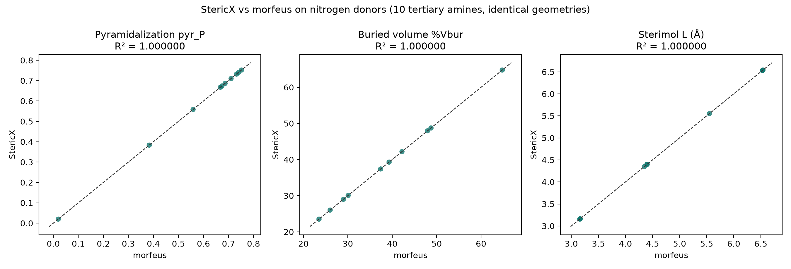

# StericX Validation — The Non-Phosphorus Donor Path

## Does `--donor-element N` actually work?

Every study in this project validates StericX on **phosphorus** donors. The `descriptors` command, though, advertises `--donor-element` for any trivalent donor — a capability with no evidence behind it until now. This validation closes that gap the same way Studies 002 and 005 validate phosphorus: it compares StericX's descriptors against **morfeus** on identical geometries, with the donor changed from P to **N**.

The set is **10 tertiary amines** — one nitrogen donor with three carbon substituents each, spanning trimethylamine to tri-n-butylamine and tribenzylamine. Geometries are generated deterministically (RDKit ETKDG + MMFF); the agreement is a property of the *shared* geometry, so it does not depend on the exact conformer. For every amine, StericX detected the nitrogen donor and its three substituents straight from the coordinates, with no atom indices supplied.

## Result — StericX matches morfeus off phosphorus

| Descriptor | R² | max \|diff\| | MAE |
|---|---:|---:|---:|
| pyramidalization pyr_P | 1.000000 | 0.00000 | 0.00000 |
| pyramidalization pyr_alpha (deg) | 1.000000 | 0.00008 | 0.00003 |
| buried volume %Vbur | 1.000000 | 0.00000 | 0.00000 |
| Sterimol L | 1.000000 | 0.00008 | 0.00001 |
| Sterimol B1 | 0.999899 | 0.01453 | 0.00509 |
| Sterimol B5 | 1.000000 | 0.00000 | 0.00000 |

The nitrogen path reproduces morfeus at the same fidelity the phosphorus studies report: pyramidalization to machine precision, buried volume and Sterimol L/B5 essentially exact, with Sterimol B1 carrying the same small 1°-angular-scan discretization difference documented for phosphorus (StericX scans B1 at one-degree steps; morfeus uses a denser search). The kernel is element-generic — donor detection uses covalent-radius bonding and the descriptor geometry never assumes phosphorus — so this is the expected outcome, now on the record rather than asserted.



*Figure. StericX vs morfeus for the three descriptor families on the ten nitrogen-donor amines. Generated by `scripts/validate_nonp_donor.py`.*

## Honest scope

- **Nitrogen, not every element.** This validates the trivalent-nitrogen path — the natural non-phosphorus case a user would reach for. It does not claim oxygen or other donors; those remain unexercised.
- **Tertiary amines only.** Clean three-substituent nitrogen donors were chosen so donor detection is unambiguous; N-H amines and aromatic (two-coordinate) nitrogens are out of scope here.
- **A fidelity check, not a chemistry claim.** This shows StericX computes the *same descriptors* as morfeus for nitrogen donors. It makes no claim that these amine descriptors model any particular reaction — only that the advertised capability produces correct, reference-matching numbers.

## Reproducing

```bash
uv run --extra science python scripts/validate_nonp_donor.py
```

Requires the release binary (`cargo build --release`), RDKit, and morfeus. Only StericX's own values and the aggregate agreement are written out.
